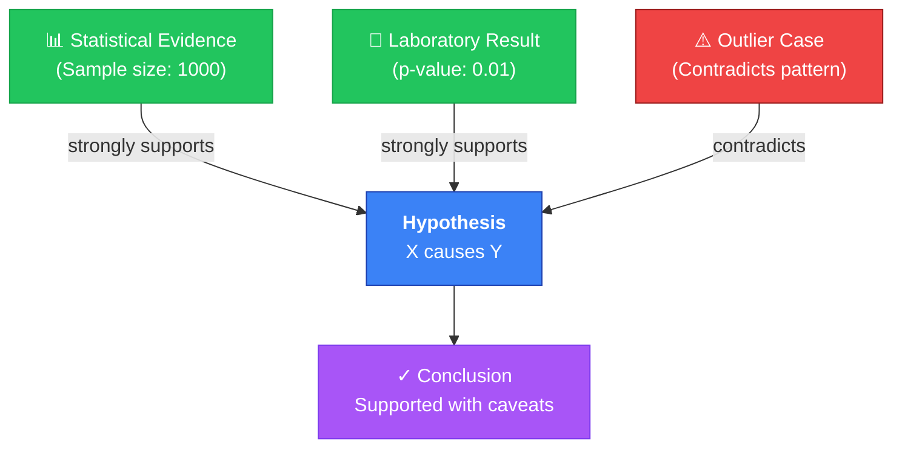
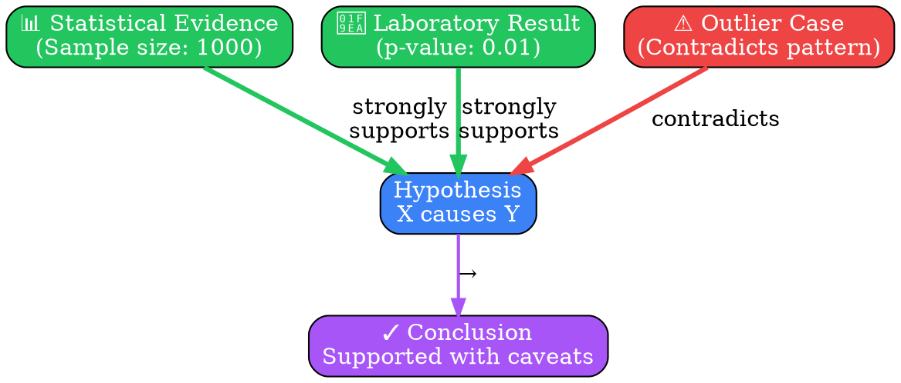

# Visual Grammar: Shared Conventions

This document establishes visual representation conventions for all per-mode grammar files in deepthinking-plugin. Per-mode grammar files inherit these conventions and may extend them with mode-specific refinements.

## Node Shapes

Semantic meaning is conveyed through node shape. Use these consistently across all diagrams:

| Shape | Semantic Meaning | Use Cases |
|-------|-----------------|-----------|
| **Rectangle** | Concrete thing, step, artifact | Actions, steps in a process, concrete entities, evidence, facts |
| **Ellipse / Rounded** | Concept, abstraction | Ideas, hypotheses, abstract reasoning, claims |
| **Diamond** | Decision point, branching logic | If-then conditions, choice nodes, decision gates |
| **Cylinder** | Data source, persistent store | Databases, memory, repositories, knowledge bases |
| **Cloud** | External system, environment | External APIs, users, environment, third-party systems |
| **Double-border rectangle** | Axiom, foundational assumption | Core assumptions, axioms, immutable truths, first principles |
| **Stadium / Pill shape** | Start/end terminal | Entry point, exit point, final conclusion, terminator |

### Examples

```
Rectangle: "Premise A" → Evidence node, factual claim
Ellipse: "Hypothesis" → Abstract idea being tested
Diamond: "Valid?" → Decision that splits logic
Double-border: "Axiom: Consistency" → Foundational assumption
Stadium: "Conclusion" → End state of reasoning
Cylinder: "Evidence Repository" → Data store or knowledge base
Cloud: "External Expert Opinion" → Outside information source
```

## Color Palette

Use semantic colors to indicate relationship type and validity. Colors are primary visual encoding for assessment:

| Color | Semantic Meaning | Hex | Notes |
|-------|-----------------|-----|-------|
| **Green** | Success, supporting, proven, valid | `#22c55e` | Use for confirmed evidence, successful proofs, supporting arguments |
| **Red** | Failure, contradicting, refuted, invalid | `#ef4444` | Use for contradictions, refutations, failed proofs, counter-evidence |
| **Blue** | Neutral, informational, baseline | `#3b82f6` | Use for general facts, neutral premises, default state |
| **Orange** | Uncertainty, warning, partial | `#f59e0b` | Use for unverified claims, weak evidence, uncertain outcomes |
| **Purple** | Meta, reasoning-about-reasoning, mode switch | `#a855f7` | Use for meta-analysis, introspection, mode transitions |
| **Gray** | Deferred, skipped, background | `#6b7280` | Use for excluded paths, optional branches, non-essential elements |

### Color Application Rules

- Apply color to **node fill** for primary assessment
- Apply color to **edge color** to indicate evidence strength/type
- A single node may have multiple colors if multi-faceted (e.g., half-green/half-red)
- Always ensure sufficient contrast with text for accessibility

### Example

```
Green node "Supporting Evidence" → Evidence that supports a hypothesis
Red node "Counterargument" → Evidence that contradicts the hypothesis
Orange node "Tentative Finding" → Unverified claim
Purple node "Mode: Causal Analysis" → Reasoning method annotation
```

## Edge Semantics

Edge style (solid, dashed, dotted) and weight encode relationship strength and type:

| Style | Semantic Meaning | Use Cases |
|-------|-----------------|-----------|
| **Solid line** | Direct dependency, causal link, strong connection | Proven relationships, direct causation, logical implication |
| **Dashed line** | Indirect relationship, inferred, revision, weak link | Implied causation, revised conclusions, probabilistic links |
| **Dotted line** | Hypothetical, counterfactual, speculative | "What if" scenarios, speculative branches, untested assumptions |
| **Thick (weight 3+)** | Strong evidence, strong relationship | High-confidence links, well-established connections |
| **Thin (weight 1)** | Weak evidence, weak relationship | Low-confidence links, circumstantial connections |

### Edge Labeling

Every edge should have a label when possible:

- Use **present-tense verb phrases**: "causes", "supports", "depends on", "contradicts", "refines", "builds on"
- Keep labels **short and clear** (2-4 words typical)
- Use labels to clarify relationship type, not just state its existence
- Avoid generic labels like "relates to" — use specific verbs

### Examples

```
Solid edge labeled "causes" → A directly causes B
Dashed edge labeled "suggests" → A suggests (not proves) B
Dotted edge labeled "would imply" → In a hypothetical scenario, A would imply B
Thick edge labeled "strongly supports" → A has high-confidence support for B
Thin edge labeled "weakly suggests" → A has low-confidence suggestion for B
```

## Label Conventions

### Node Labels

- **Short name** (1-3 words) as primary label
- **Optional secondary description** as subtitle (1 line max, ~40 chars)
- **Truncate to ~60 characters** if space is constrained
- Use **markdown-style formatting** where supported:
  - Bold for key terms: `**Evidence**`
  - Italics for emphasis: `*crucial*`
  - Line breaks with `\n` or `<br/>` for multi-line labels

### Edge Labels

- Use **present-tense verb phrases** ("causes", "supports", "depends on", "contradicts", "implies")
- Position labels **near the midpoint** of the edge for clarity
- **Avoid labels that duplicate the edge style** (e.g., don't label a dashed edge "indirect" — the dash already indicates this)
- When relationship type is complex, label it:
  ```
  "causes with delay"
  "partially supports"
  "contradicts if assumption X holds"
  ```

### Examples

```
Node label: "Premise A"
Node label: "Hypothesis\n(to be tested)"
Node label: "Assumption\n~40 chars max"

Edge label: "supports"
Edge label: "depends on"
Edge label: "weakly implies"
Edge label: "contradicts assuming X"
```

## Layout Hints

### Graph Orientation

Choose layout direction based on logical flow:

| Orientation | Mermaid | Graphviz | Best For |
|-------------|---------|----------|----------|
| **Top-to-Bottom** | `graph TD` | `rankdir=TB` | Causal chains, sequential reasoning, hierarchies, proof steps |
| **Left-to-Right** | `graph LR` | `rankdir=LR` | Comparisons, parallel reasoning paths, timelines, side-by-side analysis |
| **Hub-and-Spoke** | Custom placement | `circo` or circular layout | Meta-reasoning, central claim with supporting evidence, consensus analysis |

### Layout Best Practices

- **Left-to-right** for comparing two evidence sources against a hypothesis
- **Top-to-bottom** for step-by-step proofs or causal chains
- **Hub-and-spoke** for modes that evaluate one central claim from multiple angles
- Keep related nodes **visually proximate** to show clustering
- Use **consistent edge weights and spacing** to avoid visual noise

## Mermaid Example

Below is a worked example: an evidence-supports-hypothesis diagram with three evidence nodes (two supporting green, one contradicting red) pointing to a central hypothesis:



**Key conventions demonstrated:**
- **Green nodes** (E1, E2) represent supporting evidence
- **Red node** (E3) represents contradicting evidence
- **Blue node** (H) is the central hypothesis (neutral until evaluated)
- **Purple node** (C) is the conclusion (meta-analysis result)
- **Solid edges** for direct relationships, **labeled with relationship type**
- **Shape variety**: all rectangles in this simple example, but would vary for complex diagrams

## DOT Example

The same diagram rendered in Graphviz DOT format:



**Observations:**
- `rankdir=TB` establishes top-to-bottom flow
- `fillcolor` maps to semantic colors
- Edge `penwidth=3` indicates strong relationships
- Edge labels clarify relationship semantics
- `fontcolor="white"` ensures contrast on colored backgrounds

## Integration with Per-Mode Grammars

Per-mode grammar files (`{mode}-grammar.md`) inherit these conventions and may:

1. **Extend shapes** with mode-specific node types (e.g., "Proof Step" for formal logic)
2. **Refine color usage** with additional semantic meanings (e.g., "Light green for partial support")
3. **Add layout patterns** specific to the mode's reasoning structure
4. **Introduce custom edge styles** for mode-specific relationships

When per-mode files extend conventions, they must:
- Clearly document the extension at the top of their shapes/colors/edges sections
- Preserve backward compatibility with the shared conventions above
- Use inheritance phrasing: "In addition to shared conventions..."

---

**Last Updated:** 2026-04-11  
**Status:** Stable  
**Audience:** deepthinking-plugin developers, visual grammar file maintainers
