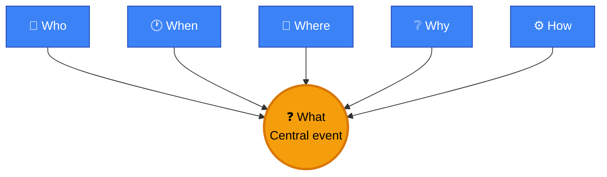
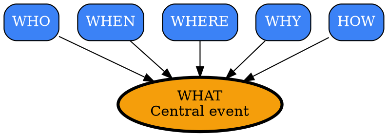
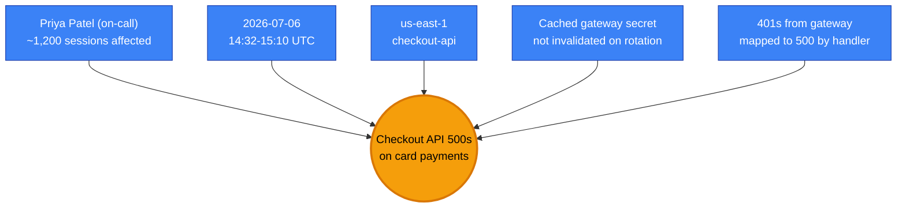
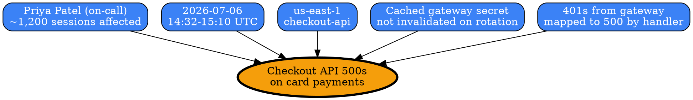

# Visual Grammar: 5W1H

How to render a `5w1h` thought as a diagram.

## Node Structure

5W1H scopes a problem across six dimensions radiating from a central "What" hub — a **6-spoke hub-and-spoke layout**:

- **What** (center) → A single **orange ellipse**, the anchor of the diagram. It names the central event/problem being scoped.
- **Who / When / Where / Why / How** (spokes) → **blue rectangles**, one per dimension, each pointing inward to the What hub
- Each spoke node's label is the excerpt of that field's value (join array entries with `; ` if the field is an array)

## Edge Semantics

- **Solid blue arrow** (`→`) from each spoke to the center — every dimension informs and scopes the central "What"
- No edges exist between spokes — 5W1H dimensions are independent facets of the same event, not a causal chain (that's `fivewhys`/`fishbone`'s job)

## Mermaid Template

## DOT Template

## Worked Example

Based on the checkout-incident scenario in `test/samples/5w1h-valid.json`:

### Mermaid

### DOT

## Special Cases

- **Array-valued fields**: When `who`/`what`/`when`/`where`/`why`/`how` is an array (multiple entries), join entries with ` ` (Mermaid) or `\n` (DOT) inside the node label rather than creating multiple spoke nodes — the diagram stays a clean 6-node hub regardless of how many facts populate each dimension.
- **`summary` field**: If present, render as a caption below the diagram (not a graph node) — it is prose, not a graph element.
- **Missing/thin dimensions**: If a dimension's value is a placeholder like "unknown" or "TBD", render its spoke with a dashed border to visually flag the scoping gap.
