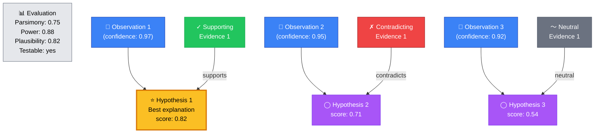
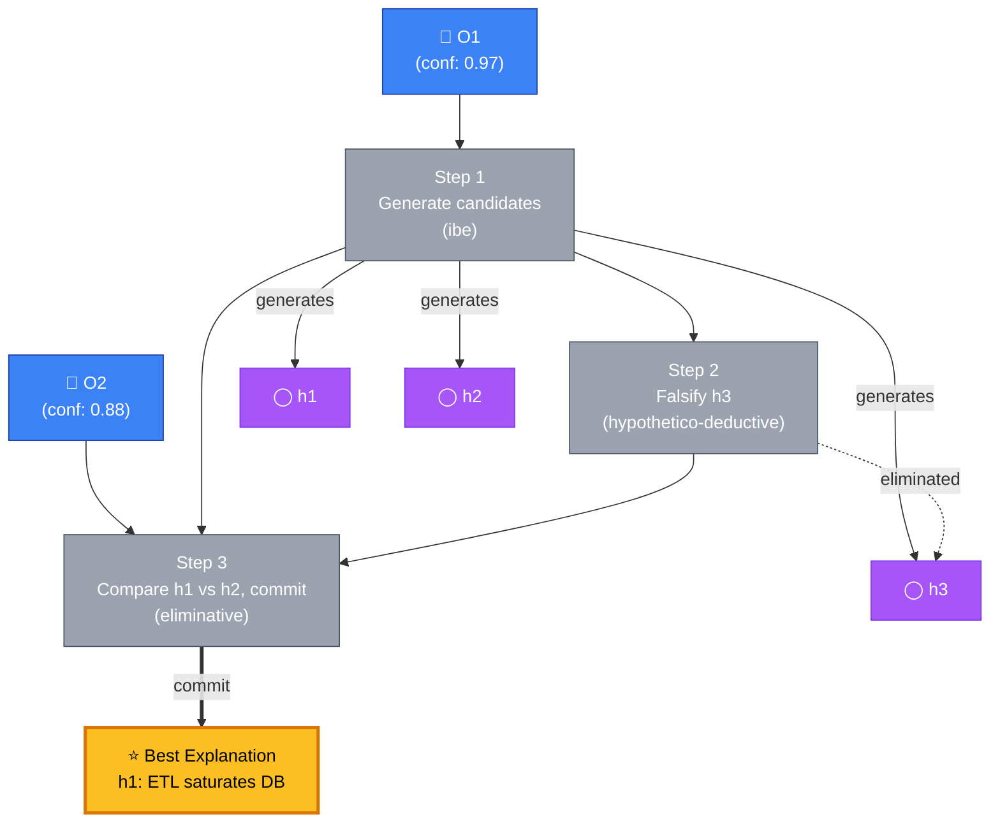
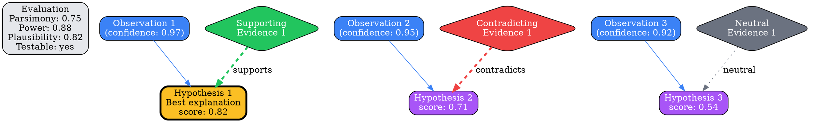
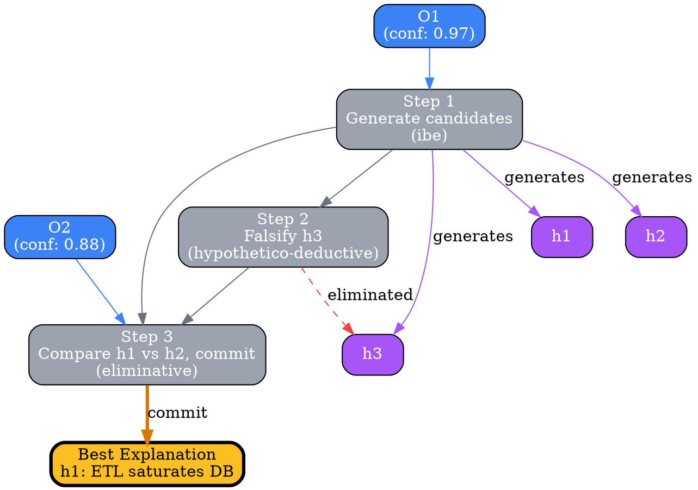
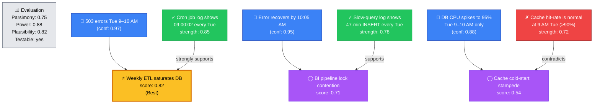
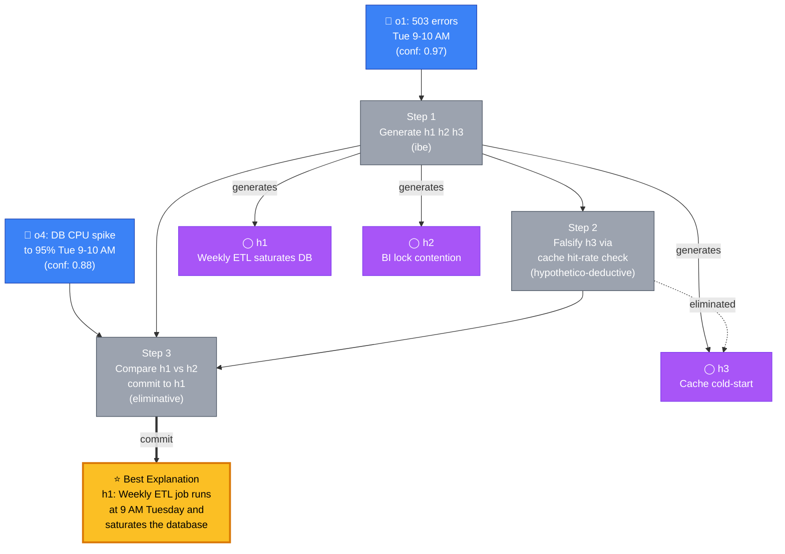
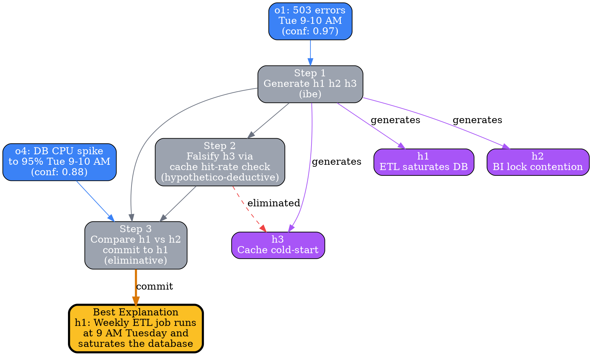

# Visual Grammar: Abductive

How to render an `abductive` thought as a diagram.

## Rendering Dispatch (v0.5.4+)

Abductive thoughts come in two shapes, and the visual grammar switches based on presence of the optional `abductionSteps[]` field:

- **Atomic** (no `abductionSteps` or `abductionSteps: []`) — classic parallel diagram: observations on top, ranked hypotheses in the middle, evidence diamonds on the side, with the gold-highlighted `bestExplanation`
- **Multi-step** (non-empty `abductionSteps[]`) — iterative flow: observations → per-step nodes that show what was generated and eliminated at each step → final gold-highlighted `bestExplanation` at the bottom

The atomic shape is the default; the multi-step shape is used when the reasoning unfolded as generate-test-refine-commit.

## Node Structure

### Atomic shape

Abductive reasoning generates and ranks candidate hypotheses to explain surprising observations. The diagram uses a **tiered top-to-bottom layout** with hypotheses ranked by score:

- **Observations** (top tier) → **Blue rectangles**, one per observation; each includes confidence level as a label (e.g., "0.97")
- **Hypotheses** (middle tier) → **Ranked ellipses** positioned vertically by score (highest at top); the `bestExplanation` hypothesis is highlighted with **gold fill** (`#fbbf24`)
- **Evidence nodes** (right side) → **Diamond shapes**, colored by type:
  - **Green diamonds** for supporting evidence
  - **Red diamonds** for contradicting evidence
  - **Gray diamonds** for neutral evidence
- **Evaluation criteria** (left side) → An optional labeled node showing the radar/criteria (parsimony, explanatoryPower, plausibility, testability)

### Multi-step shape

When `abductionSteps[]` is populated, the diagram inserts a **step tier** between the observations and the final committed explanation:

- **Observations** (top tier) → **blue rectangles**, indexed by id (`O0`, `O1`, ...)
- **Step tier** (middle tier) → **neutral gray rectangles**, one per entry in `abductionSteps[]`, labeled with the step number, short summary, and `abductionMethod`. Intermediate step nodes are always neutral gray — the gold color is reserved for the final committed explanation
- **Hypothesis satellites** — hypotheses introduced at a step are attached as purple ellipses next to the step node; hypotheses eliminated at a step are attached with a **red dashed "eliminated" edge**
- **Final commitment** (bottom tier) → **gold ellipse** with the `bestExplanation` text, connected from the final step with a thick gold arrow labeled "commit"
- **Edges**: blue from `triggerObservation` to the step that used it; gray between steps referenced via `stepsUsed[]`; purple from step to newly generated hypotheses; dashed red from step to eliminated hypotheses

## Edge Semantics

- **Solid blue arrow** (`→`) — Observation feeds into a hypothesis (atomic) or triggers a step (multi-step)
- **Solid purple arrow** — Step generates a new hypothesis
- **Dashed red arrow** — Step eliminates a hypothesis (labeled "eliminated")
- **Solid gray arrow** — A step builds on a prior step
- **Thick gold arrow** — Final step commits to the `bestExplanation`
- **Dashed green arrow** (`⇢`) — Supporting evidence; labeled "supports"
- **Dashed red arrow** (`⇢`) — Contradicting evidence; labeled "contradicts"
- **Dotted gray arrow** (`⇢`) — Neutral evidence; labeled "neutral"

## Mermaid Template — atomic

## Mermaid Template — multi-step

## DOT Template — atomic

## DOT Template — multi-step

## Worked Example — atomic

Based on the Tuesday 503 errors scenario:

### Mermaid

### DOT

```dot
digraph AbductiveErrors {
    rankdir=TB;
    node [shape=box, style="filled,rounded"];

    Crit [label="Evaluation\nParsimony: 0.75\nPower: 0.88\nPlausibility: 0.82\nTestable: yes",
          fillcolor="#e5e7eb", fontcolor="black"];

    O1 [label="503 errors Tue 9–10 AM\n(confidence: 0.97)",
        fillcolor="#3b82f6", fontcolor="white"];
    O2 [label="Error recovers by 10:05 AM\n(confidence: 0.95)",
        fillcolor="#3b82f6", fontcolor="white"];
    O3 [label="DB CPU spikes to 95%\nTue 9–10 AM only\n(confidence: 0.88)",
        fillcolor="#3b82f6", fontcolor="white"];

    H1 [label="Weekly ETL saturates DB\nscore: 0.82\n(Best Explanation)",
        fillcolor="#fbbf24", fontcolor="black", penwidth=3];
    H2 [label="BI pipeline lock\ncontention\nscore: 0.71",
        fillcolor="#a855f7", fontcolor="white"];
    H3 [label="Cache cold-start\nstampede\nscore: 0.54",
        fillcolor="#a855f7", fontcolor="white"];

    E1 [label="Cron job log:\n09:00:02 every Tue\nstrength: 0.85",
        fillcolor="#22c55e", fontcolor="white", shape=diamond];
    E2 [label="Slow-query log:\n47-min INSERT Tue\nstrength: 0.78",
        fillcolor="#22c55e", fontcolor="white", shape=diamond];
    E3 [label="Cache hit-rate normal\nat 9 AM Tue (>90%)\nstrength: 0.72",
        fillcolor="#ef4444", fontcolor="white", shape=diamond];

    O1 -> H1 [color="#3b82f6"];
    O2 -> H2 [color="#3b82f6"];
    O3 -> H3 [color="#3b82f6"];

    E1 -> H1 [label="strongly\nsupports", color="#22c55e", penwidth=3, style=dashed];
    E2 -> H2 [label="supports", color="#22c55e", penwidth=2, style=dashed];
    E3 -> H3 [label="contradicts", color="#ef4444", penwidth=2, style=dashed];
}
```

## Worked Example — multi-step

Based on the 3-step iterative version of the Tuesday 503 errors scenario (the current sample in `test/samples/abductive-valid.json`). Step 1 generates all three candidates, step 2 falsifies h3 via a prediction check, step 3 compares h1 vs h2 and commits to h1:

### Mermaid

### DOT

## Special Cases

- **Best explanation highlighting**: The hypothesis in `bestExplanation` is rendered with **gold fill** (`#fbbf24`) and a **thick border** (penwidth=3) to visually distinguish it. In the multi-step shape, intermediate hypothesis nodes stay purple; only the final committed `Best Explanation` node is gold.

- **Evidence strength encoding**:
  - **Green supporting diamonds** with thick edges (penwidth=3) for strength ≥ 0.75
  - **Green supporting diamonds** with normal edges (penwidth=2) for 0.6 ≤ strength < 0.75
  - **Red contradicting diamonds** with thick edges for strength ≥ 0.75
  - **Red contradicting diamonds** with normal edges for weaker contradicting evidence

- **Hypothesis ranking by score**: In the atomic shape, display hypotheses in vertical order (h1 at top, h3 at bottom) with y-position proportional to score. The multi-step shape does not rank hypotheses by score at all — ranking information lives in the top-level `hypotheses[].score` field and is auxiliary to the step flow.

- **Eliminated hypotheses are preserved**: A hypothesis that appears in some step's `hypothesesEliminated[]` is still shown as a node; it just has an incoming red dashed "eliminated" edge from the eliminating step. The flat `hypotheses[]` array also keeps it (this is an audit trail, not a prune operation).

- **Prediction nodes** (optional): If predictions are important, they can be rendered as smaller gray diamonds hanging below each hypothesis, labeled with the prediction text. This enriches the diagram but may add clutter; include only if the downstream task requires visibility into testable predictions.
