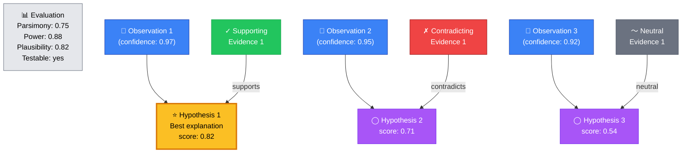
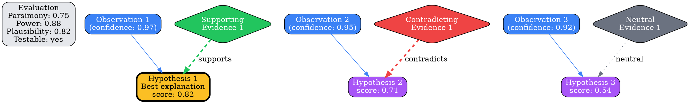
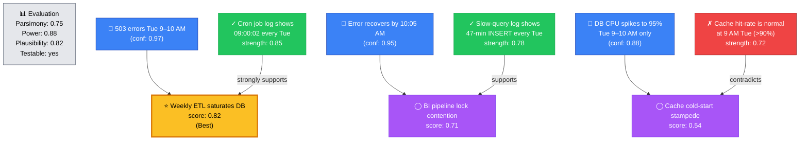

# Visual Grammar: Abductive

How to render an `abductive` thought as a diagram.

## Node Structure

Abductive reasoning generates and ranks candidate hypotheses to explain surprising observations. The diagram uses a **tiered top-to-bottom layout** with hypotheses ranked by score:

- **Observations** (top tier) → **Blue rectangles**, one per observation; each includes confidence level as a label (e.g., "0.97")
- **Hypotheses** (middle tier) → **Ranked ellipses** positioned vertically by score (highest at top); the `bestExplanation` hypothesis is highlighted with **gold fill** (`#fbbf24`)
- **Evidence nodes** (right side) → **Diamond shapes**, colored by type:
  - **Green diamonds** for supporting evidence
  - **Red diamonds** for contradicting evidence
  - **Gray diamonds** for neutral evidence
- **Evaluation criteria** (left side) → An optional labeled node showing the radar/criteria (parsimony, explanatoryPower, plausibility, testability)

Hypothesis ranking by score (h1 highest, h3 lowest):
```
    h1 (score 0.82, gold fill) ⬅ Best
    h2 (score 0.71)
    h3 (score 0.54)
```

## Edge Semantics

- **Solid arrow** (`→`) — Observation supports hypothesis evaluation; edge weight reflects confidence
- **Dashed green arrow** (`⇢`) — Supporting evidence; labeled "supports"
- **Dashed red arrow** (`⇢`) — Contradicting evidence; labeled "contradicts"
- **Dotted gray arrow** (`⇢`) — Neutral evidence; labeled "neutral"
- **Thick edge** — High-strength evidence (strength ≥ 0.75)
- **Thin edge** — Low-strength evidence (strength < 0.6)

## Mermaid Template



## DOT Template



## Worked Example

Based on the Tuesday 503 errors scenario from `reference/output-formats/abductive.md`:

### Mermaid



### DOT

```dot
digraph AbductiveErrors {
    rankdir=TB;
    node [shape=box, style="filled,rounded"];

    Crit [label="Evaluation\nParsimony: 0.75\nPower: 0.88\nPlausibility: 0.82\nTestable: yes",
          fillcolor="#e5e7eb", fontcolor="black"];

    O1 [label="503 errors Tue 9–10 AM\n(confidence: 0.97)",
        fillcolor="#3b82f6", fontcolor="white"];
    O2 [label="Error recovers by 10:05 AM\n(confidence: 0.95)",
        fillcolor="#3b82f6", fontcolor="white"];
    O3 [label="DB CPU spikes to 95%\nTue 9–10 AM only\n(confidence: 0.88)",
        fillcolor="#3b82f6", fontcolor="white"];

    H1 [label="Weekly ETL saturates DB\nscore: 0.82\n(Best Explanation)",
        fillcolor="#fbbf24", fontcolor="black", penwidth=3];
    H2 [label="BI pipeline lock\ncontention\nscore: 0.71",
        fillcolor="#a855f7", fontcolor="white"];
    H3 [label="Cache cold-start\nstampede\nscore: 0.54",
        fillcolor="#a855f7", fontcolor="white"];

    E1 [label="Cron job log:\n09:00:02 every Tue\nstrength: 0.85",
        fillcolor="#22c55e", fontcolor="white", shape=diamond];
    E2 [label="Slow-query log:\n47-min INSERT Tue\nstrength: 0.78",
        fillcolor="#22c55e", fontcolor="white", shape=diamond];
    E3 [label="Cache hit-rate normal\nat 9 AM Tue (>90%)\nstrength: 0.72",
        fillcolor="#ef4444", fontcolor="white", shape=diamond];

    O1 -> H1 [color="#3b82f6"];
    O2 -> H2 [color="#3b82f6"];
    O3 -> H3 [color="#3b82f6"];

    E1 -> H1 [label="strongly\nsupports", color="#22c55e", penwidth=3, style=dashed];
    E2 -> H2 [label="supports", color="#22c55e", penwidth=2, style=dashed];
    E3 -> H3 [label="contradicts", color="#ef4444", penwidth=2, style=dashed];
}
```



## Special Cases

- **Best explanation highlighting**: The hypothesis in `bestExplanation` is rendered with **gold fill** (`#fbbf24`) and a **thick border** (penwidth=3) to visually distinguish it from other ranked hypotheses.

- **Evidence strength encoding**: 
  - **Green supporting diamonds** with thick edges (penwidth=3) for strength ≥ 0.75
  - **Green supporting diamonds** with normal edges (penwidth=2) for 0.6 ≤ strength < 0.75
  - **Red contradicting diamonds** with thick edges for strength ≥ 0.75
  - **Red contradicting diamonds** with normal edges for weaker contradicting evidence

- **Hypothesis ranking by score**: Display hypotheses in vertical order (h1 at top, h3 at bottom) with y-position proportional to score. Use the `rank` or `{rank=same}` Mermaid/DOT constructs to group by tier if helpful.

- **Evaluation criteria sidebar**: The evaluation criteria node (parsimony, explanatoryPower, plausibility, testability) can be positioned on the left side as a reference. Alternatively, it can be rendered as a small radar/table-like diagram if visual clarity demands it, but the current node representation is sufficient.

- **Prediction nodes** (optional): If predictions are important, they can be rendered as smaller gray diamonds hanging below each hypothesis, labeled with the prediction text. This enriches the diagram but may add clutter; include only if the downstream task (e.g., design review) requires visibility into testable predictions.

