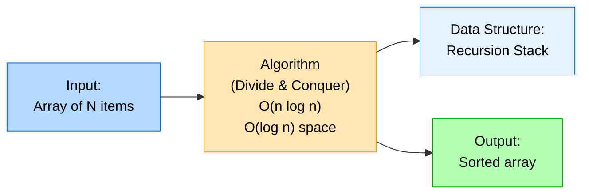
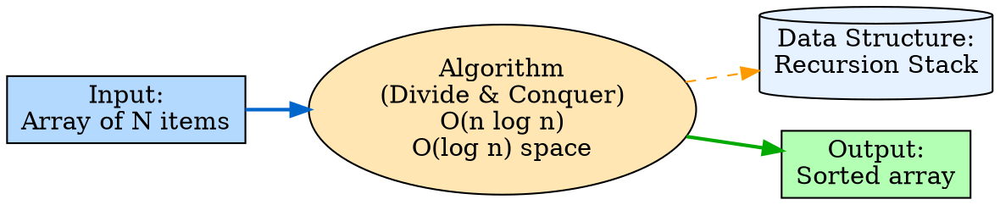
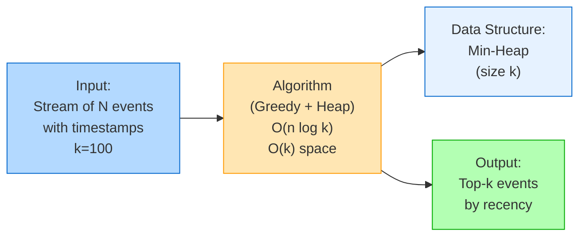
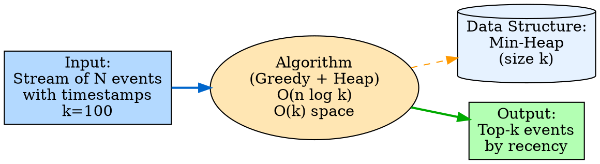

# Visual Grammar: Algorithmic

How to render an `algorithmic` thought as a diagram.

## Node Structure

Algorithmic thoughts are rendered as left-to-right pipeline diagrams:
- **Input** (rectangle, left): the data or problem instance
- **Algorithm** (ellipse or rounded rectangle, center): the core operation with CLRS category tag (e.g., "Divide & Conquer", "Greedy", "DP")
- **Data structures** (cylinder or database icon, attached to algorithm): structures used during computation (e.g., heap, hash table, array)
- **Complexity annotation** (label on algorithm node): time and space complexity (e.g., O(n log k), O(1) space)
- **Output** (rectangle, right): the result

## Edge Semantics

- **Solid arrow** (`→`) — Main pipeline: input → algorithm → output
- **Dashed arrow** (`⇢`) — Data structure usage: algorithm node to supporting data structures
- **Bold annotation** — Complexity class: labeled on the algorithm node

## Mermaid Template

## DOT Template

## Worked Example

Based on the top-K most recent items with min-heap from `reference/output-formats/algorithmic.md`:

### Mermaid

### DOT

## Special Cases

- **Multiple passes**: If the algorithm makes multiple passes over the input, show multiple arrows from input to algorithm or label the input node "Input (Pass 1, 2, ...)", or draw separate boxes for each pass.
- **Recursive structure**: If the algorithm is recursive, show a curved arrow from the algorithm to itself, labeled with the recurrence relation (e.g., "T(n) = 2T(n/2) + O(n)").
- **CLRS category tag**: Display prominently in the algorithm node (e.g., "Divide & Conquer", "Greedy", "Dynamic Programming", "Graph Traversal").
- **Multiple data structures**: If the algorithm uses several supporting structures, draw separate cylinders for each with dashed edges.
- **Space vs. time trade-off**: Annotate separate complexity values (e.g., "Time: O(n log k)", "Space: O(k)") on the algorithm node.
- **Pseudocode callout**: For complex algorithms, attach a small code box as a callout to the algorithm node.

