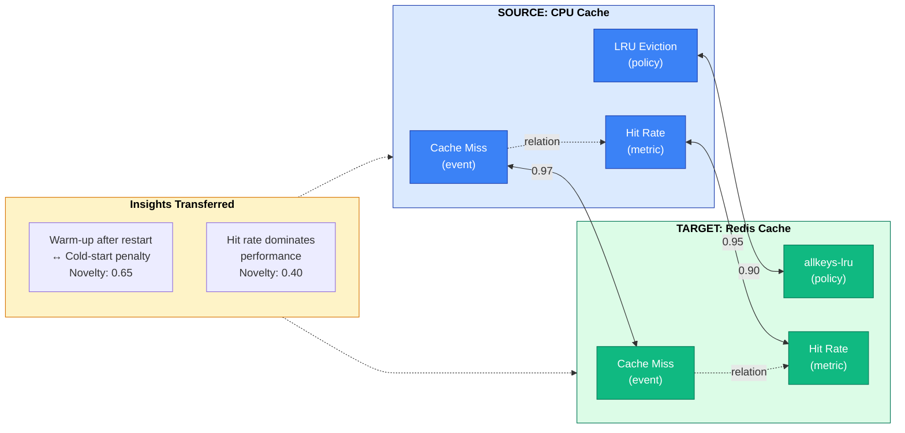
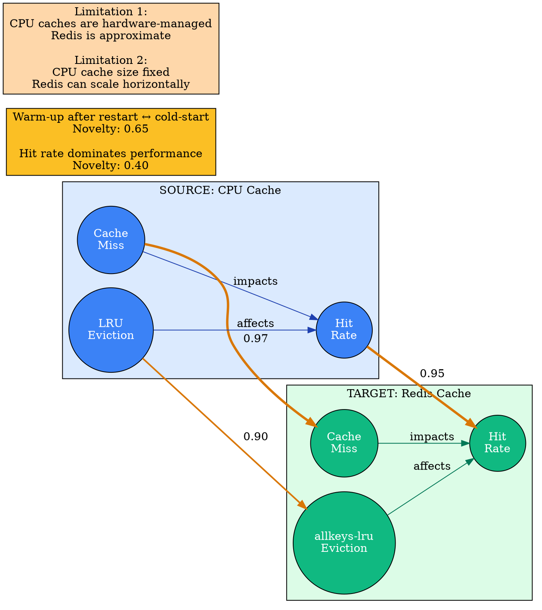
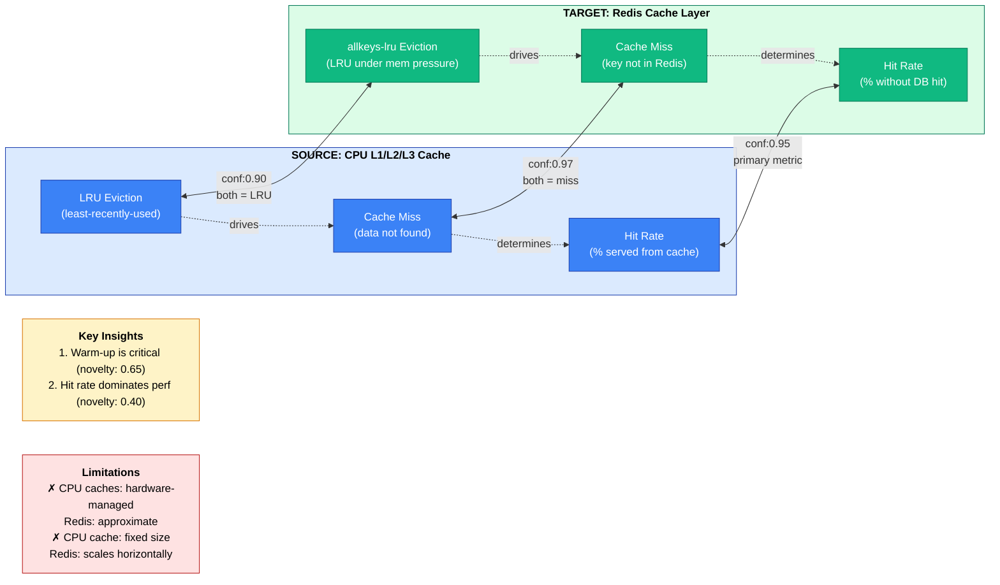
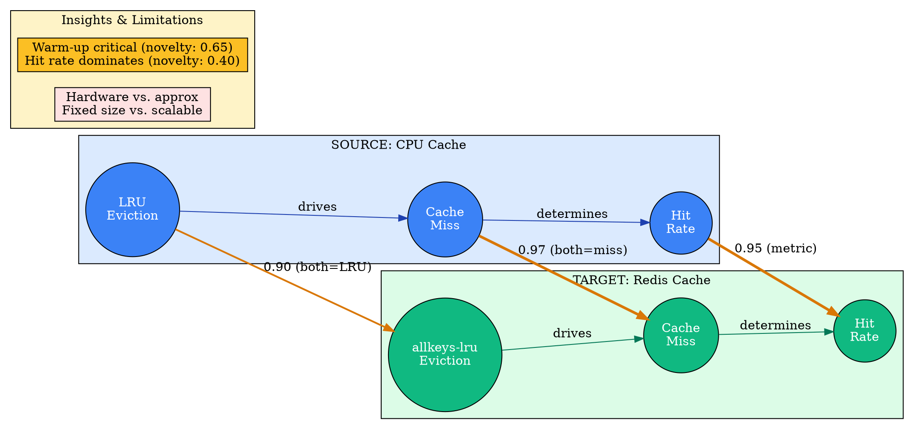

# Visual Grammar: Analogical

How to render an `analogical` thought as a diagram.

## Node Structure

Analogical reasoning diagrams show two domains side-by-side with entity mappings and insights. Structure:
- **Source domain** (left subgraph): Well-understood domain with entities and relations
- **Target domain** (right subgraph): Domain to understand; mirrors source structure
- **Entity nodes** (circles or boxes): One per domain entity, labeled with name and role
- **Mapping arrows** (bidirectional or thick directional): Connect corresponding entities between domains, labeled with confidence and justification
- **Failed mapping indicators** (red X, dashed line with strikethrough): Show entities that do not map cleanly
- **Relation edges** (within domain): Show structural relationships within each domain
- **Insights box** (below): List transferred insights and their novelty scores

Node colors:
- **Blue**: Source domain entities
- **Green**: Target domain entities
- **Gold**: High-confidence mapping
- **Orange**: Medium-confidence mapping
- **Red**: Failed or no mapping

## Edge Semantics

- **Solid arrow** (`→`) — Relation within domain (source or target)
- **Bidirectional thick arrow** (`↔`) — Entity mapping between domains; thickness indicates confidence (0-1)
- **Dashed arrow** (`⇢`) — Weak or partial mapping
- **Red X or crossed-out arrow** (`✗`) — Failed mapping or limitation of analogy

## Mermaid Template

## DOT Template

## Worked Example

Based on CPU cache ↔ Redis analogy from `reference/output-formats/analogical.md`:

### Mermaid

### DOT

## Special Cases

- **Strength annotation**: Display `analogyStrength` overall (0.88 in the CPU/Redis example) as a subtitle or header; scale background opacity to indicate strength (more opaque = stronger analogy).
- **Failed mappings**: Show unmapped or failed entities with a red "✗" symbol on both sides; optionally draw a dashed red line between them with "No mapping" label.
- **Partial mappings**: For entities that map weakly, use a dashed or thin line and lower confidence value (e.g., "0.55").
- **Multi-domain analogy**: If more than two domains are involved (e.g., CPU cache, Redis, and CDN), arrange them horizontally with pairwise mappings; draw inferences across domains as curved arrows.
- **Limitations section**: Add a separate box or list below the diagram explicitly stating where the analogy breaks down, preventing over-generalization.
- **Novelty scoring**: Annotate insights with their novelty score (0-1); higher scores (0.65+) indicate genuinely non-obvious transfers worth highlighting.
