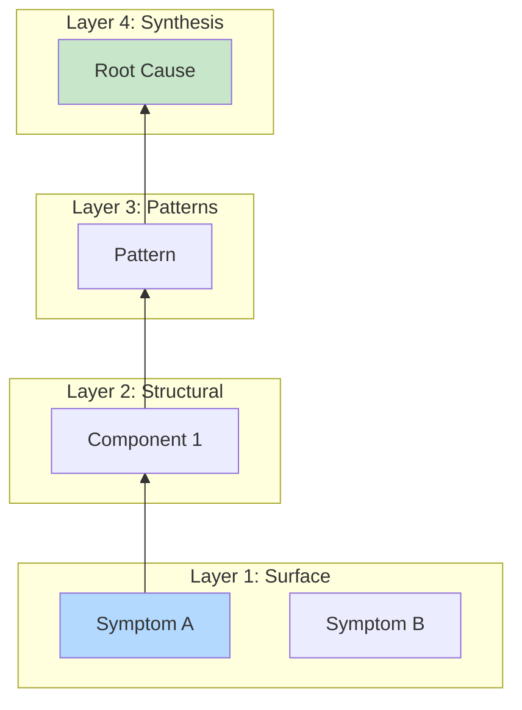
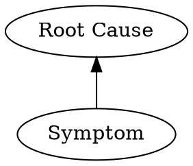
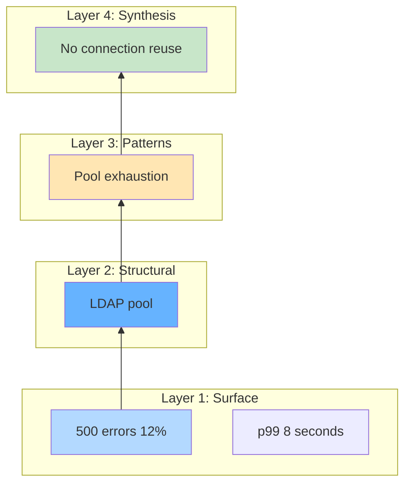
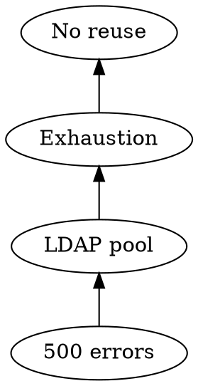

# Visual Grammar: Analysis

How to render an `analysis` thought as a diagram.

## Node Structure

Analysis diagrams display a multi-layer investigation stack:
- **Layer 1 (Bottom): Surface** (rectangles, light blue): observations, symptoms, or surface-level facts
- **Layer 2: Structural** (rectangles, medium blue): component relationships, system architecture, dependencies
- **Layer 3: Patterns** (rounded rectangles, orange): recurring patterns, causal chains, feedback loops
- **Layer 4 (Top): Synthesis** (rounded rectangles, green): higher-level conclusions, root causes, explanations
- **Coverage dial** (side annotation or node): percentage of the analyzed domain covered (e.g., 75% coverage)
- **Layer connector edges** (vertical arrows): progression from surface to synthesis

## Edge Semantics

- **Vertical solid arrows** (`↑`) — Layer progression: surface → structural → patterns → synthesis
- **Horizontal edges within a layer** — Same-level relationships or grouping
- **Coverage percentage** — Labeled on a side node or corner box

## Mermaid Template

## DOT Template

## Worked Example

Authentication service failure analysis with 4 layers.

### Mermaid

### DOT

## Special Cases

- **Incomplete analysis**: Mark with dashed borders or lighter colors.
- **Multi-path synthesis**: Multiple arrows converging into root cause.
- **Coverage tracking**: Display percentage in side box.
