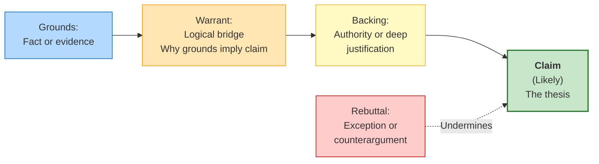
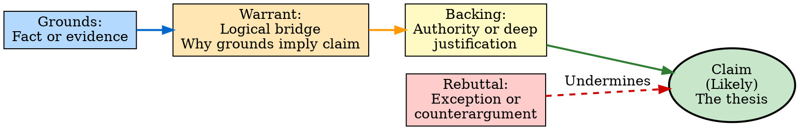
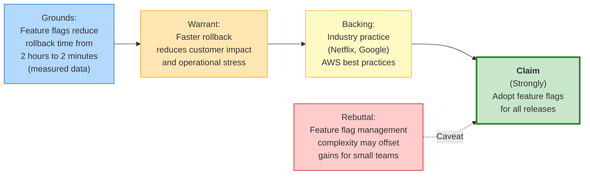
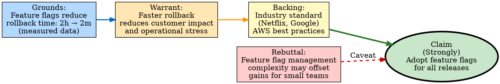

# Visual Grammar: Argumentation

How to render an `argumentation` thought as a diagram.

## Node Structure

Toulmin argumentation diagrams are rendered as horizontal chains:
- **Claim** (rectangle or rounded rectangle, center): the thesis or main assertion
- **Grounds** (rectangles, left): evidence or facts supporting the claim
- **Warrant** (rounded rectangle, below grounds): the logical bridge connecting grounds to claim
- **Backing** (box, below warrant): authority or deeper justification for the warrant
- **Qualifier** (annotation on claim): reservation or confidence level (e.g., "likely", "in most cases")
- **Rebuttal** (rectangle with dashed red edge, branching off): counterargument or exception to the claim

## Edge Semantics

- **Solid arrow** (`→`) — Support path: grounds → warrant → backing → claim
- **Dashed red arrow** (`⇢ ⊗`) — Rebuttal: counterargument pointing to the claim
- **Qualifier label** (on claim node) — Hedging: e.g., "Likely", "Probably", "Unless..."

## Mermaid Template

## DOT Template

## Worked Example

Based on the "adopt feature flags for all releases" argument from `reference/output-formats/argumentation.md`:

### Mermaid

### DOT

## Special Cases

- **Multiple grounds**: If the argument has several pieces of evidence, draw multiple ground nodes on the left, all pointing to the warrant.
- **Qualifier strength**: Use stronger/weaker qualifiers (e.g., "Certainly", "Likely", "Possibly", "Probably not") to indicate confidence level.
- **Multiple warrants**: If there are multiple logical pathways from grounds to claim, draw separate warrant nodes in parallel.
- **Nested arguments**: For complex arguments, a single node can be expanded into its own Toulmin diagram (e.g., the backing itself could have grounds, warrant, etc.).
- **Rebuttal resolution**: If the rebuttal is addressed or mitigated, show an edge from the rebuttal to a "Mitigation" or "Response" node that points back to the claim, showing the argument survives the objection.

