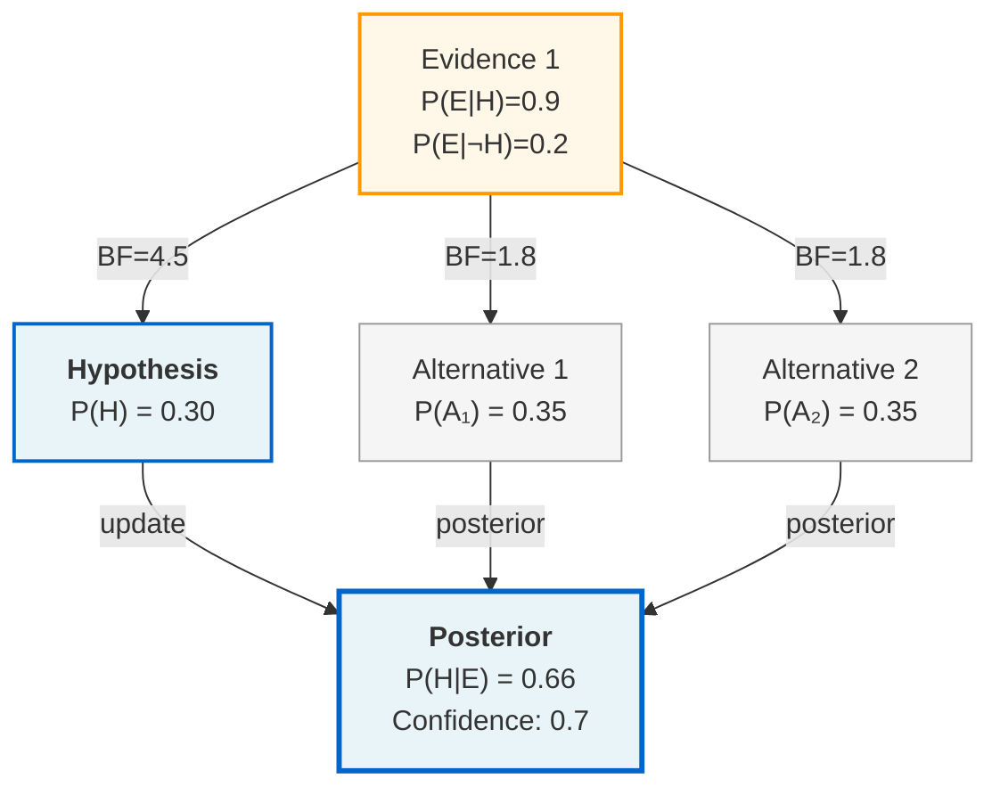
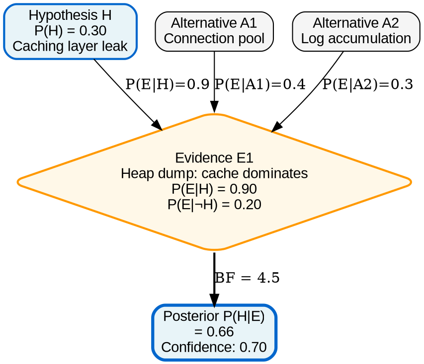
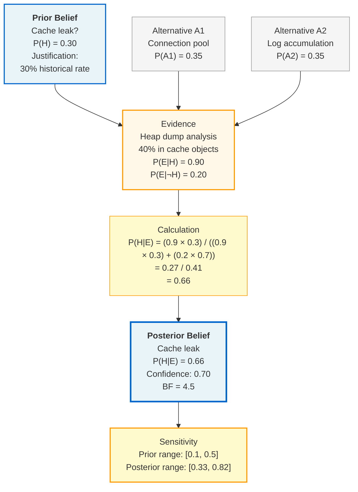
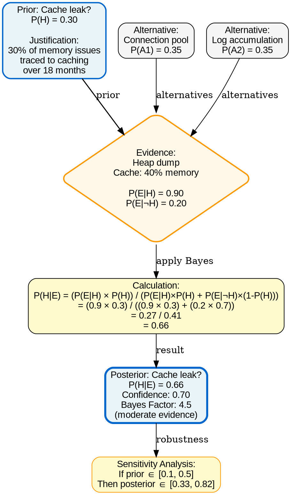

# Visual Grammar: Bayesian

How to render a `bayesian` thought as a diagram.

## Node Structure

- **Hypothesis** → Rounded rectangle (blue, center) with prior probability badge `P(H) = 0.XX` shown inline or as label
- **Alternative hypotheses** → Sibling rectangles (gray) with same sizing
- **Evidence items** → Diamond nodes (orange) with labels `P(E|H)` and `P(E|¬H)`
- **Posterior** → Updated hypothesis node (blue, bold border) below with posterior probability badge `P(H|E) = 0.XX`
- **Bayes factor** → Edge label between evidence and hypothesis

## Edge Semantics

- **Evidence supports hypothesis** → Solid arrow labeled `"P(E|H)=0.9, P(E|¬H)=0.2"`
- **Weak evidence** → Thinner arrow or lighter color
- **Posterior flow** → Bold arrow pointing downward from evidence to posterior
- **Bayes factor** → Edge label showing `BF = P(E|H) / P(E|¬H)`

## Mermaid Template

## DOT Template

## Worked Example

Input: "Is the memory leak caused by the caching layer? 30% historical base rate; heap dump shows cache objects dominating." (from bayesian.md)

**Mermaid:**

**DOT:**

## Special Cases

- **Multiple sequential evidence** → Chain evidence nodes vertically; each evidence updates the posterior from the previous step; show intermediate posterior at each stage
- **Weak likelihood ratio** → Show BF close to 1 with lighter edge; add "weak evidence" annotation
- **High sensitivity to prior** → Show sensitivity range with wide spread (e.g., posterior range much wider than prior range); flag with "⚠ Prior sensitive" label
- **Competing hypotheses** → Fan layout with multiple alternative hypotheses at same level; all receive evidence edges; show posterior comparison with highest-posterior hypothesis highlighted
