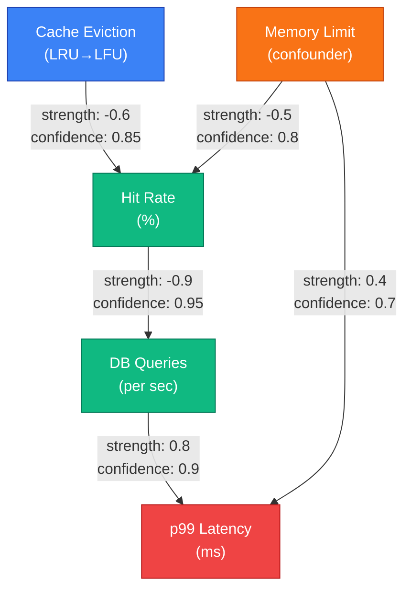
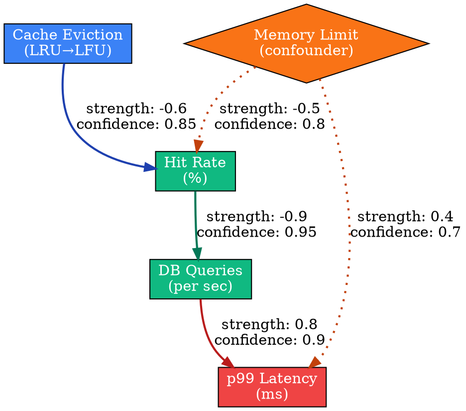
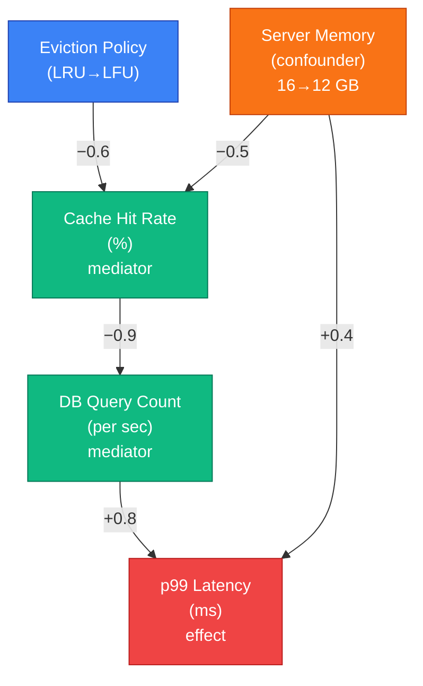
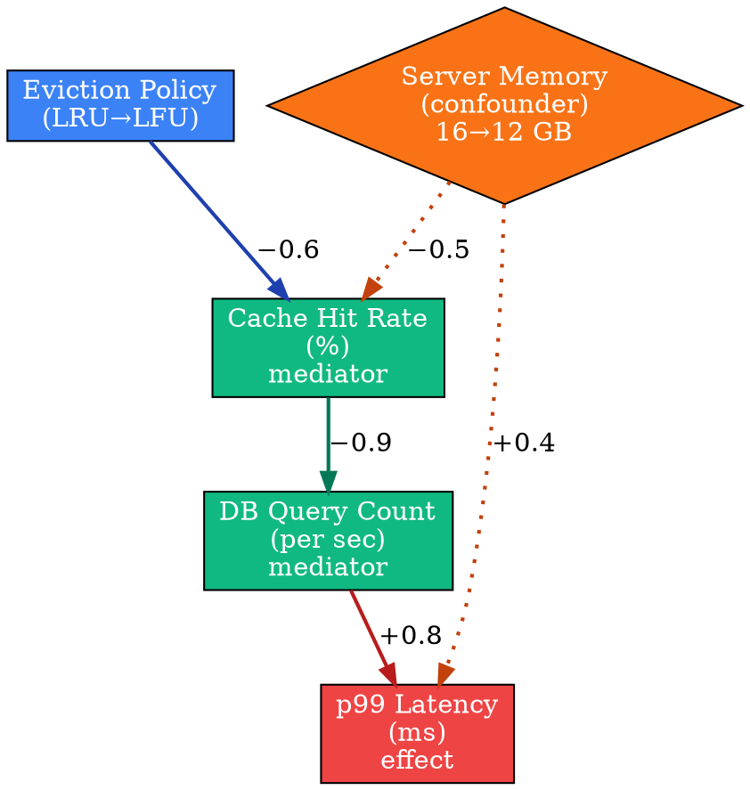

# Visual Grammar: Causal

How to render a `causal` thought as a diagram.

## Node Structure

Causal thoughts model cause-effect relationships in a directed acyclic graph (DAG). Node types:
- **Variable nodes** (rectangles): Causes, effects, mediators — labeled with the variable name
- **Confounder nodes** (diamonds): Common causes that create spurious correlation
- **Mechanism labels** (edge annotations): Describe *how* the cause produces the effect (mechanism type: direct, indirect, feedback)
- **Intervention nodes** (boxed with ✂ or red X): Mark intervention points where a cause is manually cut or altered

Node colors:
- **Blue**: Root cause (no incoming edges)
- **Green**: Mediator (intermediate)
- **Red**: Effect (terminal node, final outcome)
- **Orange**: Confounder (creates spurious correlation)
- **Gray**: Intervention point (cut edge)

## Edge Semantics

- **Solid arrow** (`→`) — Direct causal relationship; edge label shows `strength` (±0.1 to ±1.0) and `confidence` (0-1)
- **Dashed arrow** (`⇢`) — Indirect mechanism; passes through mediators
- **Bidirectional arrow with ⊗** (`↔`) — Confounder: arrow points to both affected variables
- **Red X or ✂** on edge — Intervention: causal path is cut or altered by external action
- **Feedback loop** (circular arrow) — If applicable, mark with `feedback` label and dotted style

## Mermaid Template

## DOT Template

## Worked Example

Based on the cache eviction scenario from `reference/output-formats/causal.md`:

### Mermaid

### DOT

## Special Cases

- **Confounders**: Draw as diamond nodes with dotted edges pointing to both the affected cause and effect, labeled with the confounder's description.
- **Interventions**: Mark the intervened node with a ✂ symbol or red X. Optionally draw a red dashed line through the cut edge.
- **Feedback loops**: If a causal cycle exists (rare in formal models), use a circular dashed arrow labeled "feedback" to indicate the loop.
- **Strength sign convention**: Positive strength means the cause increases the effect; negative strength means the cause decreases the effect. Always show the sign and magnitude (e.g., "+0.8", "−0.6").
- **Mechanisms**: Each edge *must* have a mechanism label explaining *how* the cause produces the effect; a blank mechanism indicates an unjustified causal claim.
