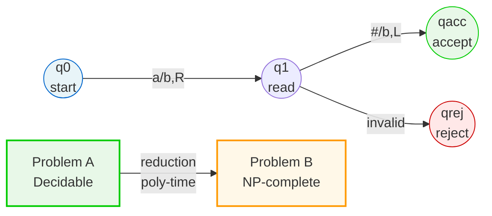
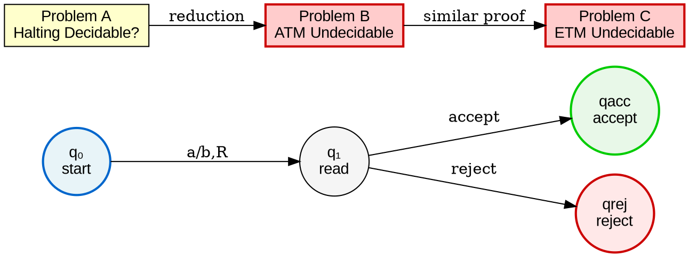
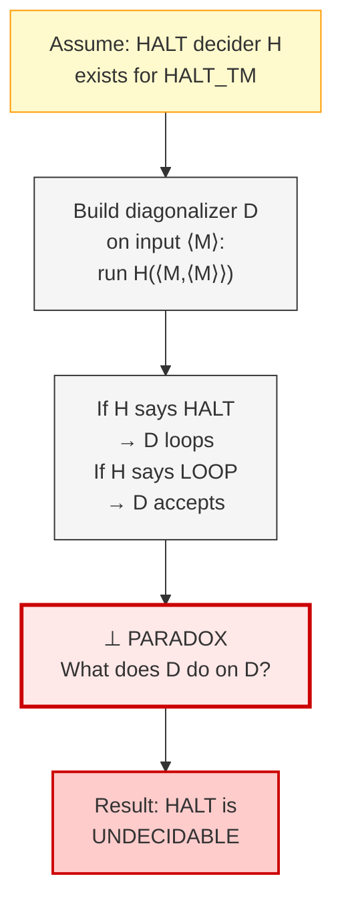
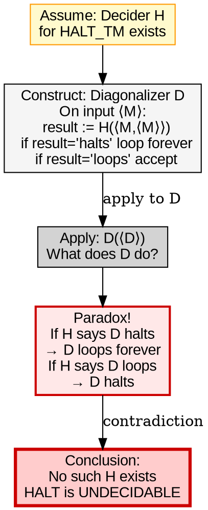

# Visual Grammar: Computability

How to render a `computability` thought as a diagram.

## Node Structure

- **Turing machine states** → Circles (blue for initial, green for accept, red for reject)
- **Problems** → Rectangles with complexity-class color fill:
  - `P` → Green fill
  - `NP` → Yellow fill
  - `NP-complete` → Orange fill
  - `Undecidable` → Red fill
  - `Unknown` → Gray fill
- **Reductions** → Directed labeled arrows between problems
- **Diagonalization arguments** → Double-boxed "paradox" node

## Edge Semantics

- **State transition** → Arrow labeled with `readSymbol/writeSymbol, direction` (e.g., `a/b, R`)
- **Reduction** → Arrow with `type: polynomial_time` or `many_one` label
- **Decidability proof** → Arrow to central problem with proof method label
- **Circular diagonalization** → Self-loop arrow with "self-reference" label

## Mermaid Template

## DOT Template

## Worked Example

Input: "Is the Halting Problem decidable?" (from computability.md)

**Mermaid:**

**DOT:**

## Special Cases

- **Turing machine computation trace** → Show as vertical timeline of states; each row represents one step with `state | tapeContents | headPos`
- **Multi-problem reductions** → Chain problems left-to-right; show reduction arrows; highlight NP-complete problems with orange fill
- **Complexity class ladder** → Vertical hierarchy with P at bottom (green), NP above (yellow), PSPACE above (light blue), EXPTIME at top (orange); show P vs NP with a question mark edge
- **Oracle separation** → Use double-border rectangles for oracle TMs; show separation with "Oracle: X" label on node
