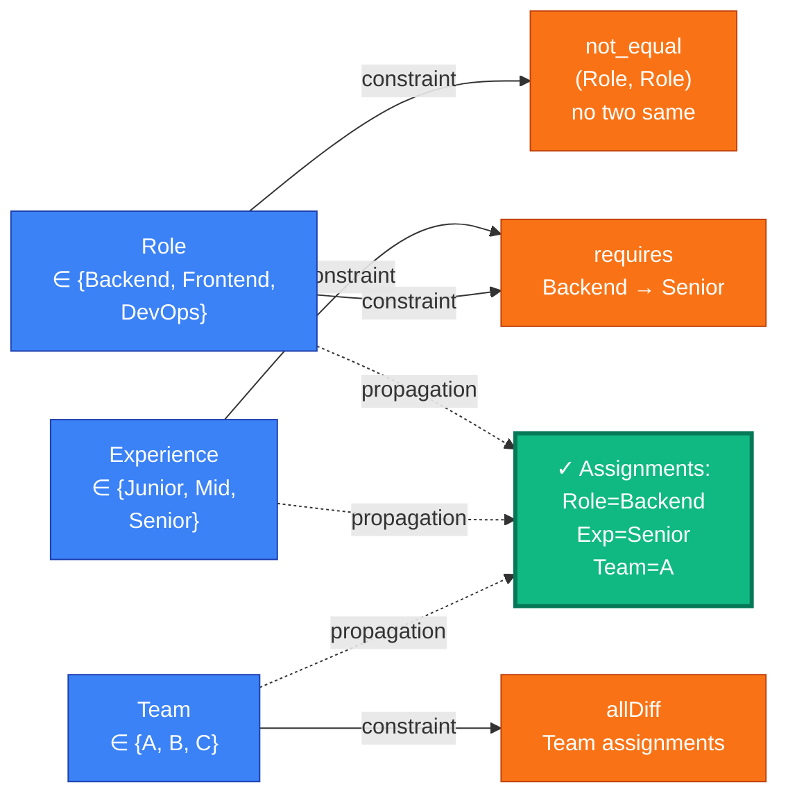
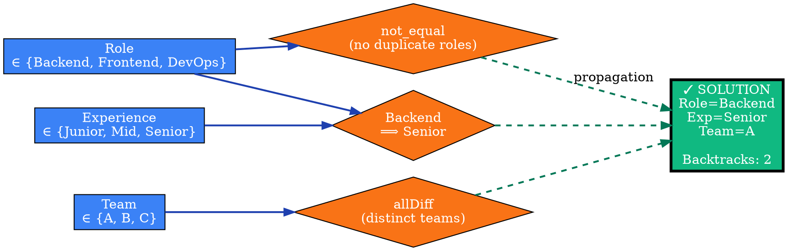
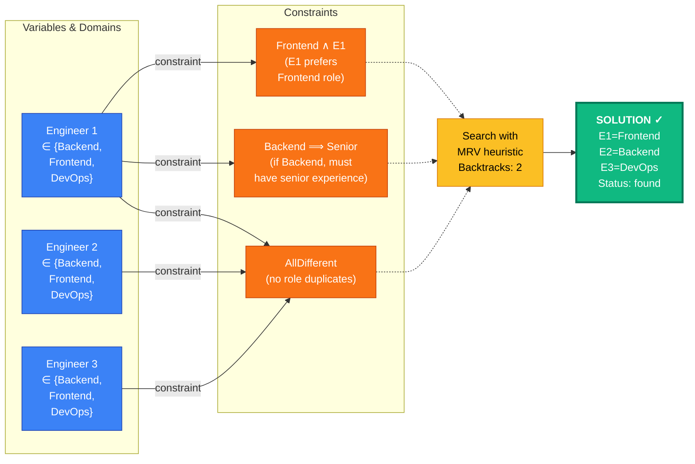
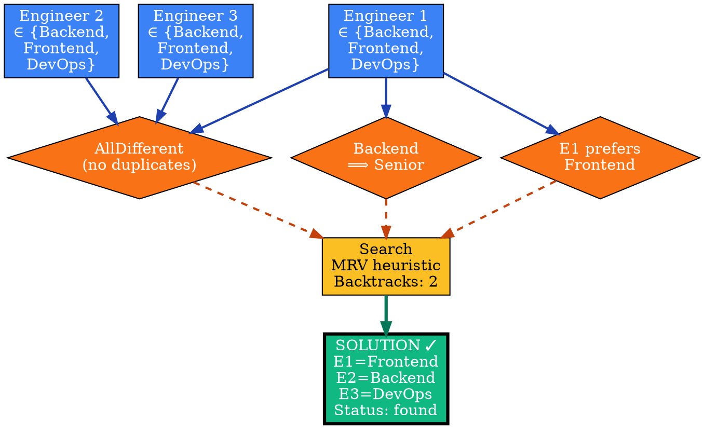

# Visual Grammar: Constraint

How to render a `constraint` (CSP) thought as a diagram.

## Node Structure

Constraint Satisfaction Problem (CSP) diagrams show variables, their domains, constraints, and assigned values. Structure:
- **Variable nodes** (rectangles): One per variable, labeled with name and initial domain (e.g., "Role ∈ {A, B, C}")
- **Constraint hyperedges** (labeled lines/boxes): Connect variables that must satisfy a relation; label shows constraint type
- **Domain values** (small circles or bubbles around variable): Possible values; grayed out or struck through when removed by propagation
- **Assignment highlights** (filled circles with value inside): Mark assignments found during search
- **Propagation steps** (dashed arrows): Show reduced domain after arc-consistency or forward-checking
- **Backtrack indicators** (diagonal lines or "↶"): Mark failed search nodes

Node colors:
- **Blue**: Variable node
- **Green**: Assigned variable (value locked in)
- **Orange**: Domain with remaining values
- **Red**: Empty domain (infeasible)
- **Gray**: Pruned value (removed by constraint propagation)

## Edge Semantics

- **Solid line** (`—`) — Hard constraint: must be satisfied
- **Dashed line** (`- - -`) — Soft constraint: violation has penalty (optional)
- **Thick solid line** (`═`) — Constraint being propagated or checked currently
- **Hyperedge box** — Multi-variable constraint (e.g., AllDifferent affecting 3+ variables)

## Mermaid Template

## DOT Template

## Worked Example

Based on the engineer role assignment CSP from `reference/output-formats/constraint.md`:

### Mermaid

### DOT

## Special Cases

- **Arc consistency (AC-3) propagation**: Show domain reductions with struck-through or grayed-out values; label edges with "AC-3 reduces to {...}".
- **Forward checking**: Mark variables with reduced domains as "FC-pruned" after an assignment; show the propagation as a dashed arrow.
- **Backtracking nodes**: For failed branches, render with a red X or "✗" and label with the constraint that failed (e.g., "C1 violated: AllDifferent").
- **Search tree representation** (optional): For deeper insight, show the search tree with nodes for each partial assignment and edges labeled with the next variable choice (using MRV heuristic or first-fail ordering).
- **Soft constraints**: Distinguish soft constraints (violations have penalties) with a dotted border and show the penalty value in the label.
- **Solution uniqueness**: If the solution is unique, mark the solution node with "Unique ✓"; if multiple solutions exist, note "Found 1 of N solutions" and optionally show backtrack count.
