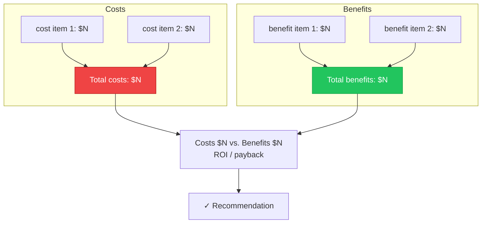
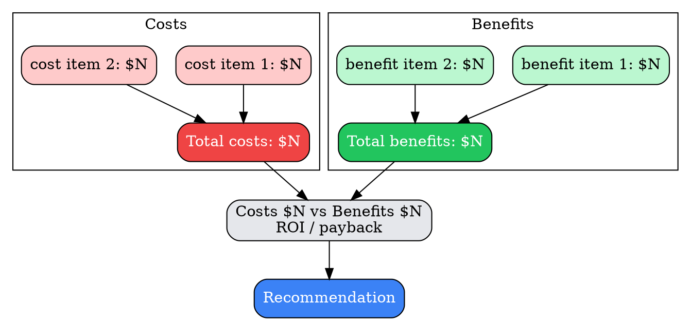
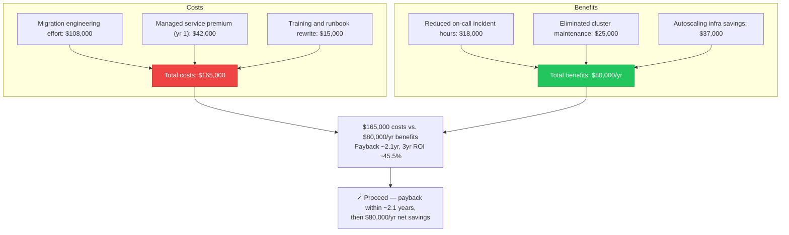
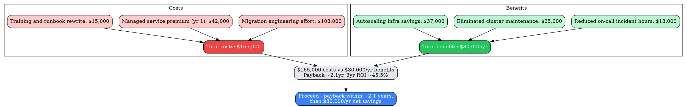

# Visual Grammar: Cost-Benefit Analysis

How to render a `costbenefit` thought as a diagram.

## Node Structure

Cost-Benefit Analysis is rendered as a **two-column balance** — costs on the left, benefits on the right, each itemized, with a bottom summary node showing the totals and derived metrics (`npv`/`roi`/`paybackPeriod`) and a final recommendation.

- **Cost column** (left) → one node per entry in `costs[]`, labeled with `item` and `amount`; a bottom node in this column sums to the cost total
- **Benefit column** (right) → one node per entry in `benefits[]`, labeled with `item` and `amount`; a bottom node in this column sums to the benefit total
- **Balance node** (center, bottom) → shows cost total vs. benefit total side by side, plus `npv`/`roi`/`paybackPeriod` when present
- **Recommendation** (bottom) → a **blue box** with the go/no-go call and the arithmetic that supports it

## Edge Semantics

- Each cost/benefit line item connects downward into its column's total node — an aggregation edge, not a causal one
- Both column totals connect into the central **Balance** node, which connects into **Recommendation** — this chain visually represents "itemized → totaled → compared → decided"

## Mermaid Template

## DOT Template

## Worked Example

Based on the RDS/Aurora migration scenario in `test/samples/costbenefit-valid.json` (costs $165,000; benefits $80,000/year):

### Mermaid

### DOT

## Special Cases

- **Always show both totals, not just the delta**: per the `think-frameworks` Output Quality Rule and this mode's prose invariant, the rendered balance must show the cost total and benefit total explicitly (not just a single "net benefit" number) so the reader can audit the underlying arithmetic.
- **`npv`/`roi`/`paybackPeriod` may be `null`**: the schema allows `null` for any of these derived metrics when they were not computed or are not meaningful for the option (e.g., a one-time cost with no recurring benefit stream); omit that line from the Balance node rather than rendering "null".
- **Column count is not fixed**: unlike `decisionmatrix`'s minimum 2×2 grid, `costbenefit` has no minimum item count per column — a single cost or single benefit line is valid and should render as a one-node column.
