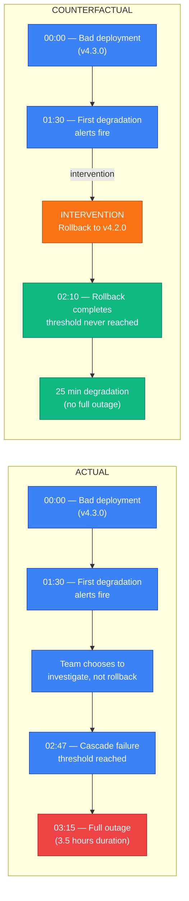
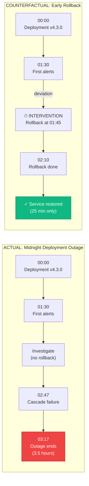

# Visual Grammar: Counterfactual

How to render a `counterfactual` thought as a diagram.

## Node Structure

Counterfactual thoughts render actual vs. hypothetical scenarios side-by-side. Structure:
- **Left column (Actual)**: Box labeled "ACTUAL" containing the real-world scenario chain
- **Right column (Counterfactual)**: Box labeled "COUNTERFACTUAL" containing the hypothetical scenario chain
- **Condition nodes** (rectangles): Each major condition or event in the causal chain
- **Intervention bracket** (red dashed bracket or arrow): Marks the point at which the counterfactual branches from actual
- **Outcome nodes** (double-border rectangles): Terminal outcomes, showing actual vs. counterfactual results
- **Divergence annotation**: Label between columns showing what changed at the branching point

Node colors:
- **Blue**: Conditions and events in common to both scenarios
- **Red**: Intervention point and subsequent changes in counterfactual
- **Green**: Outcome node showing improved/prevented result

## Edge Semantics

- **Solid arrow** (`→`) — Event progression within a scenario
- **Thick arrow** (`⟹`) — Causal consequence after intervention
- **Red dashed bracket** (`[--]`) — Intervention point; marks the single changed condition
- **Diverging arrows** — Two separate paths after intervention, showing how history splits

## Mermaid Template

## DOT Template

```dot
digraph Counterfactual {
    rankdir=LR;
    node [shape=box, style="filled"];
    
    subgraph cluster_actual {
        label="ACTUAL";
        labelloc=top;
        A1 [label="00:00 — Bad deployment\n(v4.3.0)", fillcolor="#3b82f6", fontcolor="white"];
        A2 [label="01:30 — First degradation\nalerts fire", fillcolor="#3b82f6", fontcolor="white"];
        A3 [label="Team chooses to\ninvestigate, not rollback", fillcolor="#3b82f6", fontcolor="white"];
        A4 [label="02:47 — Cascade failure\nthreshold reached", fillcolor="#3b82f6", fontcolor="white"];
        A5 [label="03:15 — Full outage\n(3.5 hours duration)", fillcolor="#ef4444", fontcolor="white"];
    }
    
    subgraph cluster_cf {
        label="COUNTERFACTUAL";
        labelloc=top;
        C1 [label="00:00 — Bad deployment\n(v4.3.0)", fillcolor="#3b82f6", fontcolor="white"];
        C2 [label="01:30 — First degradation\nalerts fire", fillcolor="#3b82f6", fontcolor="white"];
        C3 [label="INTERVENTION\nRollback to v4.2.0", fillcolor="#f97316", fontcolor="white"];
        C4 [label="02:10 — Rollback completes\nthreshold never reached", fillcolor="#10b981", fontcolor="white"];
        C5 [label="25 min degradation\n(no full outage)", fillcolor="#10b981", fontcolor="white"];
    }
    
    A1 -> A2 [color="#1e40af", penwidth=2];
    A2 -> A3 [color="#1e40af", penwidth=2];
    A3 -> A4 [color="#1e40af", penwidth=2];
    A4 -> A5 [color="#b91c1c", penwidth=3];
    
    C1 -> C2 [color="#1e40af", penwidth=2];
    C2 -> C3 [color="#c2410c", penwidth=3, label="intervention"];
    C3 -> C4 [color="#047857", penwidth=2];
    C4 -> C5 [color="#047857", penwidth=2];
}
```

## Worked Example

Based on the deployment rollback scenario from `reference/output-formats/counterfactual.md`:

### Mermaid

### DOT

```dot
digraph CounterfactualRollback {
    rankdir=LR;
    node [shape=box, style="filled"];
    
    A1 [label="00:00\nDeployment v4.3.0", fillcolor="#3b82f6", fontcolor="white"];
    A2 [label="01:30\nFirst alerts", fillcolor="#3b82f6", fontcolor="white"];
    A3 [label="Investigate\n(no rollback)", fillcolor="#3b82f6", fontcolor="white"];
    A4 [label="02:47\nCascade failure", fillcolor="#3b82f6", fontcolor="white"];
    A5 [label="03:17\nOutage ends\n(3.5 hours)", fillcolor="#ef4444", fontcolor="white"];
    
    C1 [label="00:00\nDeployment v4.3.0", fillcolor="#3b82f6", fontcolor="white"];
    C2 [label="01:30\nFirst alerts", fillcolor="#3b82f6", fontcolor="white"];
    C3 [label="⏱ INTERVENTION\nRollback at 01:45", fillcolor="#f97316", fontcolor="white"];
    C4 [label="02:10\nRollback done", fillcolor="#10b981", fontcolor="white"];
    C5 [label="✓ Service restored\n(25 min only)", fillcolor="#10b981", fontcolor="white"];
    
    A1 -> A2 [color="#1e40af", penwidth=2];
    A2 -> A3 [color="#1e40af", penwidth=2];
    A3 -> A4 [color="#1e40af", penwidth=2];
    A4 -> A5 [color="#b91c1c", penwidth=3];
    
    C1 -> C2 [color="#1e40af", penwidth=2];
    C2 -> C3 [color="#c2410c", penwidth=3, label="intervention point"];
    C3 -> C4 [color="#047857", penwidth=2];
    C4 -> C5 [color="#047857", penwidth=2];
    
    {rank=same; A1 C1}
    {rank=same; A5 C5}
}
```

## Special Cases

- **Intervention bracket**: Mark the single changed condition with a red dashed bracket `[-- --]` or a red arrow labeled "INTERVENTION" pointing to the modified condition.
- **Outcome comparison**: Render outcome nodes with thick borders and use fill color to show impact (red for actual negative outcome, green for counterfactual improved outcome).
- **Timeline annotations**: Label nodes with timestamps (e.g., "01:30 AM", "02:47 AM") to make the window of opportunity explicit.
- **Isolation principle**: Ensure only *one* condition differs between actual and counterfactual. If multiple changes occur, create separate counterfactual paths.
- **Lessons box**: Optionally add a separate box below the diagram listing key lessons or actionable conclusions extracted from the comparison.
