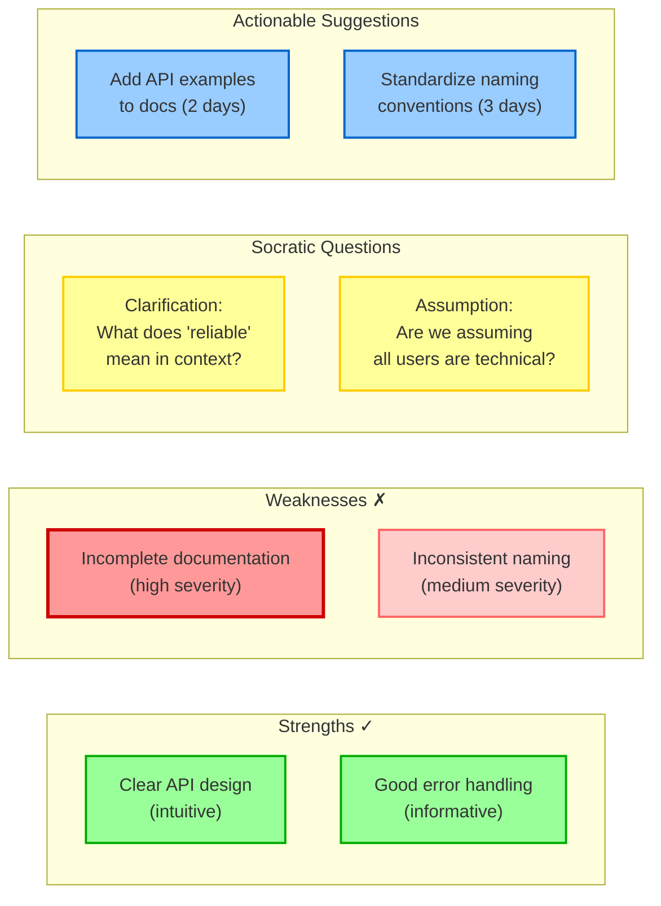
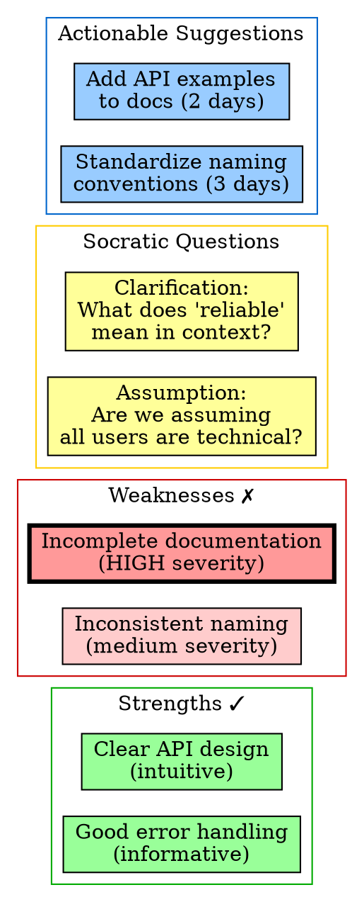
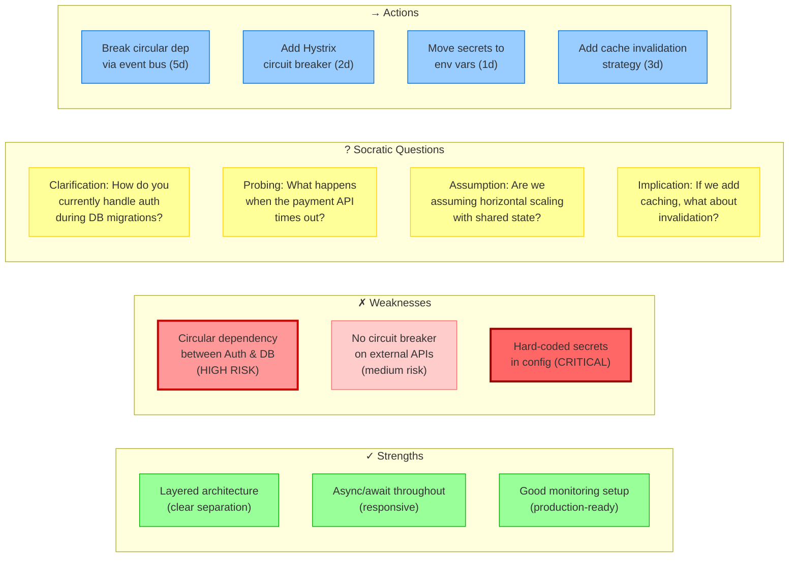
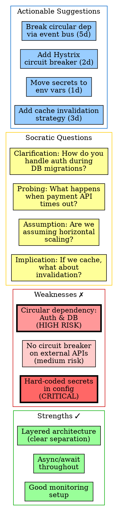

# Visual Grammar: Critique

How to render a `critique` thought as a diagram.

## Node Structure

Critique diagrams display analysis across parallel columns:
- **Strengths column** (left, green boxes): positive attributes, well-executed aspects
- **Weaknesses column** (center-left, red boxes): limitations, deficiencies, risks
- **Socratic questions column** (center-right, yellow boxes): thought-provoking questions (5 types: clarification, probing, assumption-testing, implication-exploring, perspective-taking)
- **Actionable suggestions column** (right, blue boxes): concrete improvements or next steps
- **Severity indicators** (node border color saturation): darker borders = higher impact

## Edge Semantics

- **No direct edges** between columns; instead, each finding stands independently
- **Layout via subgraphs**: Organize nodes into columnar subgraphs for visual clarity
- **Border thickness/color**: Darker or thicker borders indicate higher severity or importance

## Mermaid Template

## DOT Template

## Worked Example

Based on architecture critique from `reference/output-formats/critique.md`:

### Mermaid

### DOT

## Special Cases

- **Severity color coding**: Use deeper red for critical findings, medium red/orange for medium-severity, light red for low-severity weaknesses. Apply similar scaling to suggestions (darker blue = higher priority).
- **Linking findings to suggestions**: Though not shown as explicit edges in the base template, you can add dashed edges connecting weaknesses to their corresponding actionable suggestions for clarity.
- **Grouping by theme**: If there are many items, group them hierarchically (e.g., "Performance Weaknesses", "Security Weaknesses", "UX Strengths").
- **Confidence/priority labels**: On each finding, optionally show priority (P0/P1/P2) or confidence (high/medium/low) as a badge.
- **Timeline integration**: Actionable suggestions can include effort estimates (e.g., "2d", "1 week") to help prioritize and scope remediation.

