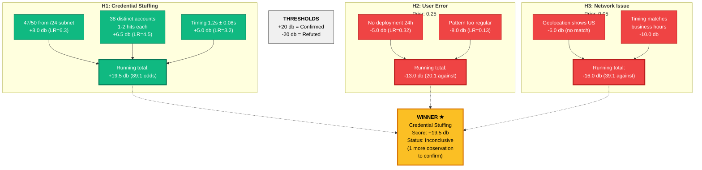
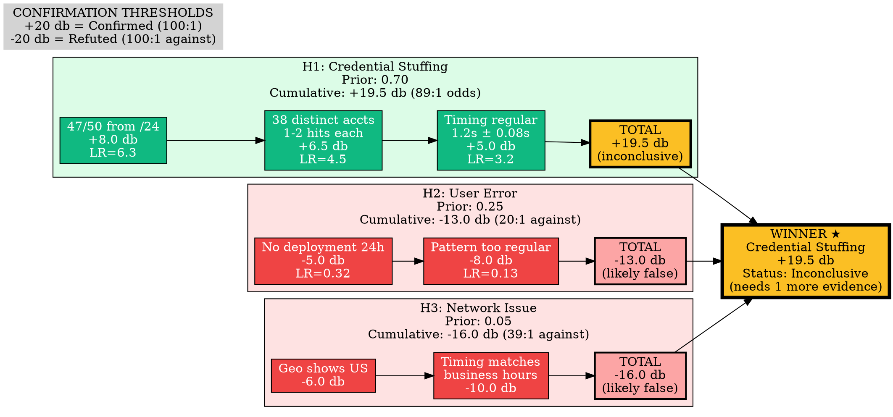
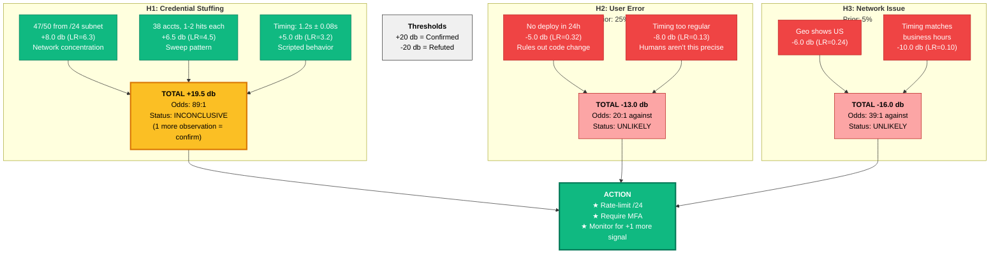
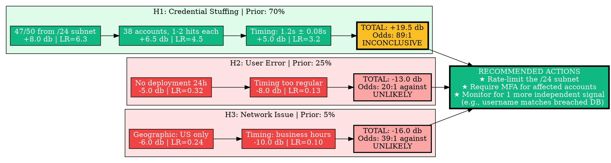

# Visual Grammar: Cryptanalytic

How to render a `cryptanalytic` thought as a diagram.

## Node Structure

Cryptanalytic diagrams use Alan Turing's deciban system to visualize hypothesis testing and evidence accumulation. Structure:
- **Hypothesis columns** (vertically stacked): One column per candidate hypothesis
- **Hypothesis header** (at top of column): Hypothesis name with prior probability
- **Cumulative deciban bars** (stacked/annotated on column): Each observation adds decibans; bar grows/shrinks as evidence accumulates
- **Evidence blocks** (horizontal rows): Each row represents one observation; label shows decibans and likelihood ratio
- **Confirmation threshold** (horizontal reference line): Typically at +20 decibans (odds 100:1 for); -20 decibans (odds 100:1 against)
- **Winner highlight** (gold/star): The hypothesis with highest cumulative decibans
- **Likelihood ratio labels** (on edges): P(evidence|hypothesis) / P(evidence|¬hypothesis)

Node colors:
- **Green**: Positive decibans (supports hypothesis)
- **Red**: Negative decibans (refutes hypothesis)
- **Blue**: Neutral decibans (0 or near-zero)
- **Gold**: Winner / confirmed hypothesis
- **Gray**: Refuted hypothesis

## Edge Semantics

- **Vertical bar/column** — Evidence accumulation for one hypothesis
- **Horizontal bar** — Evidence observation applicable to multiple hypotheses
- **Arrow label** — Decibans value (positive = supports, negative = refutes)
- **Thick border** — Binding constraint: this evidence is decisive

## Mermaid Template

## DOT Template

## Worked Example

Based on credential-stuffing vs. user-error detection from `reference/output-formats/cryptanalytic.md`:

### Mermaid

### DOT

## Special Cases

- **Deciban bar chart** (alternative visualization): Render cumulative decibans as horizontal bars for each hypothesis; bar length extends left (negative) or right (positive) from the zero-line; easier to compare totals at a glance.
- **Evidence independence**: If an observation depends on prior evidence (not independent), annotate the edge with "⚠ conditional" to signal violation of the additive assumption.
- **Likelihood ratio validation**: For complex observations, show the likelihood ratio derivation step (e.g., "P(timing|scripted) = 0.96, P(timing|human) = 0.30, LR = 3.2").
- **Prior vs. posterior**: Optionally show both the prior probability (before evidence) and posterior probability (after all evidence) for each hypothesis, displayed as pie slices or as a ratio.
- **Sensitivity analysis**: If one piece of evidence is weighted heavily, annotate it with "Critical" or show what happens if that evidence is discounted (e.g., "Without this observation, total = +11.5 db → inconclusive").
- **Multiple thought types**: Connect this diagram to prior `frequency_analysis` or `pattern_recognition` thoughts using dashed edges labeled "builds on" to show the progression of evidence gathering.
