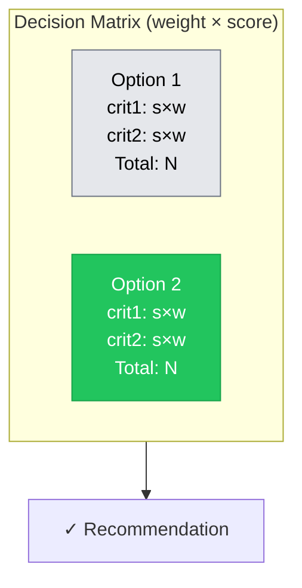
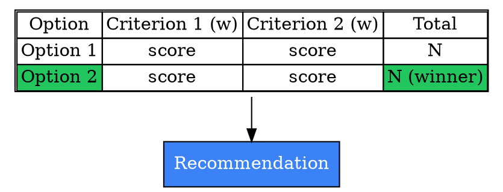
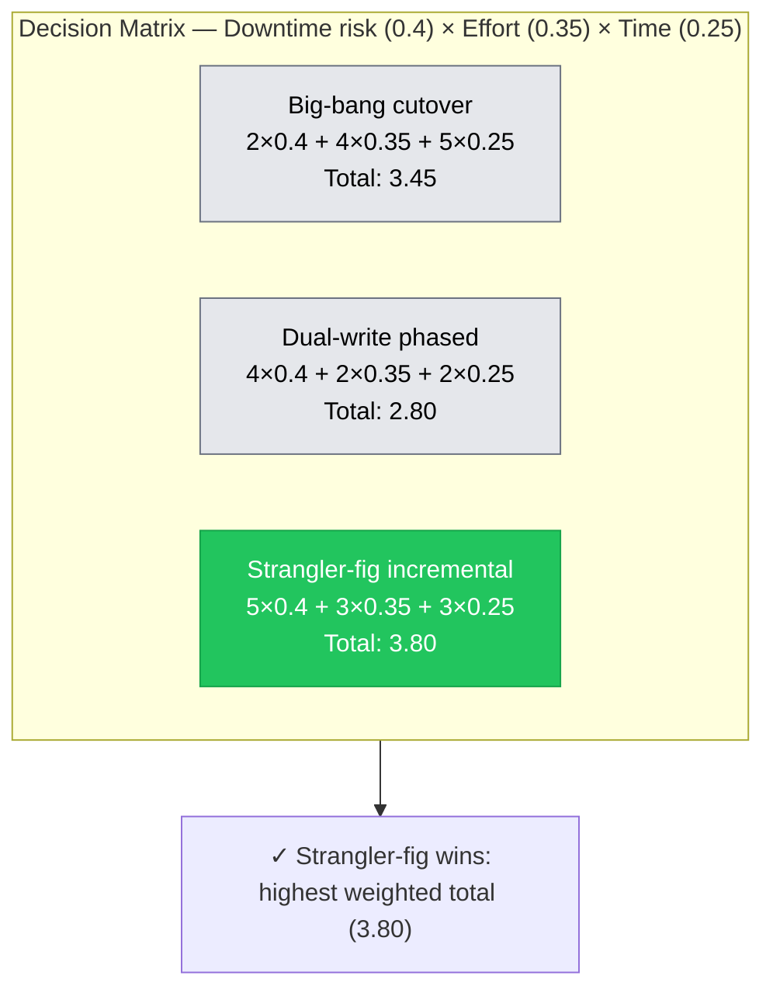
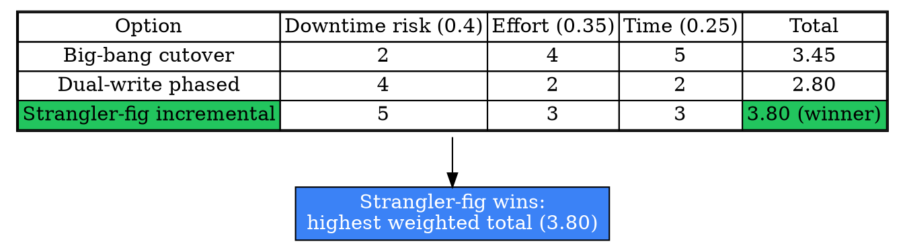

# Visual Grammar: Decision Matrix

How to render a `decisionmatrix` thought as a diagram.

## Node Structure

A Decision Matrix is rendered as a **scored grid table** — rows are `options[]`, columns are `criteria[]` (each weighted), cells are the `perCriterion` scores, and a final column shows each option's weighted `total`.

- **Header row** → one node per entry in `criteria[]`, each labeled with `name` and `weight` (e.g., "Risk of downtime (0.4)")
- **Option rows** → one row per entry in `options[]`/`scores[]`, each cell showing the raw `perCriterion[i]` score
- **Total column** → the rightmost cell of each row, showing `scores[].total` — the winning option (highest total) is highlighted
- **Recommendation** (bottom) → a **blue box** naming the chosen option and the arithmetic that supports it

## Edge Semantics

A Decision Matrix has no causal or sequential edges — it is a static scored grid, like SWOT and PESTLE. The only "edge" in the rendered diagram is an informational link from the grid into the `Recommendation` node, and (in Mermaid, which cannot natively render an HTML table inside `graph` syntax) synthetic edges connecting each option node to its total-score node to preserve the row grouping visually.

## Mermaid Template

## DOT Template

## Worked Example

Based on the database-migration scenario in `test/samples/decisionmatrix-valid.json` (criteria weights 0.4 / 0.35 / 0.25):

### Mermaid

### DOT

## Special Cases

- **Always show the arithmetic, not just the total**: Per the `think-frameworks` Output Quality Rule ("show scoring math for weighted modes"), each cell or row annotation should make `perCriterion[i] × criteria[i].weight` visible somewhere in the render — a bare `total` number without its derivation defeats the purpose of a decision matrix, which is to make the tradeoff auditable.
- **Highlighting the winner**: The option with the highest `total` gets the green highlight (`fill:#22c55e` / `bgcolor="#22c55e"`); all other options render in neutral gray — this is a ranking visualization, not a categorical one like SWOT's quadrants.
- **Minimum shape**: The schema requires `minItems: 2` on both `options` and `criteria` — the grid must always have at least a 2×2 body even in the smallest legitimate decision matrix.
