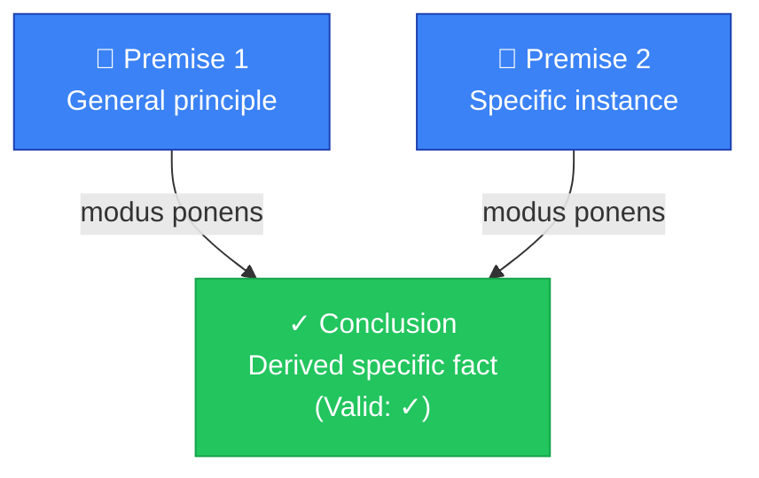
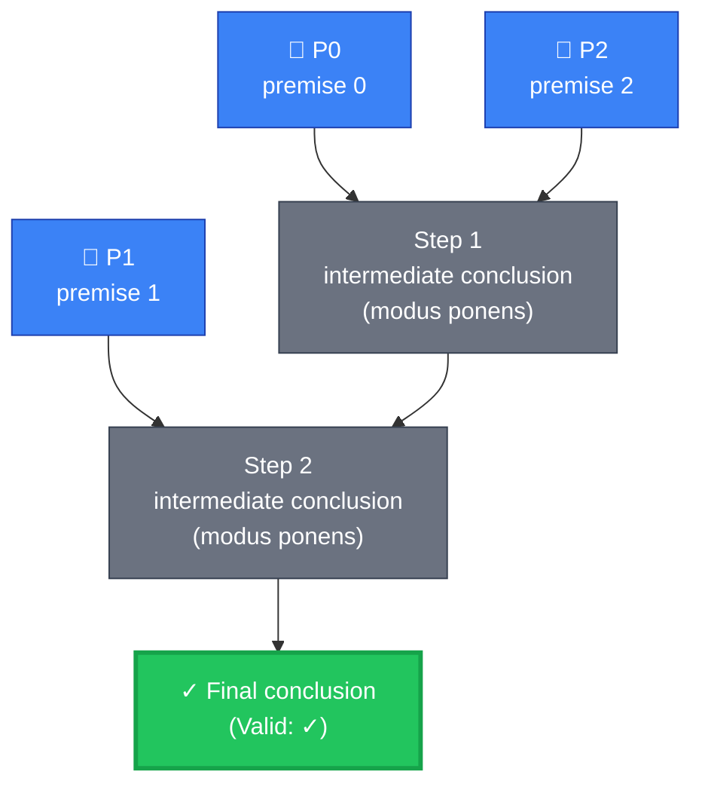
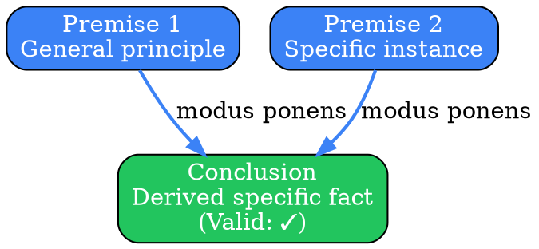
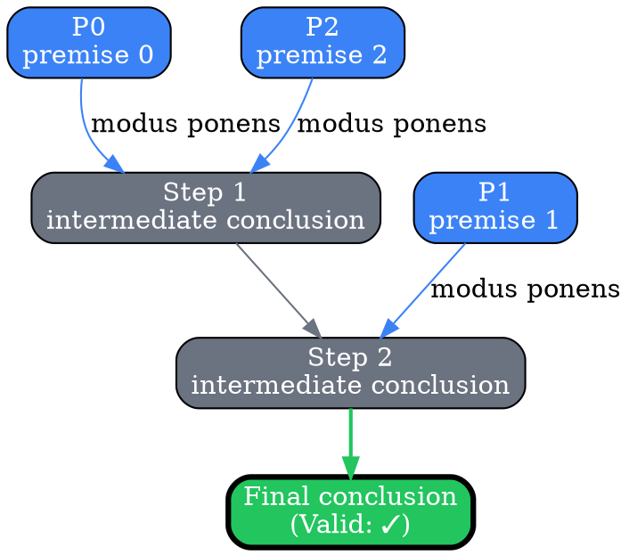
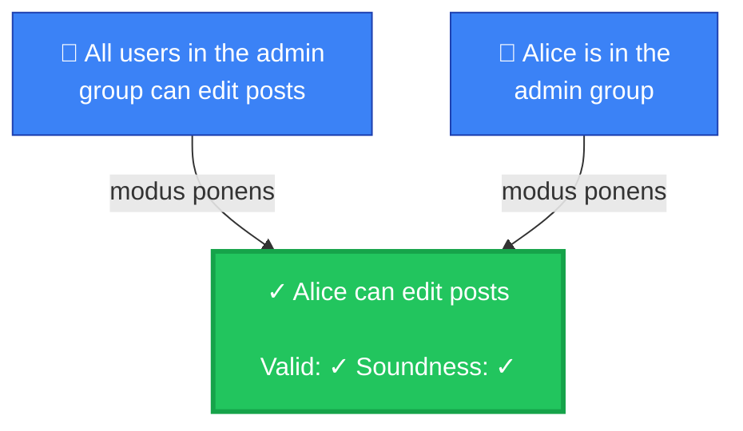
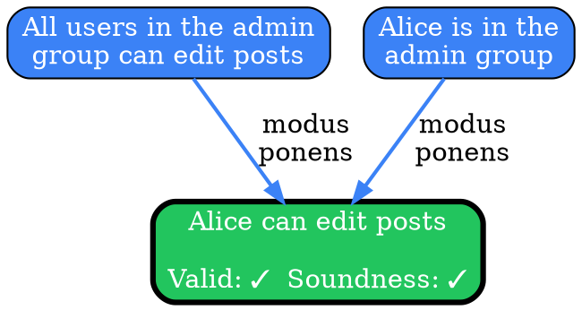
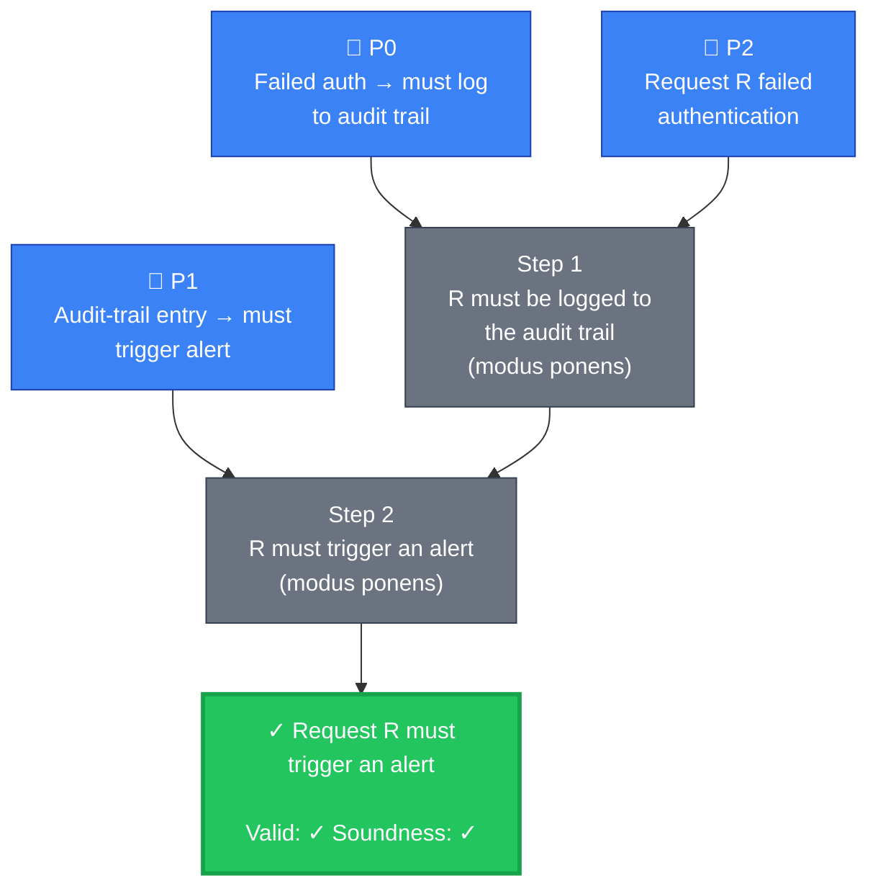

# Visual Grammar: Deductive

How to render a `deductive` thought as a diagram. The grammar has two modes depending on whether the thought carries a `derivationSteps[]` array.

## Rendering dispatch (backward compatible)

1. **If `derivationSteps` is absent, empty, or missing entirely** → render the classic single-jump pyramid (premises at top, single conclusion at bottom). This matches the pre-v0.5.2 behavior and must continue to work for all existing captured thoughts.
2. **If `derivationSteps` is a non-empty array** → render the multi-step chain (premises at top, intermediate step nodes in the middle, final conclusion at bottom). The grammar below shows both cases.

## Node Structure — single-jump (no `derivationSteps`)

Deductive reasoning moves from general premises to a specific conclusion. The diagram uses a **top-to-bottom pyramid layout**:

- **Premises** (top tier) → Rendered as **blue rectangles**, one per premise in the `premises` array
- **Logic Form** (middle) → Label on the connecting edge (e.g., "modus ponens", "modus tollens", "syllogism")
- **Conclusion** (bottom) → **Green pill/stadium shape** if `validityCheck` is true; **red pill** if `validityCheck` is false
- **Validity/Soundness badges** → Small labels or badges near the conclusion showing the check results

## Node Structure — multi-step (with `derivationSteps`)

When `derivationSteps[]` is populated, use a **top-to-bottom layered flow**:

- **Premises tier** (top) → Blue rectangles as before, one per entry in `premises`. Label each with its 0-indexed position (`P0`, `P1`, `P2`, ...) so step nodes can reference them clearly.
- **Step tier** (middle, one row per step) → **Gray rectangles** labeled `Step N: <intermediateConclusion>` with the `inferenceRule` annotated. Each step node has incoming edges from the premises listed in its `premisesUsed[]` and from the prior step nodes listed in its `stepsUsed[]`.
- **Final conclusion tier** (bottom) → **Green pill/stadium shape** (or red if invalid) containing the top-level `conclusion`. The final step in `derivationSteps[]` should have an edge pointing down to it; if the final step's `intermediateConclusion` exactly matches the top-level `conclusion`, the two may be merged into a single green node to avoid visual duplication.

Color encoding for the final conclusion:
- Green (`#22c55e`) if `validityCheck == true`
- Red (`#ef4444`) if `validityCheck == false`
- Orange (`#f59e0b`) border if `validityCheck == true` but `soundnessCheck == false`

Intermediate step nodes are always neutral gray (`#6b7280`) regardless of validity — the validity flag applies to the whole chain, not individual steps.

## Edge Semantics

- **Solid arrow** (`→`) from a premise or step to the next step — represents the inference flow
- **Edge labels** — show the `inferenceRule` for the step the edge feeds into (e.g., `modus ponens`, `modus tollens`)
- **All premises converge** — all premises used by a step draw edges to that step's node; their labels should agree on the same inference rule

## Mermaid Template — single-jump (no `derivationSteps`)

## Mermaid Template — multi-step (with `derivationSteps`)

## DOT Template — single-jump (no `derivationSteps`)

## DOT Template — multi-step (with `derivationSteps`)

## Worked Example — single-jump

Based on the Alice admin example (single modus ponens):

### Mermaid

### DOT

## Worked Example — multi-step

Based on the "Request R must trigger an alert" repeated-modus-ponens example (the current sample in `test/samples/deductive-valid.json`):

### Mermaid

## Special Cases

- **Invalid deduction**: If `validityCheck == false`, render the final conclusion in **red** (`#ef4444`) with a thick red border and dashed edges from the preceding step(s) to indicate the logical chain is broken.
- **Unsound but valid**: If `validityCheck == true` but `soundnessCheck == false`, render the final conclusion with a **yellow/orange border** (`#f59e0b`) to indicate the form is correct but one or more premises are not actually true in the real world.
- **Mixed inference rules in a chain**: Each step's edge labels should reflect that step's own `inferenceRule`. A chain can mix modus ponens and modus tollens freely.
- **Premise contradiction**: If premises are logically inconsistent, add a red `⚠️ Contradiction` node pointing to both conflicting premises, indicating the deduction is unsalvageable.
- **`derivationSteps` present but empty**: treat as absent; fall back to single-jump rendering.
- **Final step's `intermediateConclusion` matches top-level `conclusion`**: you may merge the final step and final conclusion into a single green node to avoid visual duplication. Label it as "Step N / Final Conclusion" or just the conclusion text.
