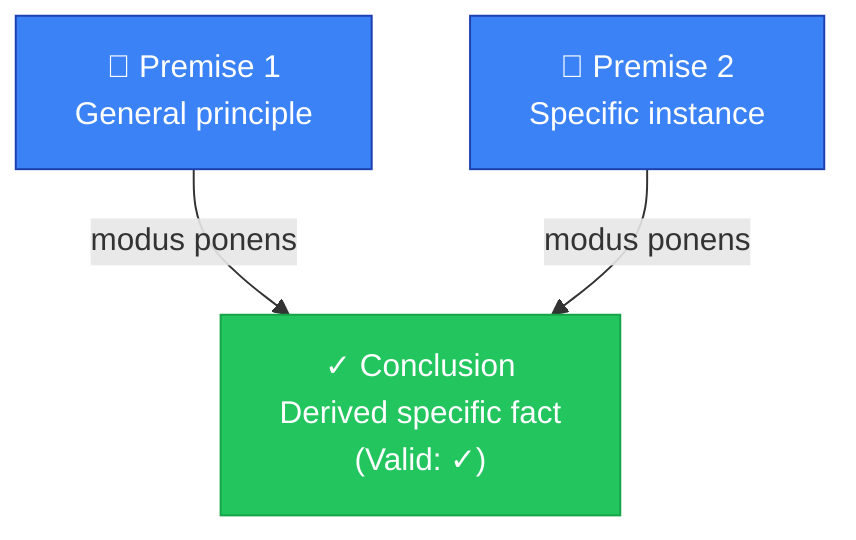
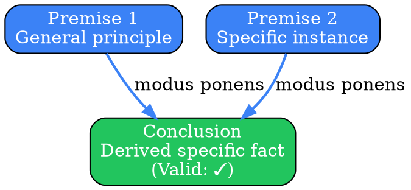
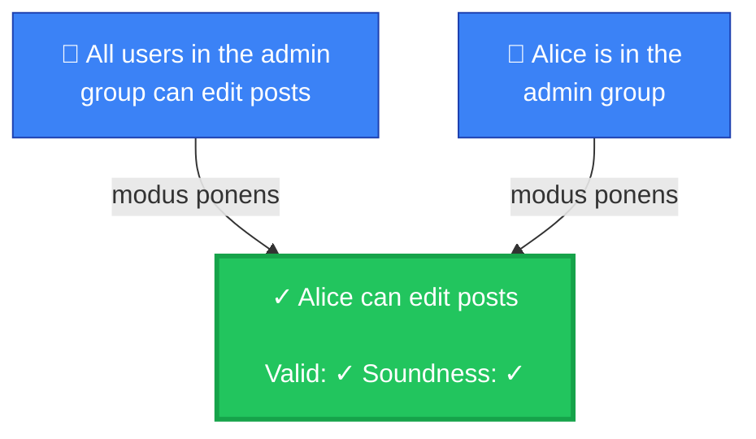
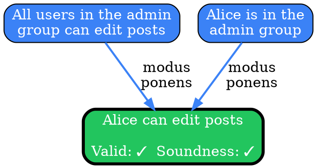

# Visual Grammar: Deductive

How to render a `deductive` thought as a diagram.

## Node Structure

Deductive reasoning moves from general premises to a specific conclusion. The diagram uses a **top-to-bottom pyramid layout**:

- **Premises** (top tier) → Rendered as **blue rectangles**, one per premise in the `premises` array
- **Logic Form** (middle) → Label on the connecting edge (e.g., "modus ponens", "modus tollens", "syllogism")
- **Conclusion** (bottom) → **Green pill/stadium shape** if `validityCheck` is true; **red pill** if `validityCheck` is false
- **Validity/Soundness badges** → Small labels or badges near the conclusion showing the check results

Color encoding for conclusion:
- Green (`#22c55e`) if `validityCheck == true`
- Red (`#ef4444`) if `validityCheck == false`
- Orange (`#f59e0b`) if `soundnessCheck == false` (premises may be false)

## Edge Semantics

- **Solid arrow** (`→`) — Premise feeds into the logical inference; all premises converge to a single conclusion arrow
- **Labeled edge** — The `logicForm` (e.g., "modus ponens") is displayed on the edge connecting premises to conclusion

## Mermaid Template

## DOT Template

## Worked Example

Based on the Alice admin example from `reference/output-formats/deductive.md`:

### Mermaid

### DOT

## Special Cases

- **Invalid deduction**: If `validityCheck == false`, render the conclusion in **red** (`#ef4444`) with a thick red border and dashed edges from premises to indicate the logical chain is broken.

- **Unsound but valid**: If `validityCheck == true` but `soundnessCheck == false`, render the conclusion with a **yellow/orange border** (`#f59e0b`) to indicate the form is correct but one or more premises are not actually true in the real world.

- **Multiple logic forms**: If the reasoning applies multiple inference rules (e.g., chained modus ponens), show each intermediate step or label the edge with all applicable forms.

- **Premise contradiction**: If premises are logically inconsistent, add a red `⚠️ Contradiction` node pointing to both conflicting premises, indicating the deduction is unsalvageable.

