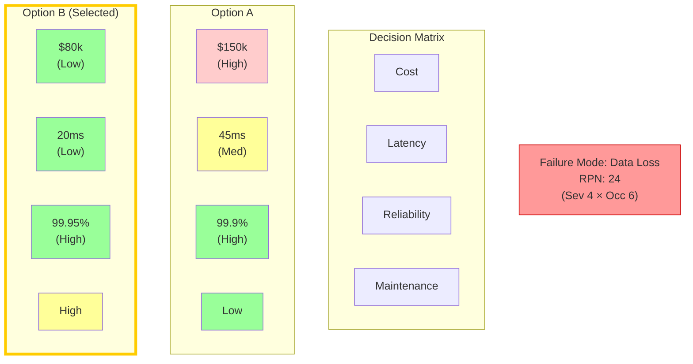
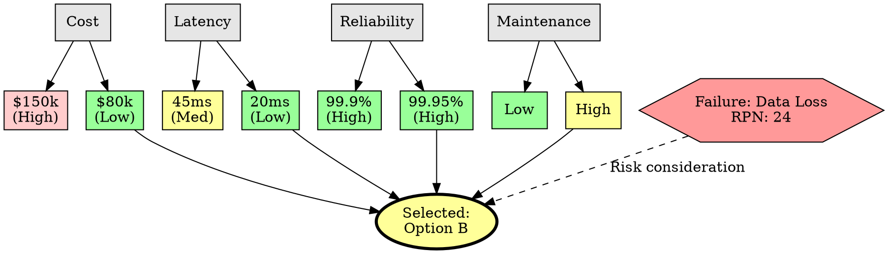
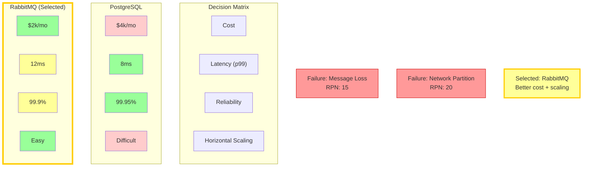
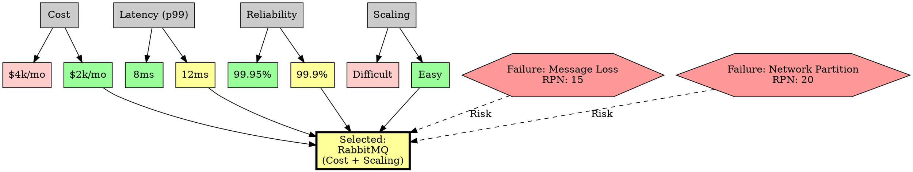

# Visual Grammar: Engineering

How to render an `engineering` thought as a diagram.

## Node Structure

Engineering decision matrices are rendered as grids or tables with colored cells:
- **Criteria row headers** (left column): evaluation dimensions (cost, latency, reliability, etc.)
- **Alternative columns** (top row): options being compared (Database A, Message Queue B, etc.)
- **Score cells** (grid interior): numerical or categorical scores, shaded by intensity
  - **Green** (dark green to light green): high scores, favorable
  - **Red** (dark red to light red): low scores, unfavorable
  - **Yellow/Orange**: medium scores
- **Winner column** (highlighted with gold/bold border): the selected alternative
- **FMEA failure modes** (separate section as hexagons): high-risk failure scenarios with RPN (Risk Priority Number)

## Edge Semantics

- **Cell shading intensity** — Score magnitude: darker = more extreme (very good or very bad)
- **Border highlight** (gold, thick) — Decision winner: the chosen alternative
- **Hexagon with RPN label** — Failure mode severity: hexagon size can scale with RPN value

## Mermaid Template

## DOT Template

## Worked Example

Based on the Database vs Message Queue trade study from `reference/output-formats/engineering.md`:

### Mermaid

### DOT

## Special Cases

- **Weighted criteria**: If some criteria are more important, annotate the row header with a weight factor (e.g., "Cost (weight 2x)").
- **FMEA table**: Draw a separate section below the decision matrix with failure modes as hexagons, labeled with severity (1-10), occurrence (1-10), and RPN = S × O.
- **Tiebreaker**: When scores are equal, highlight the decision criteria that broke the tie.
- **Trade-off annotations**: Use callout boxes to note key trade-offs (e.g., "chose Option B for 50% cost savings at 10% latency increase").
- **Risk mitigation**: Dashed lines from FMEA failure modes to the selected alternative, labeled with mitigation strategies.

