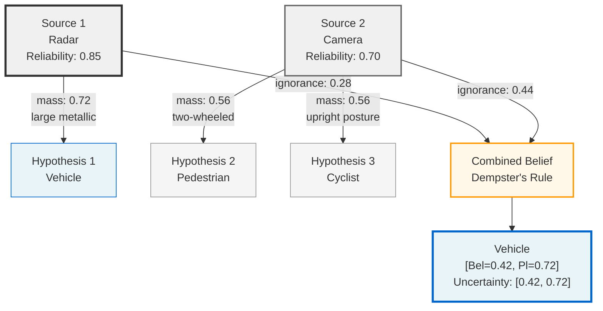
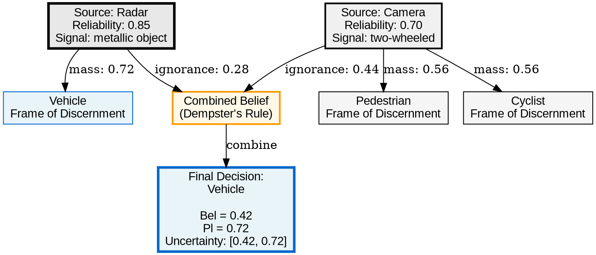
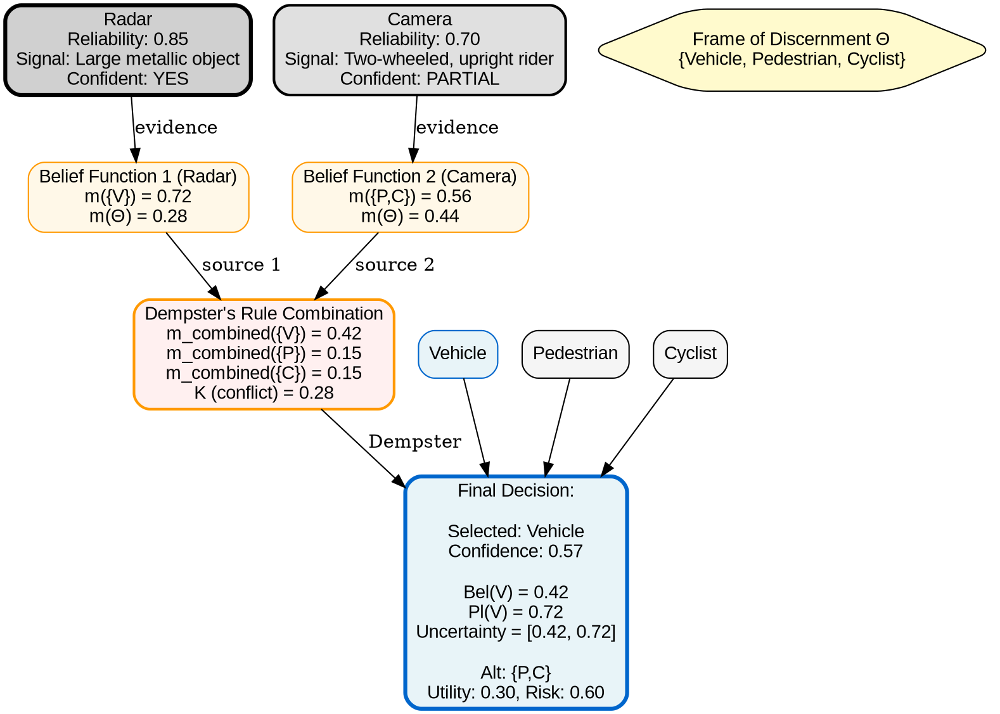

# Visual Grammar: Evidential

How to render an `evidential` thought as a diagram.

## Node Structure

- **Sources** → Rectangles at top (reliability shown as border thickness: thicker = higher reliability, or labeled `Reliability: 0.85`)
- **Hypotheses** → Rectangles in main area (color by type: main = blue, alternatives = gray)
- **Mass assignments** → Labeled edges from sources to hypothesis sets showing `mass: 0.XX`
- **Belief/Plausibility intervals** → Annotated nodes showing `[Bel=0.42, Pl=0.72]` or as overlaid labels
- **Conflict nodes** → Red dashed boxes when sources disagree strongly

## Edge Semantics

- **Mass assignment** → Solid arrow from source evidence to hypothesis set with label `mass: 0.56` and justification in subscript
- **Support** → Green arrow labeled "supports" connecting evidence to hypothesis
- **Contradiction** → Red dashed arrow labeled "contradicts" showing source disagreement
- **Combination** → Thick bold arrow toward final combined belief showing Dempster's rule result

## Mermaid Template



## DOT Template



## Worked Example

Input: "Radar says Vehicle. Camera says Cyclist or Pedestrian. What does the object most likely be?" (from evidential.md)

**Mermaid:**
```mermaid
graph TD
  S1["📡 Source 1: Radar<br/>Type: sensor<br/>Reliability: 0.85<br/>Signal: Large metallic"]
  S2["📷 Source 2: Camera<br/>Type: sensor<br/>Reliability: 0.70<br/>Signal: Two-wheeled+upright"]
  
  FRAME["Frame of Discernment<br/>{Vehicle, Pedestrian, Cyclist}"]
  
  H1["Vehicle"]
  H2["Pedestrian"]
  H3["Cyclist"]
  
  BF1["Belief Function 1<br/>Source: Radar"]
  BF2["Belief Function 2<br/>Source: Camera"]
  
  COMB["Combined Belief<br/>Dempster's Rule<br/>Conflict mass K=?"]
  
  DECISION["Decision:<br/>Vehicle<br/>Confidence: 0.57<br/>Belief = 0.42<br/>Plausibility = 0.72<br/>Uncertainty: [0.42, 0.72]"]
  
  S1 --> BF1
  S2 --> BF2
  
  BF1 -->|m1({Vehicle}) = 0.72<br/>justification: radar reliability| H1
  BF1 -->|m1(Θ) = 0.28<br/>residual ignorance| FRAME
  
  BF2 -->|m2({Pedestrian,Cyclist}) = 0.56<br/>justification: camera confidence| H2
  BF2 -->|m2({Pedestrian,Cyclist}) = 0.56| H3
  BF2 -->|m2(Θ) = 0.44<br/>residual ignorance| FRAME
  
  FRAME --> COMB
  H1 --> COMB
  H2 --> COMB
  H3 --> COMB
  
  COMB -->|all sources combined| DECISION
  
  style S1 fill:#e8e8e8,stroke:#333,stroke-width:3px
  style S2 fill:#f0f0f0,stroke:#666,stroke-width:2px
  style H1 fill:#e8f4f8,stroke:#0066cc,stroke-width:2px
  style H2 fill:#f5f5f5,stroke:#999
  style H3 fill:#f5f5f5,stroke:#999
  style BF1 fill:#fffacd,stroke:#ff9900
  style BF2 fill:#fffacd,stroke:#ff9900
  style COMB fill:#fff8e8,stroke:#ff9900,stroke-width:2px
  style DECISION fill:#e8f4f8,stroke:#0066cc,stroke-width:3px
```

**DOT:**


## Special Cases

- **High conflict mass** → Show red dashed box around COMB node with `K > 0.5` label; add warning annotation "⚠ High disagreement between sources"
- **Ignorance mass** → Show as edge to frame Θ with `m(Θ) = 0.XX` label; high ignorance means evidence hasn't resolved much
- **Uncertainty intervals** → Display as bracket notations on hypothesis nodes: `[Bel, Pl]` or as separate interval nodes positioned below; narrow intervals = well-resolved
- **Sequential combination** → Chain belief functions left-to-right; show intermediate combined belief after each source is added
