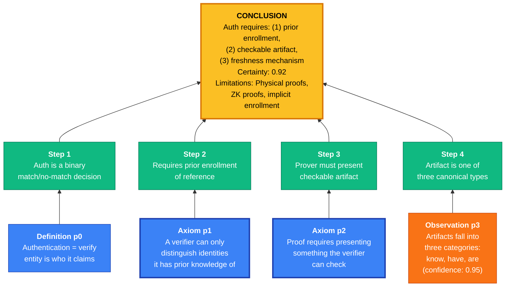
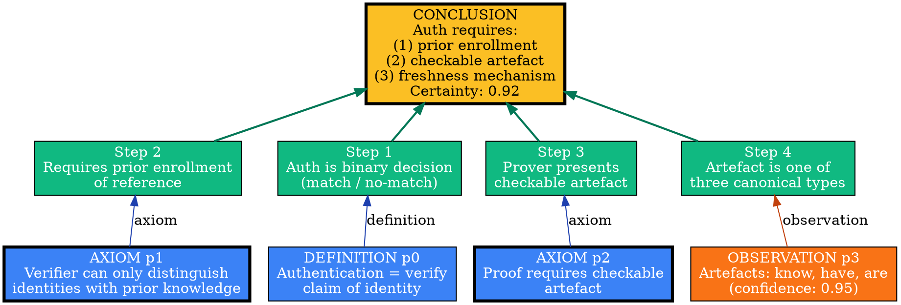
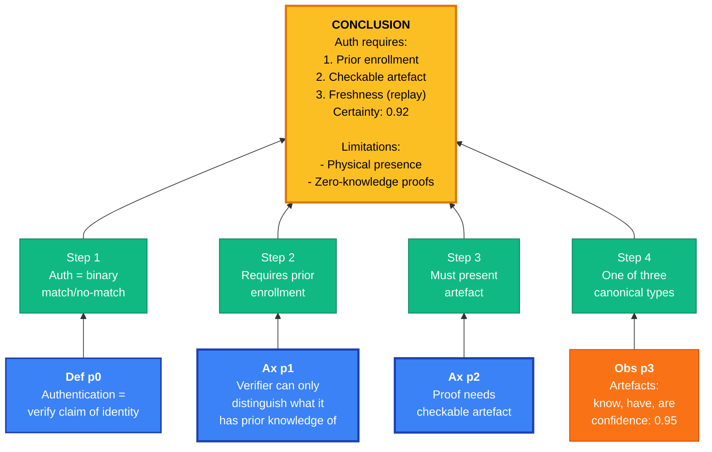
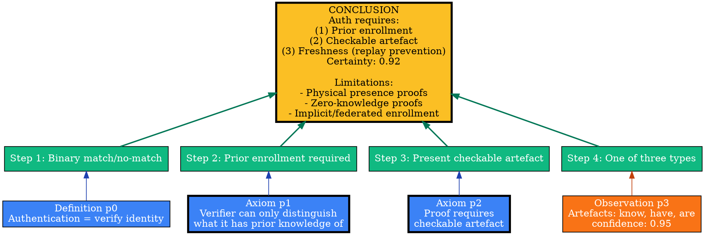

# Visual Grammar: First Principles

How to render a `firstprinciples` thought as a diagram.

## Node Structure

First principles diagrams show a tree of reasoning from foundational axioms and definitions upward to a conclusion. Structure:
- **Principle nodes** (bottom row): Leaf nodes representing axioms, definitions, observations, and assumptions
  - **Axioms** (double-border rectangles): Self-evident, need no justification
  - **Definitions** (rounded rectangles): Agreed meanings
  - **Observations** (plain rectangles): Empirical facts; labeled with confidence (0-1)
  - **Assumptions** (dashed rectangles): Contextual claims; labeled with confidence (0-1)
- **Derivation nodes** (middle rows): Intermediate inference steps building upward
- **Conclusion node** (top): Final derived statement with certainty score and limitations
- **Dependency edges** (labeled arrows): Show logical flow and inference type

Node colors:
- **Blue**: Principle nodes (foundational)
- **Green**: Derivation nodes (intermediate inferences)
- **Gold/Yellow**: Conclusion node (final derived statement)
- **Red**: Assumptions or low-confidence observations requiring caution

## Edge Semantics

- **Solid arrow** (`→`) — Direct logical inference from principle(s)
- **Thick solid arrow** (`⟹`) — Strong inference (high confidence)
- **Dashed arrow** (`⇢`) — Weak inference (requires assumption or has low confidence)
- **Curved arrow** — Indirect reference; principle is cited but not directly applied
- **Edge label** — Inference rule or reasoning type (e.g., "modus ponens", "universal instantiation")

## Mermaid Template

## DOT Template

## Worked Example

Based on "What does authentication actually require?" from `reference/output-formats/firstprinciples.md`:

### Mermaid

### DOT

## Special Cases

- **Axiom indicators**: Render axioms with a double border (`penwidth=3`) or special styling (bold text) to signal unquestionable foundations.
- **Confidence annotations**: For observations and assumptions, include the confidence score (0-1) as a label on the node; color-code low-confidence nodes in red or orange to flag risky foundations.
- **Derivation rule labels**: On edges, annotate the inference rule used (e.g., "modus ponens", "universal instantiation", "definition", "axiom").
- **Certainty propagation**: The conclusion's certainty should not exceed the minimum confidence of any cited principle. Optionally highlight this with color fading if a low-confidence principle is involved.
- **Alternative interpretations**: If multiple valid readings of the same principles exist, show them as separate branches from a shared set of principles, with different conclusions drawn.
- **Limitations box**: Always include a "Limitations" or "Scope" section in the conclusion node, explicitly stating edge cases and conditions under which the derivation may not hold.
