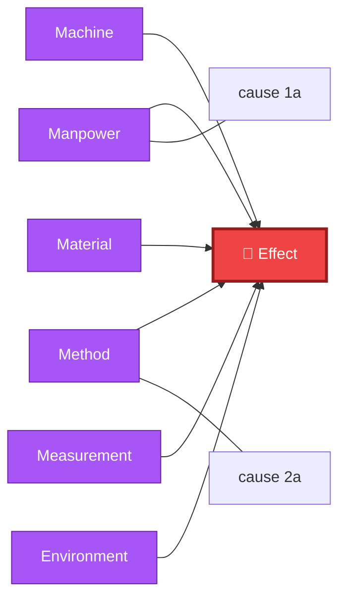
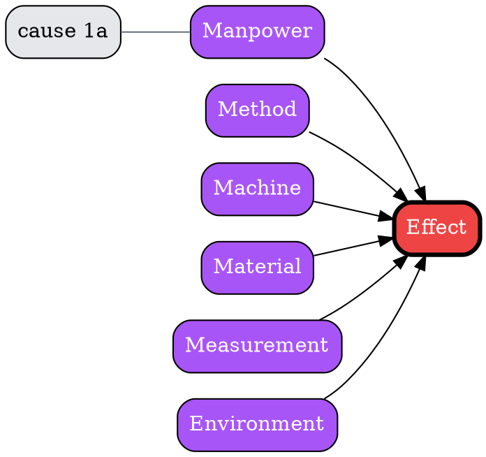
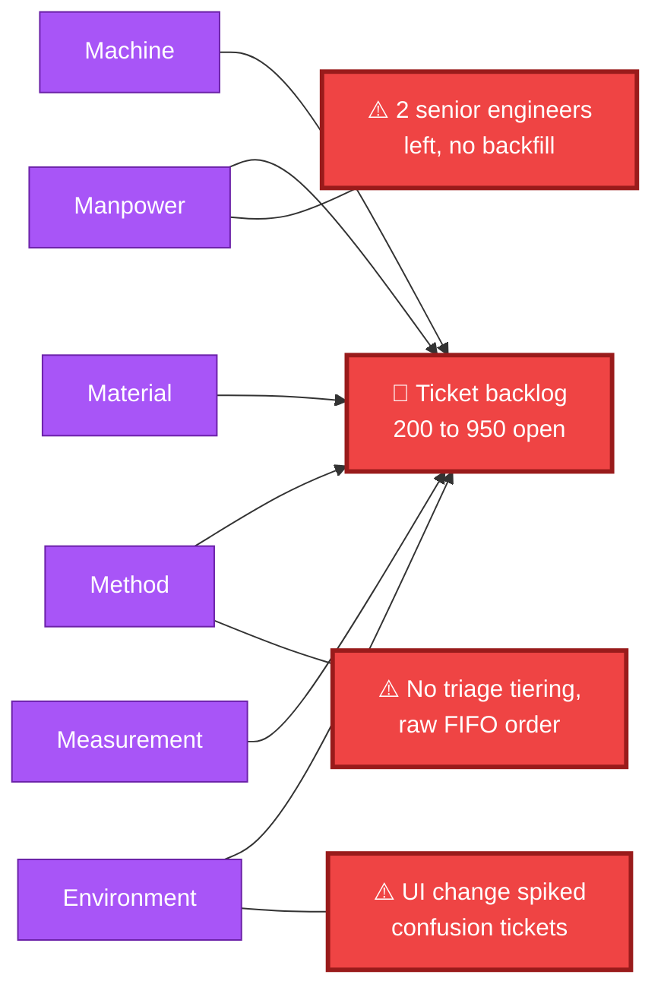
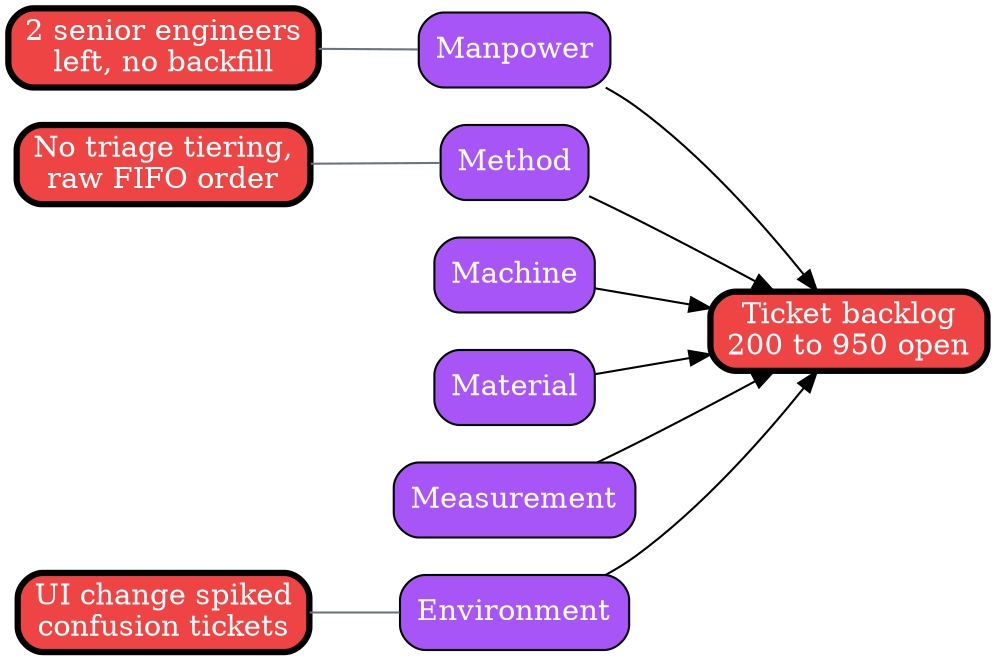

# Visual Grammar: Fishbone (Ishikawa)

How to render a `fishbone` thought as a diagram.

## Node Structure

Fishbone (Ishikawa) diagrams render cause analysis as a **fish skeleton**: a horizontal spine leading to the effect (the fish head), with category "ribs" branching off the spine.

- **Effect** (right end of spine) → A **red rectangle**, the fish's head, containing the `effect` text
- **Category ribs** (branching off the spine) → **purple rectangles**, one per entry in `categories[]`, labeled with `name` (e.g., Manpower, Method, Machine, Material, Measurement, Environment — the "6Ms" — or any domain-specific category set)
- **Cause leaves** (attached to each rib) → **gray small boxes**, one per entry in that category's `causes[]` array, listed under/beside their rib
- **Primary causes** (optional highlight) → Any cause node whose text also appears in the top-level `primaryCauses[]` array is rendered with a **thick red border** to flag it as a priority driver, regardless of which category rib it hangs from

## Edge Semantics

- **Solid purple arrow** — each category rib points toward the spine/effect, mirroring the classic fishbone diagonal-rib layout
- **Thin gray line** — connects each cause leaf to its parent category rib (not a directional arrow — causes are enumerated members of a category, not a causal sequence)
- **Thick red border** (not an edge — a node style) — flags a cause that also appears in `primaryCauses[]`

## Mermaid Template

## DOT Template

## Worked Example

Based on the support-backlog scenario in `test/samples/fishbone-valid.json`:

### Mermaid

### DOT

## Special Cases

- **Fewer than 6 categories**: The schema requires `minItems: 1` on `categories[]`. Render only the ribs actually present — do not pad to the classic 6Ms if the analysis legitimately used fewer categories (e.g., a 4M software-focused variant: Method, Machine, Material, Manpower).
- **`primaryCauses[]` cross-reference**: Match by exact string equality against entries in each category's `causes[]`. A cause that appears in `primaryCauses[]` gets the thick red border regardless of which rib it hangs from — this is the primary visual signal for "where to focus first."
- **When to use `fivewhys` instead**: If there is really only one linear chain of causation rather than independent categories, prefer `fivewhys` — fishbone is for cause analysis that genuinely branches across multiple categories.
