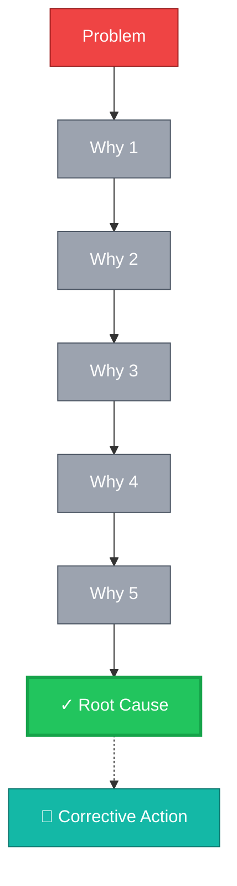
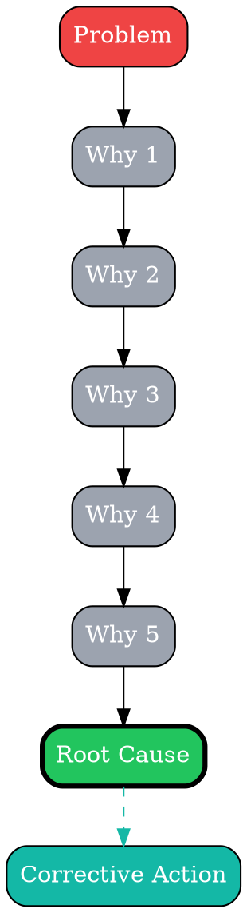
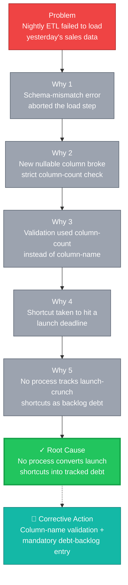
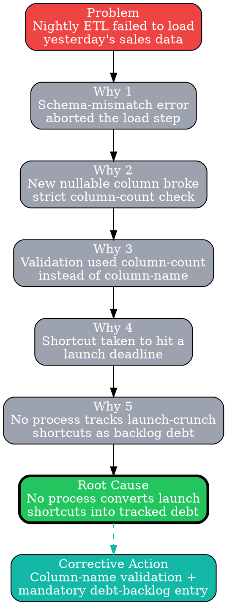

# Visual Grammar: 5 Whys

How to render a `fivewhys` thought as a diagram.

## Node Structure

5 Whys is a **vertical drill-down chain** from a symptom to a single root cause:

- **Problem** (top) → A **red rectangle** stating the observed problem
- **Why 1 … Why N** (middle tiers) → **neutral gray rectangles**, one per entry in `whys[]`, each labeled with its `question` (short form) and `answer`
- **Root Cause** (bottom) → A **green pill/stadium shape** containing `rootCause`
- **Corrective Action** (optional side node) → A **teal box** connected to Root Cause with a dashed edge, present only if `correctiveAction` is populated

The chain length equals `whys.length` — classically 5, but the schema allows any `minItems: 1` count; render exactly as many why-tiers as are present in the sample.

## Edge Semantics

- **Solid gray arrow** (`→`) chains Problem → Why 1 → Why 2 → ... → Why N → Root Cause — each arrow represents "which led to asking"
- **Dashed teal arrow** from Root Cause to Corrective Action — the action addresses the cause, it doesn't cause it

## Mermaid Template

## DOT Template

## Worked Example

Based on the ETL-failure scenario in `test/samples/fivewhys-valid.json`:

### Mermaid

### DOT

## Special Cases

- **Fewer or more than 5 whys**: The schema only requires `minItems: 1`. Render exactly `whys.length` tiers — do not pad to 5 or truncate beyond 5.
- **When to use `fishbone` instead**: If the drill-down reveals multiple independent contributing categories rather than one linear chain, prefer `fishbone` — 5 Whys assumes a single linear causal chain to one root cause.
- **Missing `correctiveAction`**: Omit the `CA` node entirely rather than rendering an empty box.
