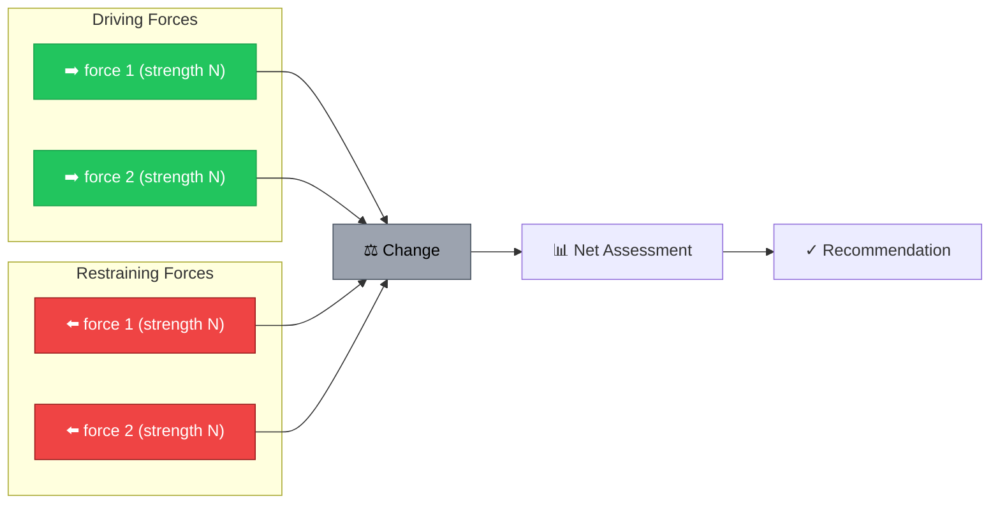
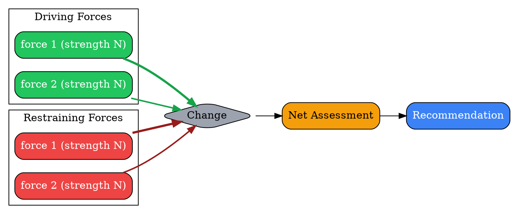
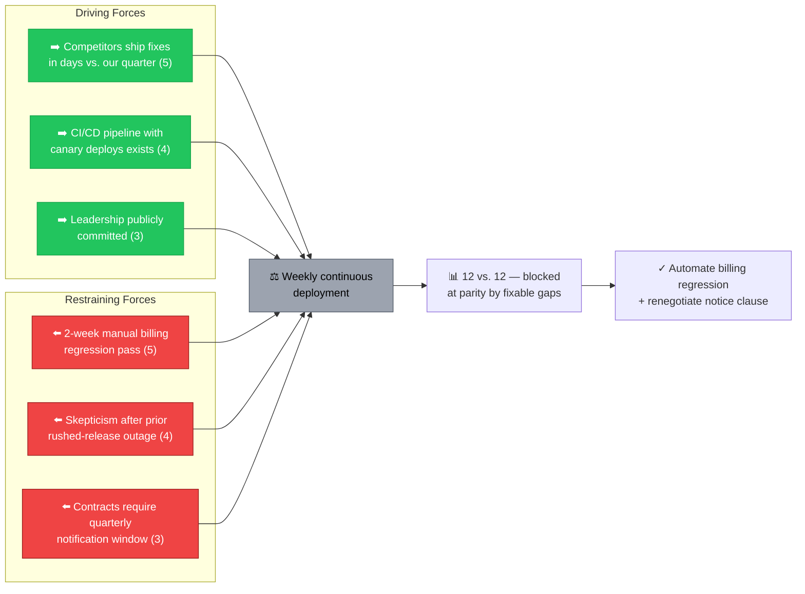
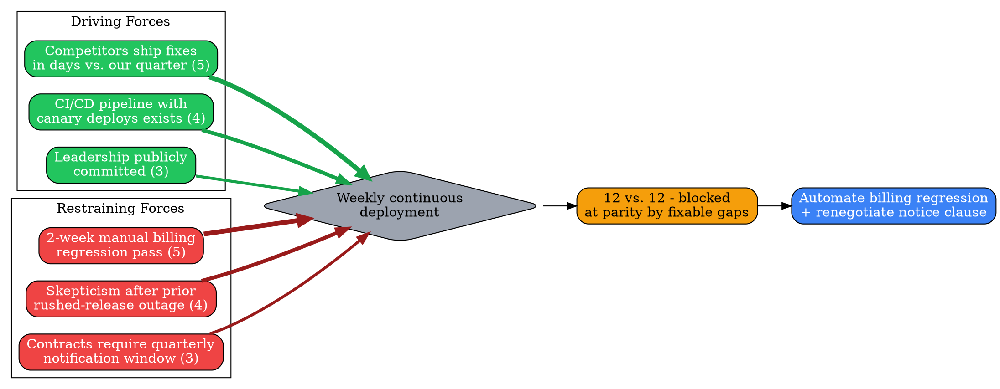

# Visual Grammar: Force Field Analysis

How to render a `forcefield` thought as a diagram.

## Node Structure

Force Field Analysis is rendered as **opposing horizontal arrows pushing toward a center line** representing the proposed `change` — driving forces push from the left, restraining forces push from the right.

- **Change** (center line/node) → a **gray vertical bar or box**, the fulcrum both force sets push against
- **Driving forces** (left side, pushing right toward the change) → **green arrows**, one per entry in `drivingForces[]`, each labeled with `force` text and sized/annotated by `strength` (1-5)
- **Restraining forces** (right side, pushing left against the change) → **red arrows**, one per entry in `restrainingForces[]`, each labeled with `force` text and sized/annotated by `strength` (1-5)
- **Net Assessment** (optional, below the diagram) → a **gold box** summarizing which side currently dominates
- **Recommendation** (optional, bottom) → a **blue box** with the action to shift the balance

## Edge Semantics

- **Thick green arrow pointing right** — a driving force; arrow thickness/weight should scale with `strength` (1 = thin, 5 = thick) so the diagram visually communicates which forces matter most, not just which exist
- **Thick red arrow pointing left** — a restraining force; same strength-to-thickness scaling
- Both arrow sets terminate at the central `Change` node — this is the one place the grammar deviates from a typical top-down/left-right flow graph, since the visual point of Force Field Analysis is the head-on opposition, not a directed pipeline

## Mermaid Template

## DOT Template

## Worked Example

Based on the continuous-deployment scenario in `test/samples/forcefield-valid.json`:

### Mermaid

### DOT

## Special Cases

- **Strength-to-thickness mapping**: Use `penwidth` (DOT) or a visual weight cue in the node label (Mermaid, which lacks per-edge thickness styling in the plain flowchart syntax) equal to the `strength` integer (1-5) so viewers can see which forces dominate at a glance, not just count them.
- **Tied totals**: When the sum of driving strengths equals the sum of restraining strengths (as in the worked example: 12 vs. 12), the diagram should still render both sides fully — a tie is a legitimate, informative outcome ("blocked by addressable gaps," not "no forces exist") and must not be visually collapsed or hidden.
- **Missing `netAssessment`/`recommendation`**: Both are optional in the schema; omit the `Net`/`Rec` nodes entirely rather than rendering them empty if absent from the thought.
