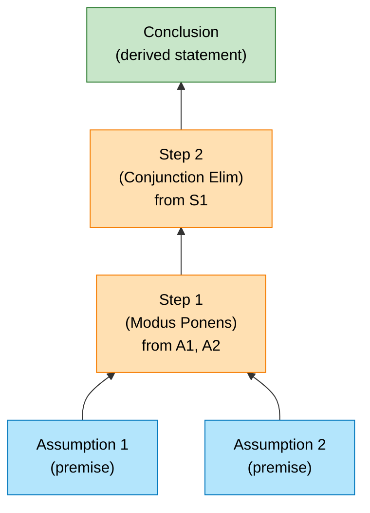
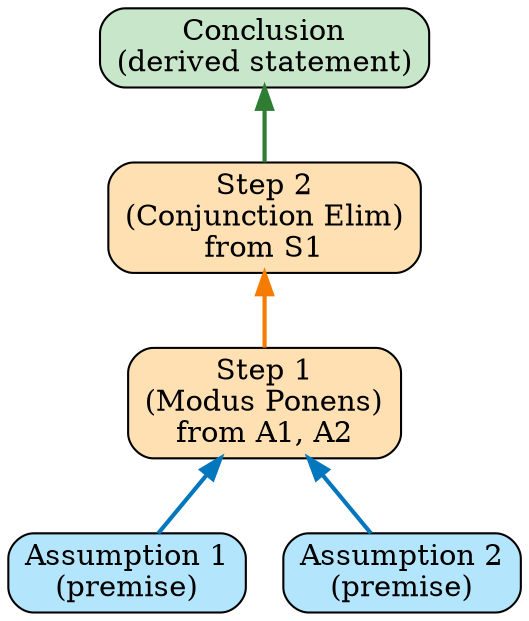
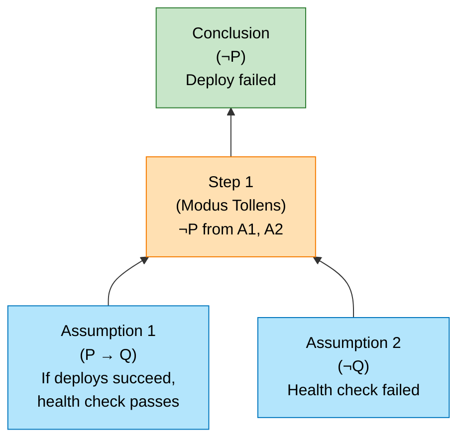
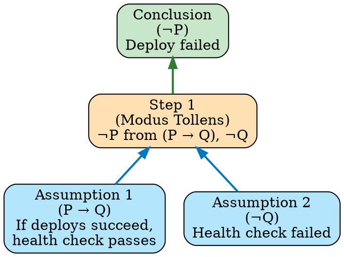

# Visual Grammar: Formal Logic

How to render a `formallogic` thought as a diagram.

## Node Structure

Formal logic proofs are rendered as natural deduction trees:
- **Assumptions** (rounded rectangles, top of inverted tree): premises or hypothesis that are assumed
- **Inference step** (rounded rectangle, middle): application of a logical rule (modus ponens, conjunction elimination, etc.)
- **Discharged assumption** (grayed or crossed-out node, connected with dashed line): an assumption that has been discharged (no longer needed)
- **Conclusion** (bold rounded rectangle, bottom or top depending on rankdir): the derived statement

Each node is labeled with the statement and the inference rule applied.

## Edge Semantics

- **Solid arrow** (`→`) — Logical dependency: the child node follows from the parent(s) via a named inference rule
- **Dashed arrow** (`⇢`) — Discharged assumption: an assumption that was used but is no longer active in the proof
- **Double arrow** (`⟹`) — Conclusion path: highlights the final step leading to the conclusion

## Mermaid Template

## DOT Template

## Worked Example

Based on the Modus Tollens proof (deployment health check) from `reference/output-formats/formallogic.md`:

### Mermaid

### DOT

## Special Cases

- **Discharged assumptions**: When an assumption is used in a subproof and then discharged, show a dashed line from the assumption to the step where it is discharged, and cross out or gray the assumption node.
- **Conditionals (→ introduction)**: When proving an implication, show the assumption being introduced and then discharged at the end of the subproof.
- **Subproofs**: Nested proofs can be shown as indented or boxed subtrees within the main tree.
- **Multiple inference steps**: Label each edge with the rule name (Modus Ponens, Conjunction Introduction, Existential Instantiation, etc.).
- **Contradiction**: If the proof derives a contradiction (⊥), highlight it in red as the conclusion to show the original assumption is false (proof by contradiction).

