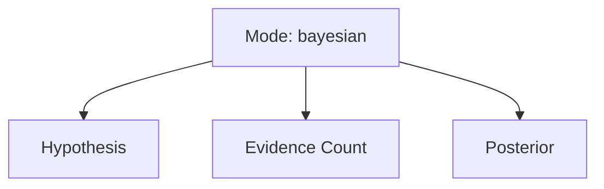
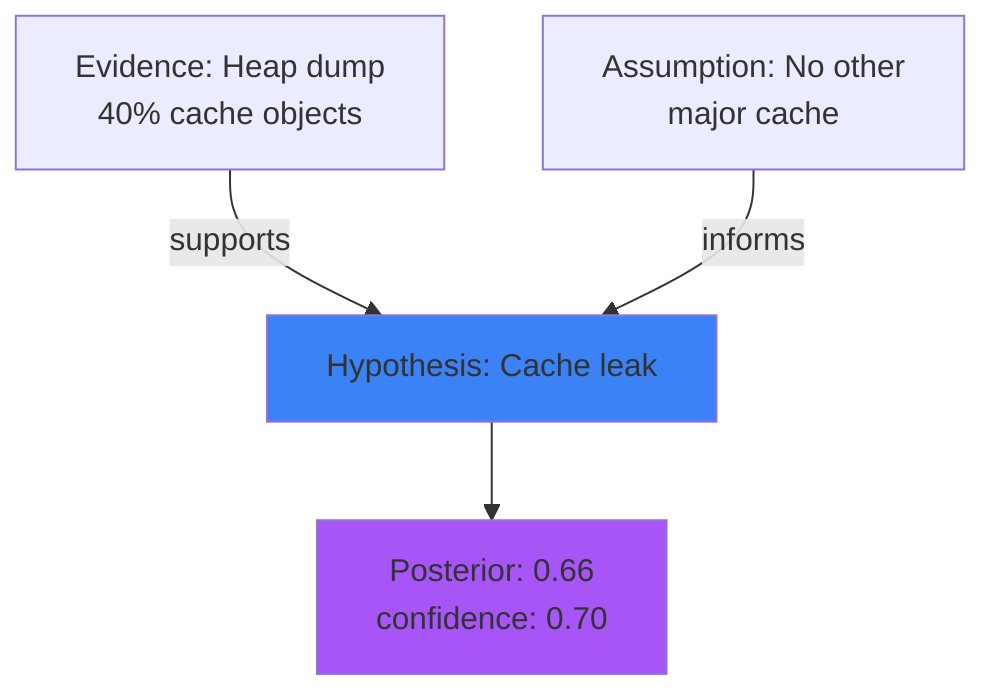

# Format Grammar: Dashboard

How to encode a deepthinking-plugin thought into an interactive HTML dashboard — a self-contained single-file web page with client-side visualization, JSON exploration, and mode-adaptive styling.

## Format Overview

The dashboard format is the most feature-rich output, combining:

1. **Header**: Mode badge, timestamp, session ID, confidence/metadata indicators
2. **Left Pane**: Interactive Mermaid diagram rendered from the thought
3. **Right Pane**: Collapsible JSON explorer for detailed field inspection
4. **Action Bar**: Export buttons (download JSON, PNG, SVG, Markdown)
5. **Styling**: Mode-adaptive colors matching the shared visual grammar

Unlike static HTML documents, dashboards are fully **interactive in any modern browser** — no build step, no server required. The template loads Mermaid and JSON explorer libraries from CDNs at page view time.

**Use case**: Share thoughts with colleagues, archive for documentation, embed in reports, or email as standalone attachment.

## Encoding Rules

### Dashboard Generation (Agent Responsibility)

The agent does **NOT** hand-write HTML. Instead, the agent:

1. **Captures the thought JSON** (output from `/think <mode>` command)
2. **Invokes the render script** (Python) with the JSON file path and optional Mermaid source
3. **Receives the HTML output path** and returns it to the user

The render script (`scripts/render-html-dashboard.py`) is responsible for:
- Loading the thought JSON and validating structure
- Injecting the JSON into the template's data structure
- Rendering Mermaid diagram (if provided) or generating fallback
- Applying mode-specific styling (color scheme, icons, layout)
- Outputting a self-contained standalone HTML file

### Template Structure

The template (`reference/html-dashboard-template.html`) is injected with:

```json
{
  "mode": "bayesian",
  "timestamp": "2026-04-11T15:30:00Z",
  "content": "...",
  "metadata": { ... },
  "modeSpecificFields": { ... }
}
```

**Template sections** (to be populated by render script):
- `<title>`: Mode name + timestamp
- `<style>`: Mode-specific CSS (colors, layout)
- `<body id="mode-{mode}">`: Mode-aware styling root
- `<script id="thought-data">`: Injected JSON object
- `<div id="mermaid-container">`: Rendered diagram from Mermaid CDN
- `<div id="json-explorer">`: Expandable JSON tree viewer

### Script Invocation Pattern

```bash
python scripts/render-html-dashboard.py \
    --thought <path-to-thought.json> \
    --mermaid <path-to-diagram.mmd> \
    --output <path-to-output.html>
```

**Parameters:**
- `--thought` (required): File path to the JSON thought object (e.g., `/tmp/bayesian-thought.json`)
- `--mermaid` (optional): File path to pre-rendered Mermaid source (e.g., `/tmp/bayesian.mmd`). If omitted, script generates a minimal fallback diagram from top-level thought fields.
- `--output` (required): Output file path for the HTML dashboard (e.g., `/tmp/bayesian-dashboard.html`)

**Return value**: Path to the generated HTML file (e.g., `/tmp/bayesian-dashboard.html`)

### Fallback Diagram Generation

If `--mermaid` is not provided, the render script generates a minimal Mermaid diagram based on thought structure:



**Fallback rules:**
- Extract top-level keys from the thought JSON
- Create nodes for major fields (hypothesis, evidence, posterior, etc.)
- Link to main mode node with labeled edges
- Use generic shapes and colors

This ensures a dashboard is always renderable, even without a dedicated per-mode grammar diagram.

## Template

### Command-Line Invocation

**Basic usage** (with pre-rendered Mermaid):

```bash
python scripts/render-html-dashboard.py \
    --thought /tmp/bayesian-thought.json \
    --mermaid /tmp/bayesian-diagram.mmd \
    --output /tmp/bayesian-dashboard.html
```

**Fallback usage** (auto-generate diagram):

```bash
python scripts/render-html-dashboard.py \
    --thought /tmp/causal-thought.json \
    --output /tmp/causal-dashboard.html
```

**With default output path** (inferred from thought name):

```bash
python scripts/render-html-dashboard.py \
    --thought /tmp/sequential-thought.json \
    --mermaid /tmp/sequential.mmd
# Output: /tmp/sequential-thought-dashboard.html
```

### Script Output Example

```
✓ Dashboard generated: /tmp/bayesian-dashboard.html
  Mode: bayesian
  Thought: "Caching layer is root cause of memory leak"
  Mermaid: embedded (2.3 KB)
  JSON: embedded (4.7 KB)
  Total size: 142 KB
  Open in browser: file:///tmp/bayesian-dashboard.html
```

### HTML Structure (Rendered Output)

The generated dashboard includes:

```html
<!DOCTYPE html>
<html>
<head>
  <title>Bayesian | 2026-04-11 15:30:00</title>
  <link rel="stylesheet" href="https://cdn.jsdelivr.net/mermaid/...">
  <script src="https://cdn.jsdelivr.net/mermaid/..."></script>
  <script src="https://cdn.jsdelivr.net/npm/json-tree-viewer@..."></script>
  <!-- Mode-specific CSS injected here -->
  <style>
    body#mode-bayesian { --primary-color: #3b82f6; ... }
    .mode-badge::before { content: "🧠 Bayesian"; }
  </style>
</head>
<body id="mode-bayesian">
  <header>
    <span class="mode-badge">Bayesian</span>
    <span class="timestamp">2026-04-11 15:30</span>
    <span class="confidence">0.85</span>
  </header>
  
  <main>
    <aside id="diagram-pane">
      <div id="mermaid-container" class="mermaid">
        <!-- Mermaid diagram embedded here -->
      </div>
    </aside>
    
    <section id="content-pane">
      <h1>Caching layer is root cause...</h1>
      <div id="json-explorer">
        <!-- Expandable JSON tree viewer -->
      </div>
    </section>
  </main>
  
  <footer>
    <button onclick="exportJSON()">Download JSON</button>
    <button onclick="exportPNG()">Download PNG</button>
    <button onclick="exportSVG()">Download SVG</button>
  </footer>
  
  <script id="thought-data" type="application/json">
  {
    "mode": "bayesian",
    "timestamp": "2026-04-11T15:30:00Z",
    ...
  }
  </script>
</body>
</html>
```

## Worked Example

**End-to-end flow**: User runs `/think bayesian "Is the caching layer causing the memory leak?"`, gets a JSON block. User then invokes the render script to generate an interactive dashboard.

### Step 1: Generate Thought JSON

```bash
# User command (simulated)
# /think bayesian "Is the caching layer causing the memory leak?"

# Output (JSON):
{
  "mode": "bayesian",
  "timestamp": "2026-04-11T15:30:00Z",
  "content": "A caching layer is suspected...",
  "hypothesis": {
    "claim": "Caching layer is root cause",
    "prior": 0.30
  },
  "posterior": {
    "probability": 0.66,
    "confidence": 0.70
  }
}
```

User saves this to `/tmp/bayesian-memory-leak.json`.

### Step 2: Generate Mermaid Diagram (Optional)

Using the per-mode Bayesian grammar, the visual-exporter agent generates:



Agent saves to `/tmp/bayesian-memory-leak.mmd`.

### Step 3: Invoke Render Script

```bash
python scripts/render-html-dashboard.py \
    --thought /tmp/bayesian-memory-leak.json \
    --mermaid /tmp/bayesian-memory-leak.mmd \
    --output /tmp/bayesian-memory-leak-dashboard.html
```

Script output:
```
✓ Dashboard generated: /tmp/bayesian-memory-leak-dashboard.html
  Mode: bayesian
  Thought: "A caching layer is suspected as the root cause..."
  Diagram: embedded (Mermaid source 387 bytes)
  JSON: embedded (1.2 KB)
  Total: 156 KB (all externals from CDN)
  Open: file:///tmp/bayesian-memory-leak-dashboard.html
```

### Step 4: User Views Dashboard

The user opens `/tmp/bayesian-memory-leak-dashboard.html` in any browser. The dashboard displays:

**Header:**
- Mode badge: "🧠 Bayesian"
- Timestamp: "2026-04-11 15:30"
- Confidence: 0.70 (as a progress bar or score)

**Left pane (Diagram):**
- Mermaid diagram rendered in full (colors, fonts, layout from the source)
- Fully interactive (hover, click to zoom, export as image)

**Right pane (Content & JSON):**
- Main narrative: "A caching layer is suspected..."
- Expandable JSON tree:
  - `hypothesis` → click to expand → `claim`, `prior` visible
  - `evidence` → click to expand → list of evidence items
  - `posterior` → click to expand → `probability`, `confidence`

**Footer:**
- "Download JSON": Saves the raw JSON to `bayesian-memory-leak.json`
- "Download PNG": Exports Mermaid diagram as image
- "Download SVG": Exports Mermaid diagram as vector

## Per-Mode Considerations

### All 34 Modes

**Every mode** can produce a viable dashboard. The quality scales with the richness of the thought's structure and diagram:

| Mode | Dashboard Quality | Rationale |
|------|-------------------|-----------|
| **Bayesian** | Excellent | Rich structure (hypothesis, evidence, posterior); graph rendering is informative |
| **Causal** | Excellent | DAG structure maps perfectly to Mermaid; causal paths are visually clear |
| **Systems Thinking** | Excellent | Stock-flow diagrams render beautifully; loops and archetypes are visually apparent |
| **GameTheory** | Excellent | Game states, payoff matrices, Nash equilibria render as rich state diagrams |
| **Sequential** | Good | Linear flow with steps; timeline visualization is straightforward |
| **Temporal / Historical** | Good | Timeline rendering; event ordering is clear |
| **Scientific Method** | Good | Hypothesis-prediction-evidence flow is visually compelling |
| **Simple Modes** (Deductive, Inductive, etc.) | Adequate | Minimal structure; fallback diagram shows basic premise-conclusion chain |

### Mode-Adaptive Styling

The template applies mode-specific colors and icons:

- **Bayesian**: Blue (`#3b82f6`) with probability icon (📊)
- **Causal**: Red (`#ef4444`) with causality icon (→)
- **Systems Thinking**: Teal (`#06b6d4`) with feedback icon (↩️)
- **Sequential**: Green (`#22c55e`) with arrow icon (→)
- **GameTheory**: Orange (`#f59e0b`) with strategy icon (♞)
- And so on for all 34 modes

The render script looks up the mode in a mode-to-color mapping and injects the corresponding CSS.

## Rendering Tools

### No Build Step Required

The dashboard is a single standalone HTML file. Rendering is **100% client-side**:

- **Mermaid library**: Loaded from CDN (`cdn.jsdelivr.net/mermaid/`)
- **JSON viewer**: Loaded from CDN (`cdn.jsdelivr.net/npm/json-tree-viewer/`)
- **No server**: File can be opened directly in a browser (`file:///path/to/dashboard.html`)
- **No dependencies**: Browser with JavaScript enabled only

### Browser Support

- Chrome/Chromium 90+
- Firefox 88+
- Safari 14+
- Edge 90+

### Viewing & Sharing

**Local viewing:**
```bash
open /tmp/bayesian-dashboard.html  # macOS
xdg-open /tmp/bayesian-dashboard.html  # Linux
start /tmp/bayesian-dashboard.html  # Windows
```

**Sharing:**
- Email as attachment: Small enough to email (typically 100-200 KB)
- Upload to static site (GitHub Pages, S3, etc.): No server-side processing needed
- Embed in Markdown: Link to the HTML file
- Print to PDF: Browser print function generates a static snapshot

### Export Features

The dashboard includes client-side export buttons:

- **JSON**: Downloads the raw thought JSON
- **PNG**: Exports the Mermaid diagram as a raster image (requires canvas support)
- **SVG**: Exports the Mermaid diagram as a vector image (crisp at any scale)
- **Markdown**: Generates a Markdown document with embedded diagram

---

**Last Updated**: 2026-04-11  
**Format Stability**: Stable (forward reference to Phase 5 Stage 4 implementation)  
**Target Audience**: Knowledge workers, documentation builders, thought sharers, visual communicators
