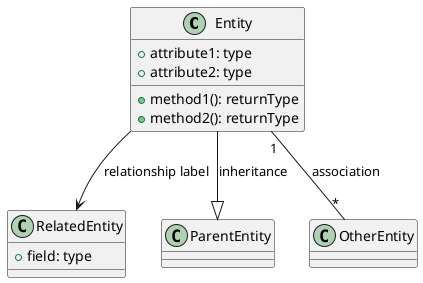
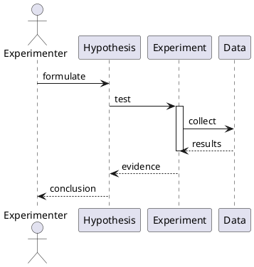
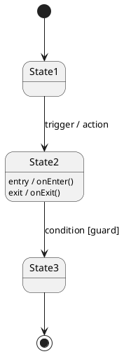
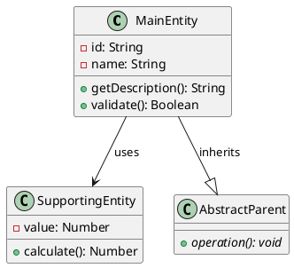
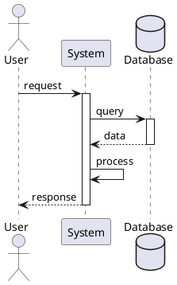
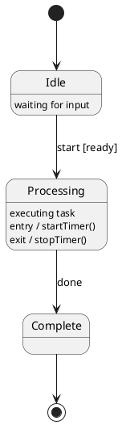
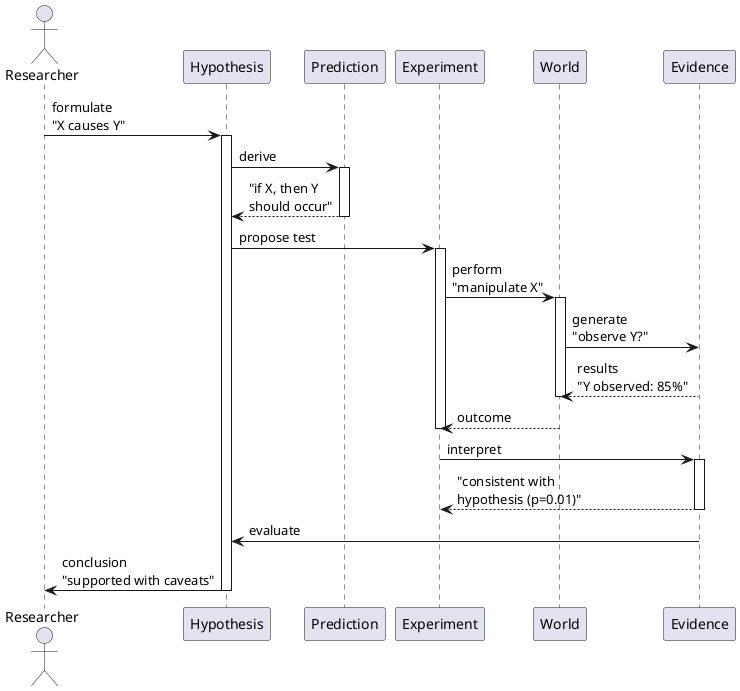

# Format Grammar: UML

How to encode a deepthinking-plugin thought into Unified Modeling Language (UML) diagrams. This format supports three diagram types for different reasoning patterns.

## Format Overview

UML provides three primary diagram types, each suited to different reasoning modes:

1. **Class Diagram**: Entity relationships and hierarchies. Best for modes with multiple entities, attributes, and dependencies (Analytical, Synthesis, Systems Thinking).
2. **Sequence Diagram**: Time-ordered interactions between actors. Best for temporal reasoning, step-by-step processes, and scientific method (Sequential, Temporal, Scientific Method, Computability).
3. **State Diagram**: States and transitions. Best for stateful reasoning and automata (Computability, Stochastic, Modal, GameTheory).

Each uses PlantUML syntax, which is widely supported and renders to SVG/PNG via `plantuml.jar` (requires Java and Graphviz).

## Encoding Rules

### Class Diagram

**Use when**: Multiple entities with relationships, hierarchies, or object-oriented structure.



**Syntax conventions:**
- `class ClassName { attributes and methods }`
- `+` public, `#` protected, `-` private
- `attribute: type` format
- `-->` solid arrow for direct association
- `--|>` inheritance (is-a)
- `"cardinality"` on association lines (e.g., `"1" -- "*"` for one-to-many)
- `class X as "Full Name" {}` for aliasing

### Sequence Diagram

**Use when**: Time-ordered messages, actors, interactions, and lifelines.



**Syntax conventions:**
- `actor Name` for human/external entity
- `participant Name` for system/component
- `A -> B : message` for synchronous call
- `A --> B : message` for return/response
- `activate A ... deactivate A` for lifeline activation
- `alt / else` for conditional branches
- `loop N times` for repetition
- `par` for parallel execution

### State Diagram

**Use when**: States, transitions, and event-driven behavior.



**Syntax conventions:**
- `[*]` for start/end terminals
- `State1 --> State2 : trigger` for transitions
- `trigger / action` for event-driven behavior
- `[guard]` for conditional transitions
- `entry / action` and `exit / action` for state entry/exit
- Composite states: `state Composite { inner1 inner2 }`

## Template

### Class Diagram Template



### Sequence Diagram Template



### State Diagram Template



## Worked Example

**Scenario**: Scientific Method thought as a sequence diagram. The researcher formulates a hypothesis, makes a prediction, conducts an experiment, observes results, and optionally revises.



**Key features:**
- Actors: Researcher (external), abstract concepts (Hypothesis, Prediction, etc.)
- Time flows top-to-bottom
- `activate/deactivate` shows lifeline activity (focus of control)
- Edge labels describe transformations and key results
- Linear flow with optional branching points for alternative outcomes

## Per-Mode Considerations

### Diagram Type by Mode

| Mode | Recommended Diagram | Rationale |
|------|---------------------|-----------|
| **Sequential** | Sequence (primary) or State | Step-by-step flow with defined order; use sequence for multi-actor, state for single agent |
| **Temporal / Historical** | Sequence (primary) or State | Timeline is natural; actors can be events or agents |
| **Scientific Method** | Sequence (primary) | Hypothesis → Prediction → Experiment → Observation → Revision cycle |
| **Systems Thinking** | Class (primary) | Entity relationships and feedback loops |
| **Bayesian** | Class (primary) | Hypothesis, evidence, alternatives as entities with relationships |
| **Causal** | Class (primary) | Causal variables and relationships; DAG structure |
| **GameTheory** | State (primary) | Game states and payoff-driven transitions |
| **Computability / Algorithmic** | State (primary) | State machines, Turing machines, automata |
| **Stochastic** | State (primary) | Markov chains, probabilistic transitions |
| **Modal** | State (primary) | Modalities (possible worlds) as states, transitions between them |
| **Synthesis / Argumentation / Critique / Analysis** | Class (primary) | Multi-entity reasoning with argument structure |
| **Analogical / FirstPrinciples** | Class (primary) | Source and target domains, mappings as relationships |
| **MetaReasoning / Recursive** | Class (primary) | Nested reasoning, introspection as hierarchical structure |

### Mode-Specific Patterns

**Sequential**: Use sequence diagram with a `participant Reasoner` and multiple `participant Step_N` components, or a state diagram progressing through numbered states.

**Scientific Method**: Use sequence diagram with actors (Researcher, Experiment, World, Evidence) and numbered steps.

**Systems Thinking**: Use class diagram to show stocks (entities), flows (methods returning rates), and feedback (association lines with labels like "R1", "B1").

**GameTheory**: Use state diagram where each state represents a game configuration, and transitions are moves/strategies with payoff labels.

**Bayesian / Causal**: Use class diagram where the main hypothesis is a central class, evidence and alternatives are related classes, and associations show support/contradiction relationships.

## Rendering Tools

### PlantUML
- **Official site**: https://plantuml.com/
- **Online editor**: https://www.plantuml.com/plantuml/uml/
- **Installation**: Requires Java and Graphviz (for layout)
  ```bash
  # macOS
  brew install plantuml graphviz
  
  # Linux
  apt-get install plantuml graphviz
  
  # Windows
  choco install plantuml graphviz
  ```
- **Command-line usage**:
  ```bash
  plantuml input.uml -o output_dir  # Generates PNG by default
  plantuml input.uml -tsvg           # Generate SVG
  ```

### Mermaid (Limited UML Support)
- **Native**: Flowchart, stateDiagram, sequenceDiagram (partial UML syntax)
- **Limitations**: No full class diagram support; sequence and state diagrams are simplified
- **Advantage**: No external dependencies; renders in most Markdown renderers
- **Use as fallback** if PlantUML is not available

### Rendering Workflow
```bash
# Option 1: Command-line (PlantUML)
echo '@startuml
class A
class B
A --> B
@enduml' > diagram.uml
plantuml diagram.uml -tsvg

# Option 2: Online (no installation)
# Copy diagram text, paste into https://www.plantuml.com/plantuml/uml/, click "Download"

# Option 3: Visual Studio Code Extension
# Install "PlantUML" extension, preview with Alt+D
```

### Integration
- **Markdown**: Embed PlantUML fence:
  ```markdown
  ```plantuml
  @startuml
  ...
  @enduml
  ```
  ```
- **HTML**: Use online PlantUML service with embedded image tags
- **Documentation**: Many doc generators (Sphinx, MkDocs) support PlantUML rendering

---

**Last Updated**: 2026-04-11  
**Format Stability**: Stable  
**Target Audience**: Object-oriented designers, workflow modelers, process analysts, behavioral engineers
