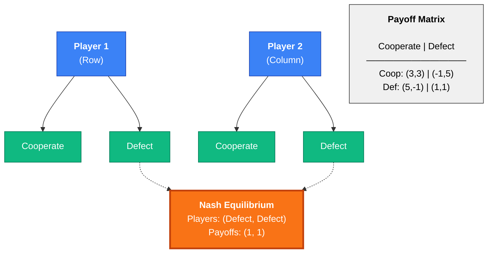
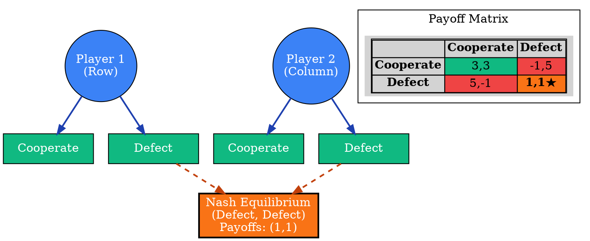
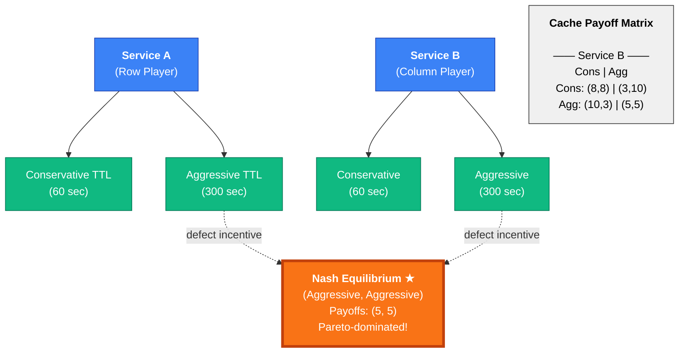
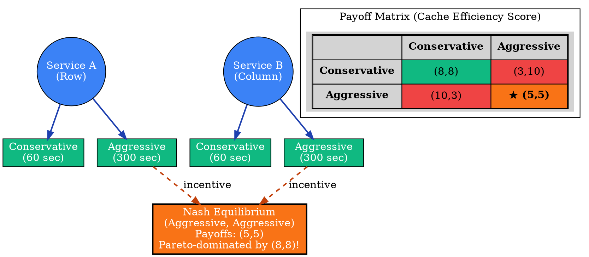

# Visual Grammar: Game Theory

How to render a `gametheory` thought as a diagram.

## Node Structure

Game theory diagrams show players, strategies, payoffs, and equilibria. Structure:
- **Player nodes** (circles): One circle per player, labeled with player name
- **Strategy branches** (from each player): Radiating outward or stacked below player node
- **Payoff matrix** (as a subgraph or grid): Entries showing payoff pairs for each strategy combination
- **Nash equilibrium nodes** (bold border or star): Highlighted entries where no player wants to deviate
- **Dominant strategy highlight** (thick border or special color): Strategy that is strictly or weakly dominant

Node colors:
- **Blue**: Player nodes
- **Green**: Strategy labels
- **Gold/Yellow**: Nash equilibrium cell
- **Red**: Pareto-dominated outcome

## Edge Semantics

- **Solid arrow** (`→`) — Strategy choice from player to strategy label
- **Thin lines** — Payoff matrix cell boundaries
- **Bold border** (`★`) — Nash equilibrium cell; no player can improve by unilateral deviation
- **Dashed arrow** — Dominant strategy pointer

## Mermaid Template

## DOT Template

## Worked Example

Based on the cache TTL competition scenario (Prisoner's Dilemma) from `reference/output-formats/gametheory.md`:

### Mermaid

### DOT

## Special Cases

- **Dominant strategies**: Highlight with a thick border or special color (bold green box) to show strategies that dominate all others.
- **Multiple Nash equilibria**: If multiple equilibria exist (e.g., mixed-strategy equilibria), render them all with ★ markers and note which are Pareto-efficient.
- **Zero-sum games**: For zero-sum games, show payoffs in the matrix with negatives: player 1 gains what player 2 loses (e.g., "(3, -3)").
- **Cooperative vs. non-cooperative**: For cooperative games, add a dashed box around the payoff matrix labeled "Coalition" or "Agreement" to show that binding agreements exist.
- **Pareto dominance**: Mark Nash equilibria that are Pareto-dominated (worse for both players than an alternative outcome) with a red outline and the label "Pareto-dominated" to highlight tension between individual incentives and collective welfare.
