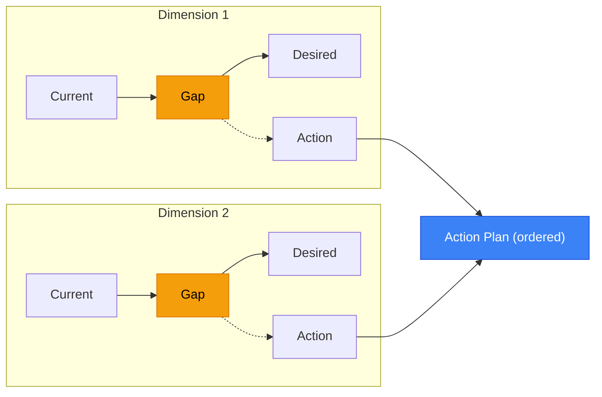
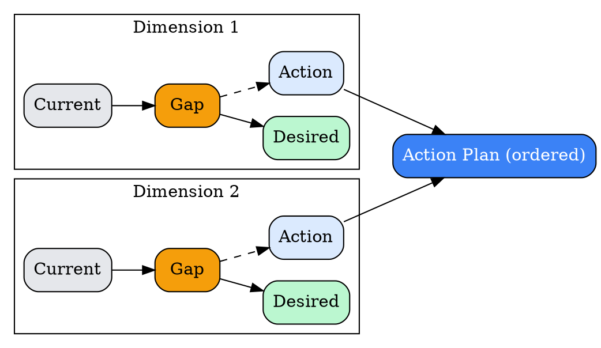
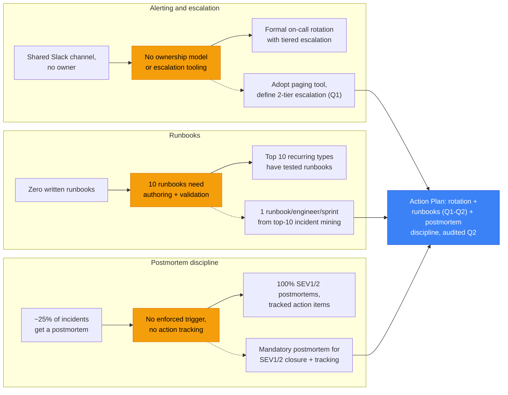
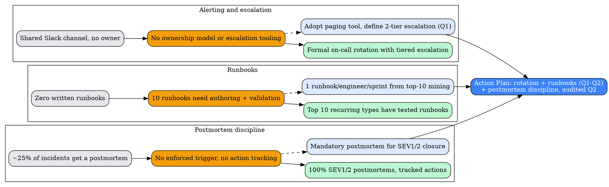

# Visual Grammar: Gap Analysis

How to render a `gapanalysis` thought as a diagram.

## Node Structure

Gap Analysis is rendered as **current → gap → desired lanes** — one horizontal lane per dimension, showing the current state on the left, the gap in the middle, and the desired state on the right, converging into an action plan.

- **Current-state column** (left) → one node per entry in `gaps[]`, labeled with `dimension` and `current`
- **Gap column** (middle) → one node per entry in `gaps[]`, labeled with `gap`; visually distinct (amber/warning color) since this is the delta being closed
- **Desired-state column** (right) → one node per entry in `gaps[]`, labeled with `desired`
- **Action nodes** (below each lane, or aggregated) → one per `gaps[].action`, or the aggregated `actionPlan[]` sequence if present
- **Overall current/desired** (top banner, optional) → two summary nodes for the top-level `currentState`/`desiredState` strings, framing all per-dimension lanes

## Edge Semantics

- Each lane flows **current → gap → desired** (solid directed edges) — this is a "closing the gap" narrative, not a causal claim
- Each **gap** node also connects down to its **action** node — the action is what closes that specific gap
- If `actionPlan[]` is present, its entries chain in sequence (dashed edges) below all lanes, representing the ordered execution plan across dimensions

## Mermaid Template

## DOT Template

## Worked Example

Based on the incident-response maturity scenario in `test/samples/gapanalysis-valid.json`:

### Mermaid

### DOT

## Special Cases

- **One lane per `gaps[]` entry, always**: unlike PESTLE's fixed six lanes, `gapanalysis` has as many lanes as `gaps[]` has entries (`minItems: 1`) — do not force a fixed number of dimensions.
- **`actionPlan[]` is optional and sequence-level, not per-gap**: if present, it represents the *ordered execution plan* across all dimensions (which may interleave or reorder individual `gaps[].action` items) and renders as a separate dashed chain below the lanes, distinct from the direct `gap → action` edge within each lane.
- **Overall `currentState`/`desiredState` frame the lanes**: these two top-level strings are not another dimension — render them (if at all) as a banner above the lanes, not as a fifth lane, to avoid double-counting against the per-dimension `current`/`desired` pairs.
