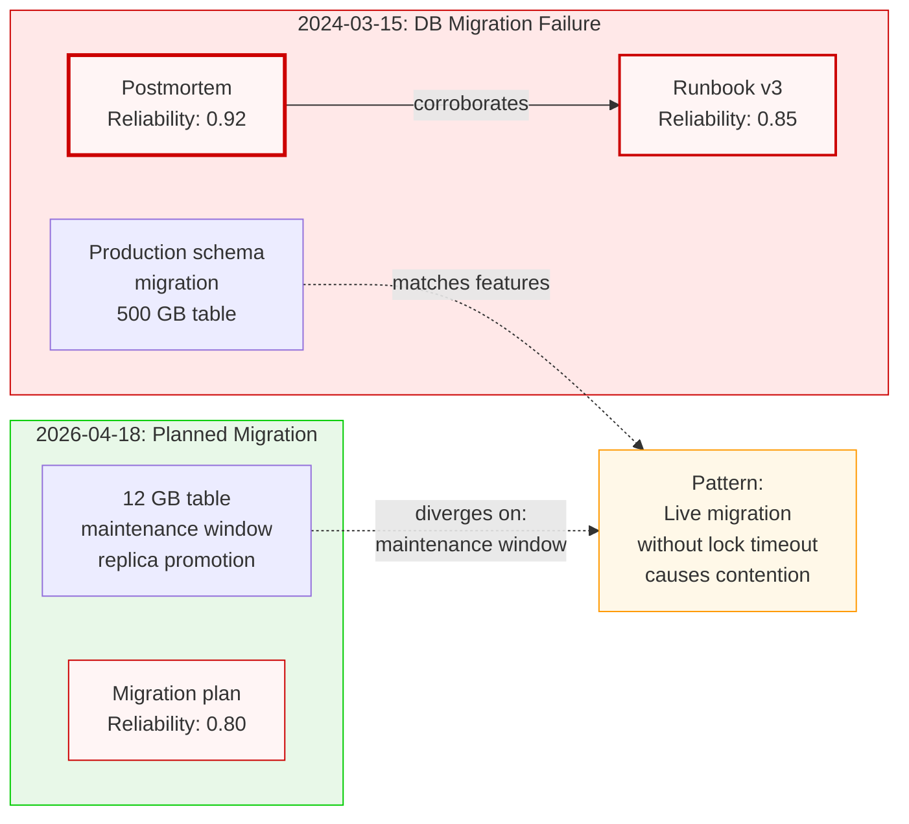
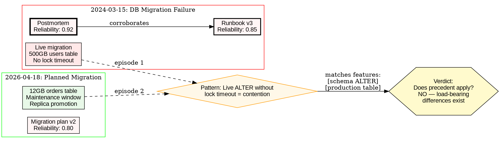
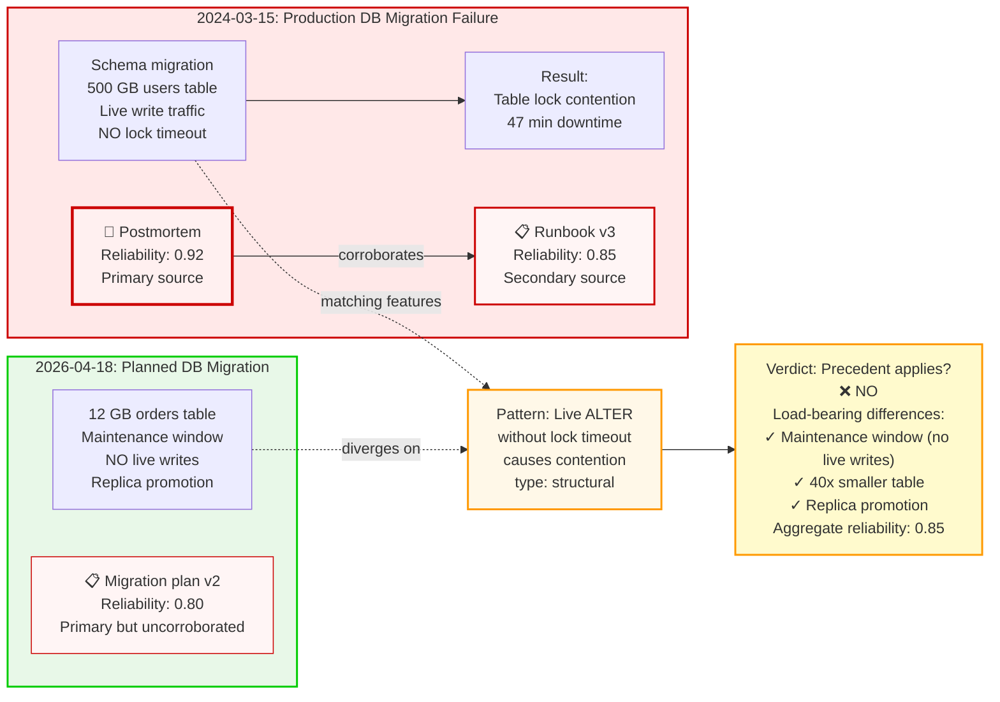
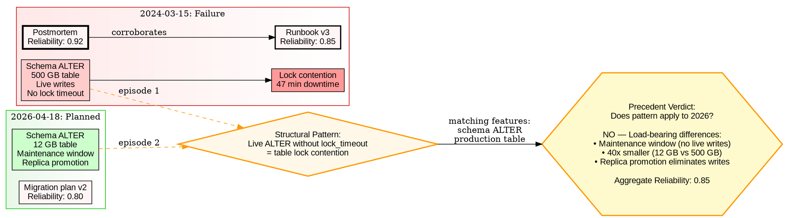

# Visual Grammar: Historical

How to render a `historical` thought as a diagram.

## Node Structure

- **Historical episodes** → Boxed subgraphs (clusters in DOT, `subgraph` in Mermaid) spanning left-to-right timeline; label with date and event name
- **Source nodes** → Rectangles below each episode with reliability shown as border thickness (thicker = higher reliability) or a `reliability: 0.XX` label
- **Pattern nodes** → Oval/diamond shapes connecting similar episodes across time
- **Precedent nodes** → Hexagons with `verdictApplies: true/false` label

## Edge Semantics

- **Precedent match** → Green solid arrow labeled "precedent: <feature>" connecting past to present
- **Divergence** → Red dashed arrow labeled "diverges on: <load-bearing difference>"
- **Source corroboration** → Thin solid arrow between sources with "corroborates" label
- **Source contradiction** → Bold red dashed arrow with "contradicts" label
- **Pattern evidence** → Arrow from episode to pattern with "episode <N>" label

## Mermaid Template

## DOT Template

## Worked Example

Input: "Is our planned production database migration similar to the failed 2024 incident?" (from historical.md)

**Mermaid:**

**DOT:**

## Special Cases

- **Multiple precedents** → Show multiple episode subgraphs left-to-right on timeline; draw pattern arrows connecting matching episodes
- **Source contradiction** → Draw thick red dashed arrow between source nodes with "contradicts" label; add conflict note in VERDICT
- **Historiographical debate** → Add an annotation node below the verdict with `historiographicalSchool: "<school>"` label showing contested interpretations
- **Causal chain** → Chain events within an episode with arrows labeled `cause -> effect` with `mechanism: <description>` and `confidence: <score>` labels
