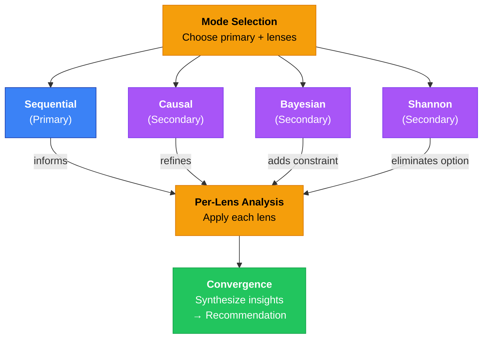
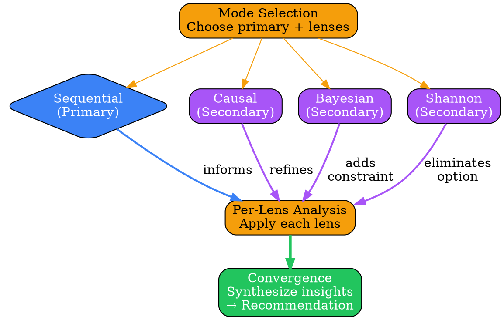
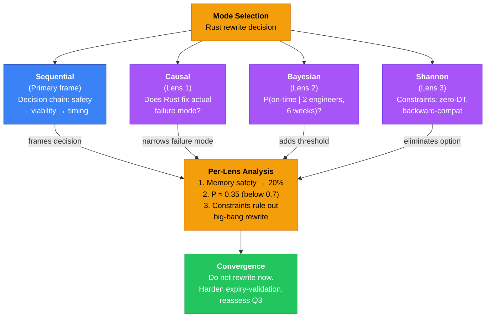
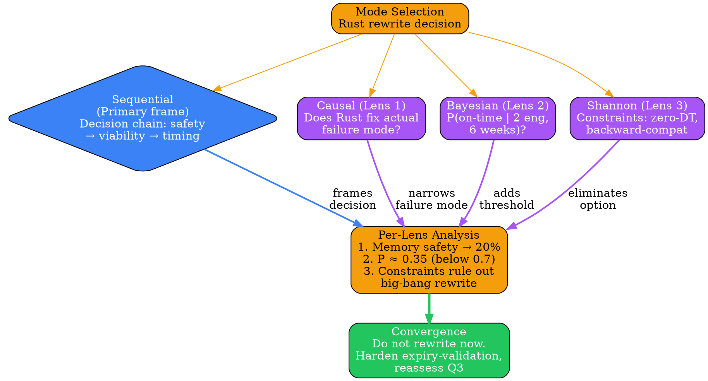

# Visual Grammar: Hybrid

How to render a `hybrid` thought as a diagram.

## Node Structure

Hybrid reasoning composes a primary mode with one or more secondary lenses. The diagram uses a **hub-and-spoke layout**:

- **Center diamond**: The primary mode (e.g., "Sequential", "Shannon") positioned at the center
- **Satellite ellipses**: Each secondary feature/lens positioned around the center (e.g., "Causal", "Bayesian", "Shannon")
- **Phase boxes**: Vertical sections labeled "Mode Selection", "Per-Lens Analysis", "Convergence Check" to organize the thought chain
- **Content excerpt**: In each node, show the mode name and a 40-character excerpt of the key insight

Related concepts:
- **Primary mode** → Center diamond in blue
- **Secondary lenses** → Surrounding ellipses in purple
- **Convergence node** → Pill/stadium shape at the bottom, typically green or gold

## Edge Semantics

- **Solid arrow** (`→`) — Data/insight flows from secondary lens back to primary mode
- **Dashed arrow** (`⇢`) — Conditional or probabilistic relationship (for Bayesian lenses)
- **Thick solid arrow** (`⟹`) — Strong consensus from multiple lenses; labeled "converges to"

Edge labels show the relationship type:
- "informs"
- "refines estimate"
- "eliminates option"
- "adds constraint"
- "strengthens confidence"

## Mermaid Template

## DOT Template

## Worked Example

Based on the Rust auth rewrite decision from `reference/output-formats/hybrid.md`:

### Mermaid

### DOT

## Special Cases

- **Mode switching**: If the hybrid thought spans multiple distinct analysis phases (each with its own primary mode), render them as vertically stacked sections with clear phase labels ("Phase 1: Sequential", "Phase 2: Causal", etc.).
- **Per-lens thoughts**: When `thoughtType == "per_lens"`, highlight the active lens with a thicker border and show its specific contribution (e.g., "Bayesian narrows confidence to 0.35").
- **Convergence check**: When `thoughtType == "convergence_check"`, use a green pill/stadium shape for the final synthesis node and draw bold convergence arrows from all secondary lenses.
- **Mathematical model**: If `mathematicalModel` is present, render a small code block or node showing the LaTeX or symbolic form as a supplementary detail.

