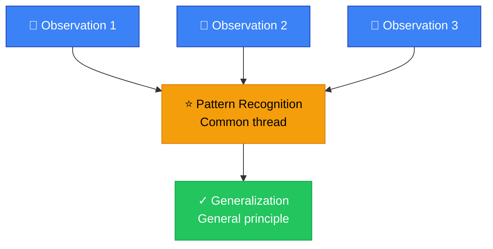
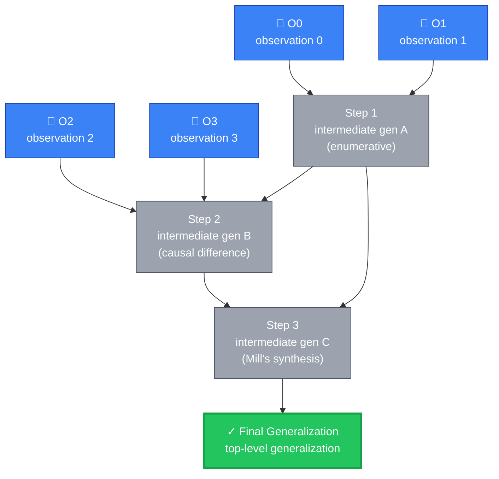
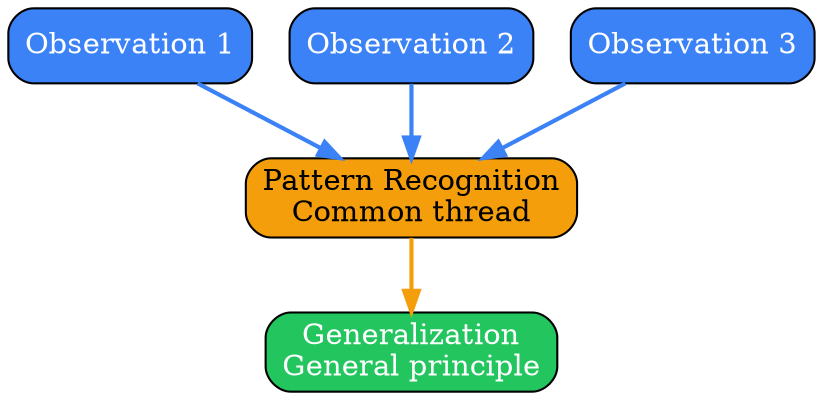
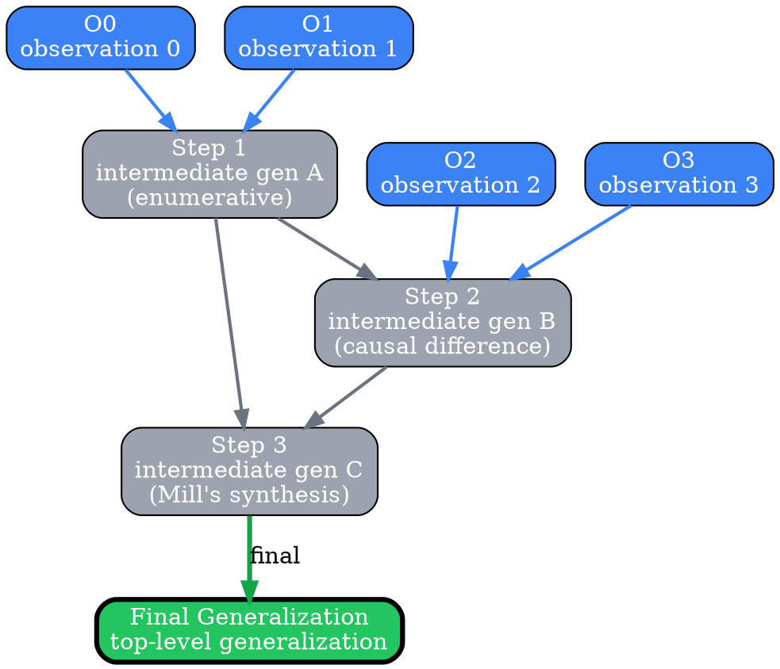
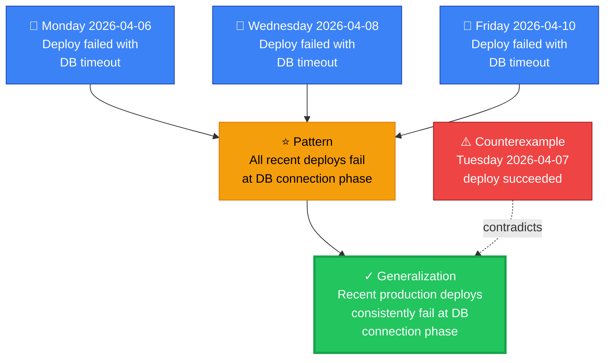
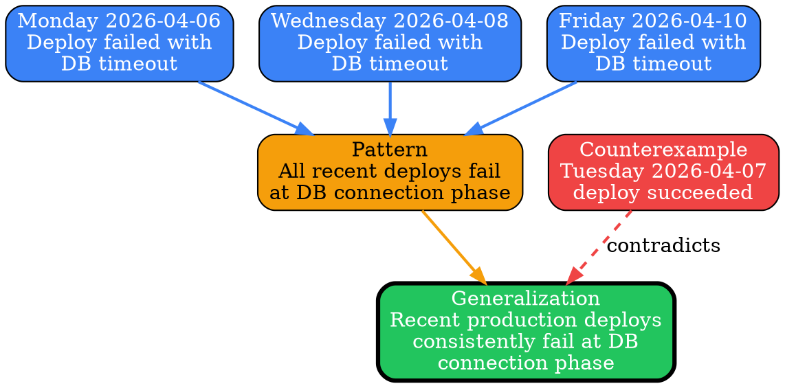
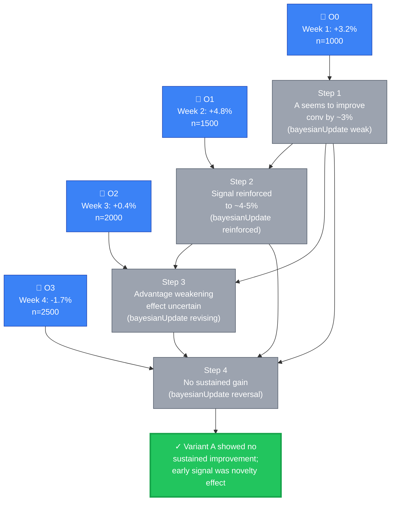
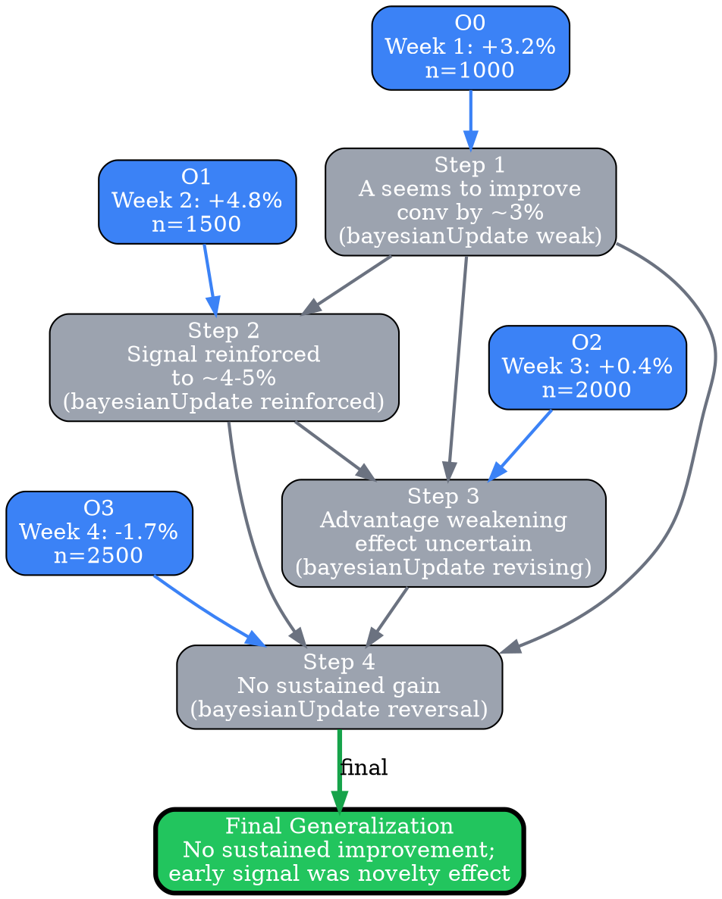

# Visual Grammar: Inductive

How to render an `inductive` thought as a diagram.

## Rendering Dispatch (v0.5.3+)

Inductive thoughts come in two shapes, and the visual grammar switches based on presence of the optional `inductionSteps[]` field:

- **Atomic** (no `inductionSteps` or `inductionSteps: []`) — classic 3-tier funnel: observations → pattern → generalization
- **Multi-step** (non-empty `inductionSteps[]`) — multi-tier flow: observations → per-step intermediate generalizations → final generalization

The atomic shape is the default; the multi-step shape is used when the induction is progressive refinement, Mill's methods, or hierarchical generalization.

## Node Structure

### Atomic shape

Inductive reasoning moves from specific observations to a general principle. The diagram uses a **top-to-bottom funnel layout**:

- **Observations** (top tier) → Rendered as **blue rectangles**, one per observation in the `observations` array
- **Pattern node** (middle tier) → A single **orange ellipse** labeled with the `pattern` excerpt (or "Pattern Recognition" if pattern is not yet explicit)
- **Generalization node** (bottom tier) → A **green pill/stadium shape** containing the `generalization` text
- **Counterexamples** (side tier) → **Red boxes with dashed edges** to the generalization, showing exceptions that constrain confidence

Border thickness on the generalization node encodes confidence: `confidence ≥ 0.8` → thick border; `confidence < 0.6` → thin dotted border.

### Multi-step shape

When `inductionSteps[]` is populated, the diagram inserts a **step tier** between the observations and the final generalization:

- **Observations** (top tier) → **blue rectangles**, one per observation, indexed `O0`, `O1`, `O2`, ...
- **Step tier** (middle tier) → **neutral gray rectangles**, one per entry in `inductionSteps[]`, labeled `Step N intermediateGeneralization (inductionMethod)`. Intermediate steps are always neutral gray — the validity/confidence color is reserved for the final generalization
- **Final generalization** (bottom tier) → **green pill/stadium** with the top-level `generalization` text, border thickness encoding confidence
- **Edges from observations to steps** — each step's `observationsUsed[]` produces a blue edge from that observation to the step node
- **Edges from steps to later steps** — each step's `stepsUsed[]` produces a gray edge from the prior step to the current step
- **Edge from the final step to the final generalization** — a thick green arrow labeled "final"

## Edge Semantics

- **Solid blue arrow** (`→`) — Observation supports the pattern or the step; weight reflects the strength of the observation
- **Solid gray arrow** — A step refines or builds on an earlier step
- **Thick green arrow** — The final step closes the chain by producing the top-level generalization
- **Dashed red arrow** (`⇢`) — Counterexample contradicts the generalization; labeled "contradicts" or "exception"

## Mermaid Template — atomic

## Mermaid Template — multi-step

## DOT Template — atomic

## DOT Template — multi-step

## Worked Example — atomic

Based on the 3-observation database connection timeout scenario:

### Mermaid

### DOT

## Worked Example — multi-step

Based on the 4-observation progressive-Bayesian-refinement A/B test scenario (the current sample in `test/samples/inductive-valid.json`). Each step represents the reasoner's belief at that point in time, with later steps revising earlier ones as new weekly data arrives:

### Mermaid

### DOT

## Special Cases

- **Confidence encoding**:
  - `confidence ≥ 0.85`: Thick border (penwidth=3) on generalization
  - `0.6 ≤ confidence < 0.85`: Normal border (penwidth=2)
  - `confidence < 0.6`: Dotted border (style=dotted) to show weak confidence

- **Sample size indicator**: If `sampleSize` is small (≤3), add a badge to the pattern node (e.g., "🔍 n=3") to indicate limited sample.

- **Counterexamples**: Render each counterexample as a red rectangle with a dashed edge to the generalization, labeled "contradicts" or "exception: [brief description]". Multiple counterexamples reduce confidence (model this via border style/thickness).

- **Multiple patterns**: If the inductive reasoning identifies more than one pattern (unlikely in the simple format but possible in extended cases), show them as separate orange ellipses, each feeding into the generalization with different arrow weights.

- **Step node with empty observationsUsed**: A synthesis step that combines only prior steps (not observations) still renders — just without incoming blue edges from the observation tier.
