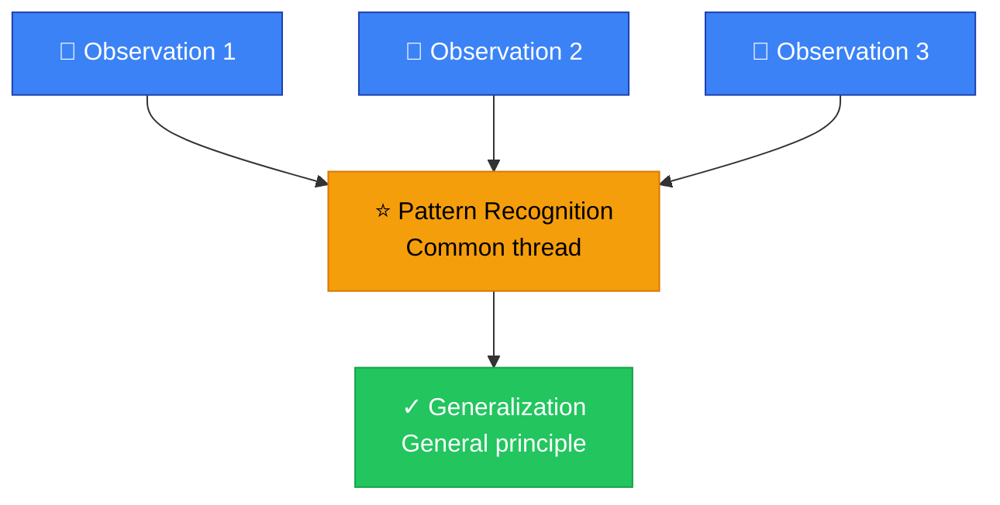
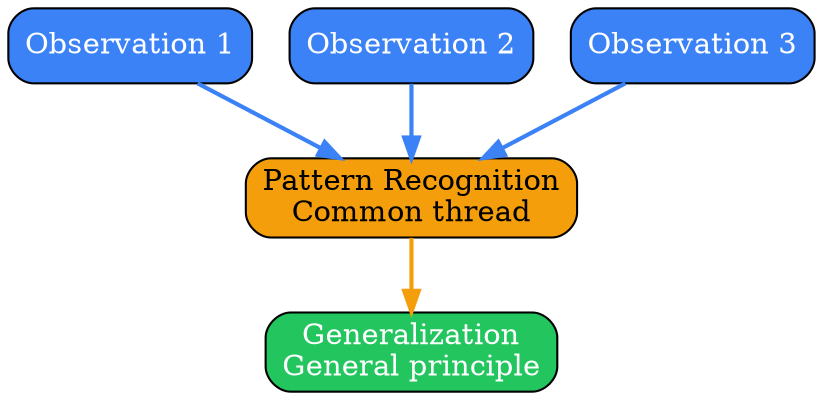
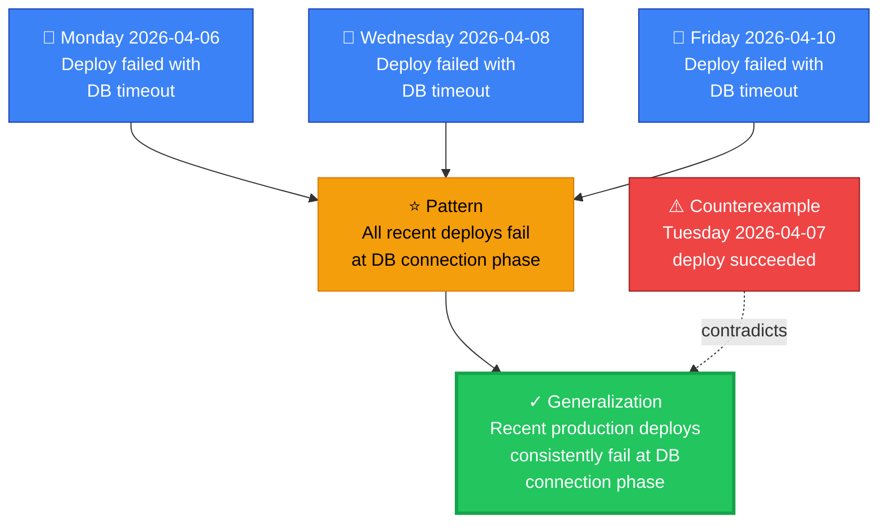
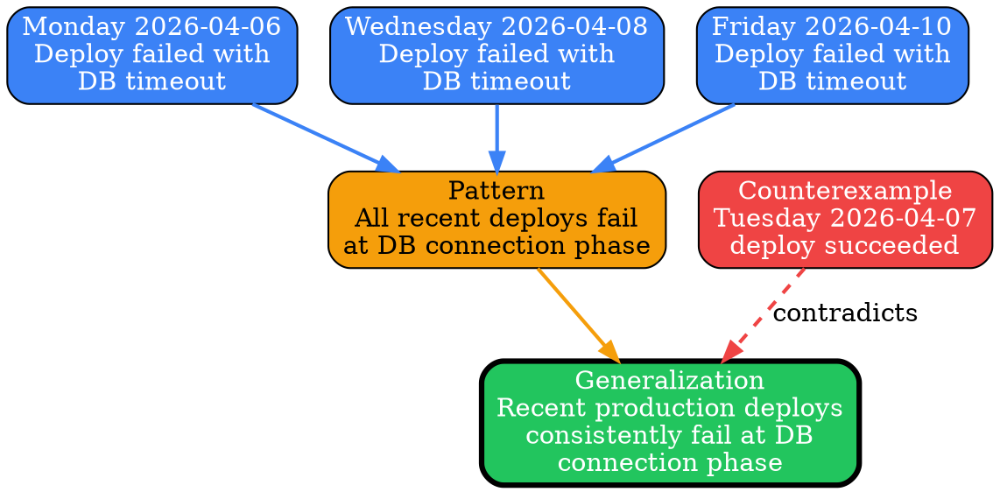

# Visual Grammar: Inductive

How to render an `inductive` thought as a diagram.

## Node Structure

Inductive reasoning moves from specific observations to a general principle. The diagram uses a **top-to-bottom funnel layout**:

- **Observations** (top tier) → Rendered as **blue rectangles**, one per observation in the `observations` array
- **Pattern node** (middle tier) → A single **orange ellipse** labeled with the `pattern` excerpt (or "Pattern Recognition" if pattern is not yet explicit)
- **Generalization node** (bottom tier) → A **green pill/stadium shape** containing the `generalization` text
- **Counterexamples** (side tier) → **Red boxes with dashed edges** to the generalization, showing exceptions that constrain confidence

Border thickness on the generalization node encodes confidence: `confidence ≥ 0.8` → thick border; `confidence < 0.6` → thin dotted border.

## Edge Semantics

- **Solid arrow** (`→`) — Observation supports the pattern; weight reflects the strength of the observation
- **Dashed arrow** (`⇢`) — Counterexample contradicts the generalization; labeled "contradicts" or "exception"
- **Thick edge** — Strong supporting observation; used when observation relevance is high

## Mermaid Template

## DOT Template

## Worked Example

Based on the database connection timeout scenario from `reference/output-formats/inductive.md`:

### Mermaid

### DOT

## Special Cases

- **Confidence encoding**: 
  - `confidence ≥ 0.85`: Thick border (penwidth=3) on generalization
  - `0.6 ≤ confidence < 0.85`: Normal border (penwidth=2)
  - `confidence < 0.6`: Dotted border (style=dotted) to show weak confidence
  
- **Sample size indicator**: If `sampleSize` is small (≤3), add a badge to the pattern node (e.g., "🔍 n=3") to indicate limited sample.

- **Counterexamples**: Render each counterexample as a red rectangle with a dashed edge to the generalization, labeled "contradicts" or "exception: [brief description]". Multiple counterexamples reduce confidence (model this via border style/thickness).

- **Multiple patterns**: If the inductive reasoning identifies more than one pattern (unlikely in the simple format but possible in extended cases), show them as separate orange ellipses, each feeding into the generalization with different arrow weights.

