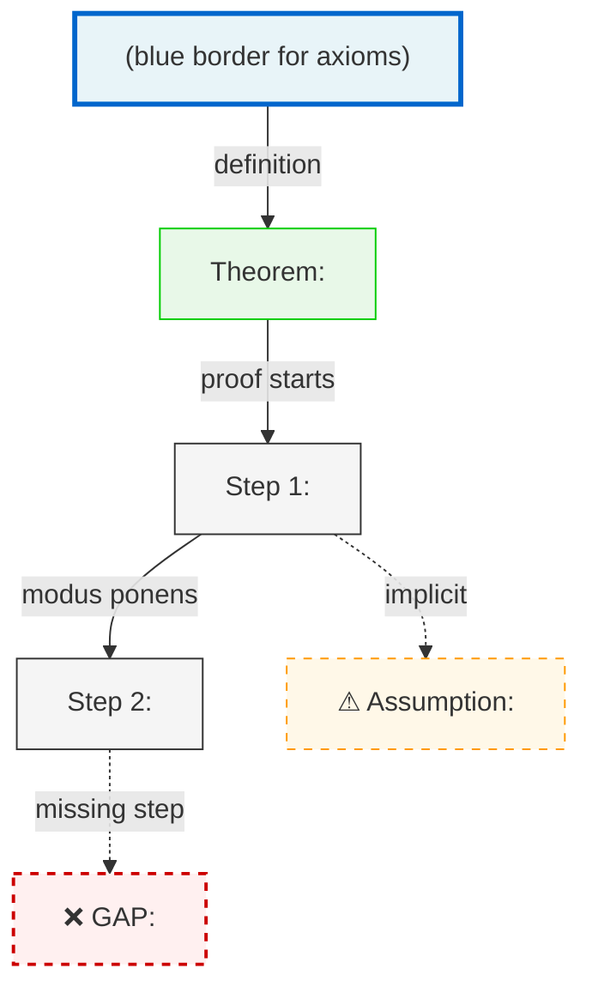
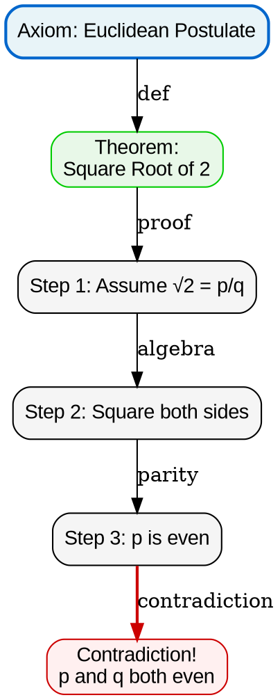
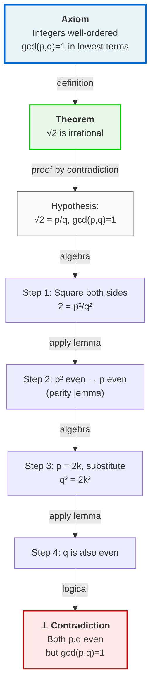
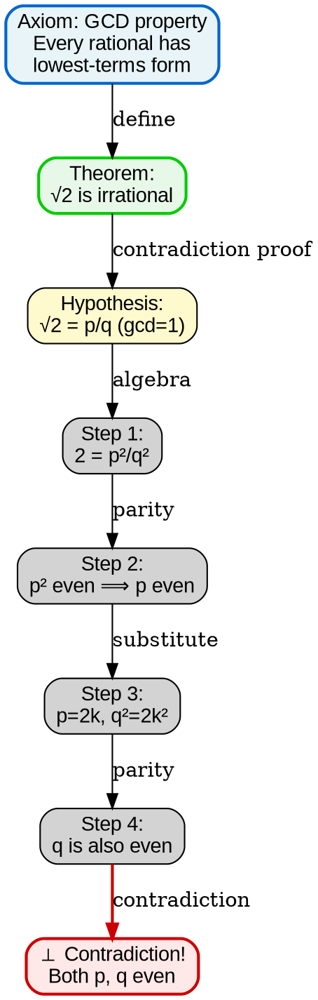

# Visual Grammar: Mathematics

How to render a `mathematics` thought as a diagram.

## Node Structure

- **Theorems** → Rounded rectangles (blue)
- **Axioms/Definitions** → Double-bordered rectangles (green, `[[...]]` in Mermaid)
- **Proof steps** → Rounded rectangles (light gray)
- **Gaps** → Red dashed outlines (warning color)
- **Implicit assumptions** → Dashed rectangles (orange)

## Edge Semantics

- **Logical derivation** → Solid black arrow with step label
- **Gap/missing step** → Dashed red arrow with "GAP: <description>"
- **Assumption dependency** → Orange dashed arrow with "ASSUMES: <assumption>"
- **Contradiction** → Red arrow with "⊥" (contradiction symbol)
- **Proof complete** → Bold arrow with "✓"

## Mermaid Template

## DOT Template

## Worked Example

Input: "Prove that √2 is irrational" (from mathematics.md)

**Mermaid:**

**DOT:**

## Special Cases

- **Gaps in proof** → Show as dashed red nodes with "GAP: <gap type>" label; use `stroke-dasharray` in DOT or dashed red outline in Mermaid
- **Circular dependencies** → Draw a loop with arrows; add "⚠ Circular" label
- **Incomplete induction** → Show base case and inductive step separately; if either is missing, add "GAP: missing base case" or "GAP: missing inductive step"
- **Case exhaustion** → Use a fan layout from the statement to multiple case boxes, each ending at a conclusion box
- **Proof by contradiction** → Assumption leads to contradictory node marked with "⊥"; conclusion is the negation of the assumption
