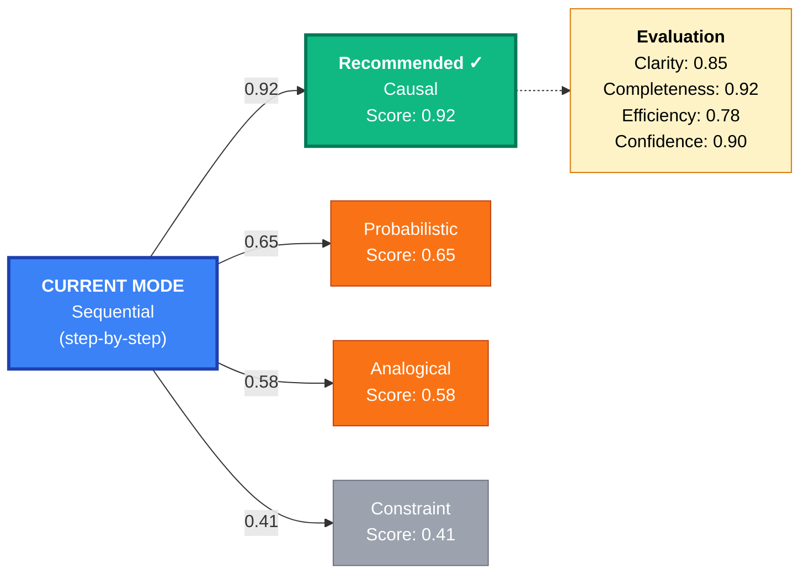
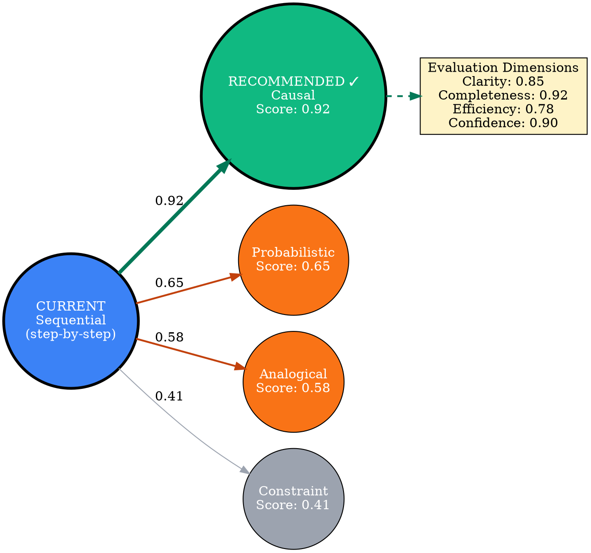
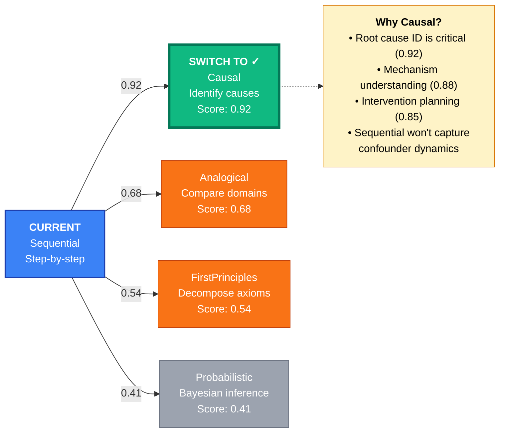
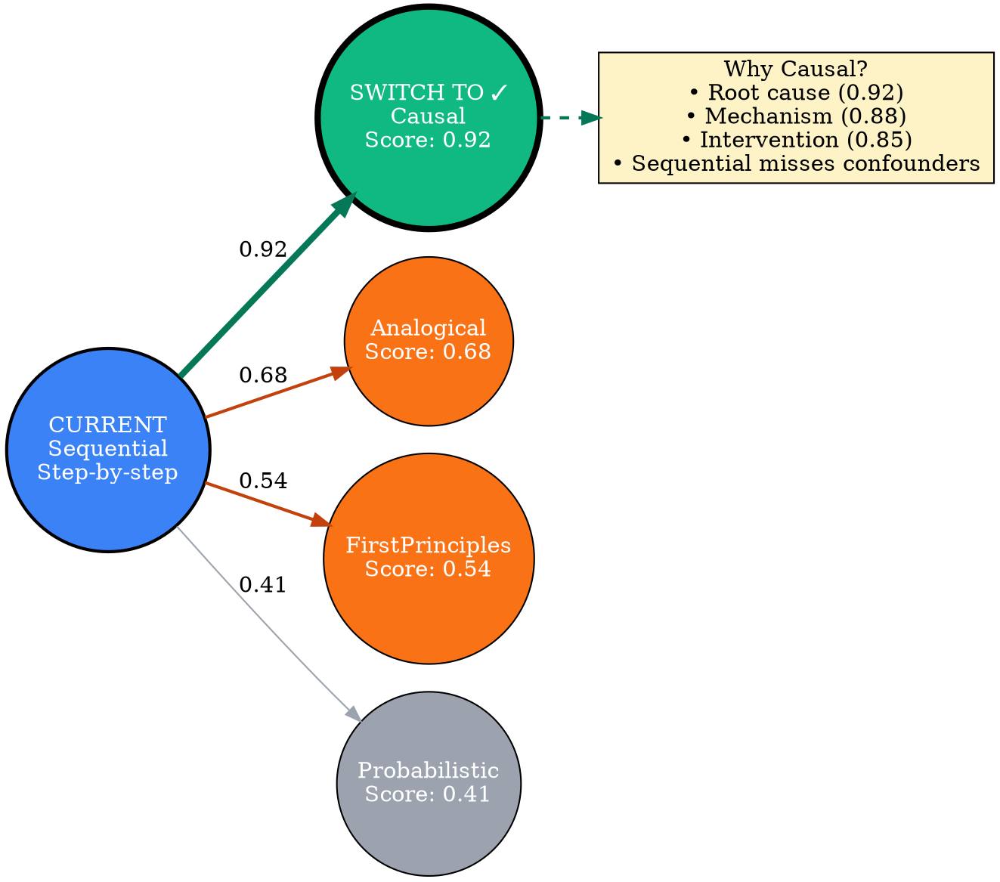

# Visual Grammar: Meta Reasoning

How to render a `metareasoning` thought as a diagram.

## Node Structure

Meta-reasoning diagrams show the current reasoning mode and alternative modes with evaluation scores, mode-switch recommendations, and evaluation dimensions. Structure:
- **Current mode node** (large circle at center): The reasoning mode currently in use, labeled with mode name
- **Alternative mode satellites** (circles around center): Other modes with evaluation scores on edges
- **Recommendation arrow** (thick arrow to best alternative): Points to the mode that should be adopted
- **Evaluation dimensions** (optional radar/spider labels): Show scores on dimensions like `clarity`, `completeness`, `efficiency`, `confidence`
- **Score labels** (on edges): Numerical scores (0-1 or percentages) indicating how well each alternative mode fits the current task

Node colors:
- **Blue**: Current mode
- **Green**: Recommended alternative mode
- **Orange**: Other candidate modes
- **Gray**: Modes with low scores / not recommended
- **Red**: Mode with critical gaps

## Edge Semantics

- **Solid arrow** (`→`) — Mode transition; edge thickness indicates score
- **Thick arrow** (`⟹`) — Recommended switch to this mode; strongest signal
- **Dashed arrow** (`⇢`) — Alternative mode, lower priority
- **Edge label** — Score or evaluation metric (e.g., "0.87", "87%")

## Mermaid Template

## DOT Template

## Worked Example

Based on a session evaluation recommending a mode switch:

### Mermaid

### DOT

## Special Cases

- **Radar/spider plot** (optional): Show evaluation dimensions as a multi-axis radar plot with current mode and recommended mode overlaid for visual comparison of relative strengths.
- **Critical gaps**: If the current mode has a critical gap on a key dimension, highlight it with a red arrow and label "CRITICAL: <dimension>".
- **Confidence bars**: Below each mode score, optionally show a confidence bar (0-1) indicating how certain the recommendation is.
- **Multiple recommendations**: If two or more modes are equally strong, show them with equal thickness arrows and label "Co-optimal: Mode A, Mode B".
- **Explanation box**: Add a text box explaining *why* the recommended mode is better (e.g., "Causal thinking is essential for root-cause analysis; Sequential is too linear for confounder dynamics").
- **Dimension sensitivity**: If switching modes because one dimension improved significantly, annotate that dimension with a "↑" arrow or highlight the improvement.
