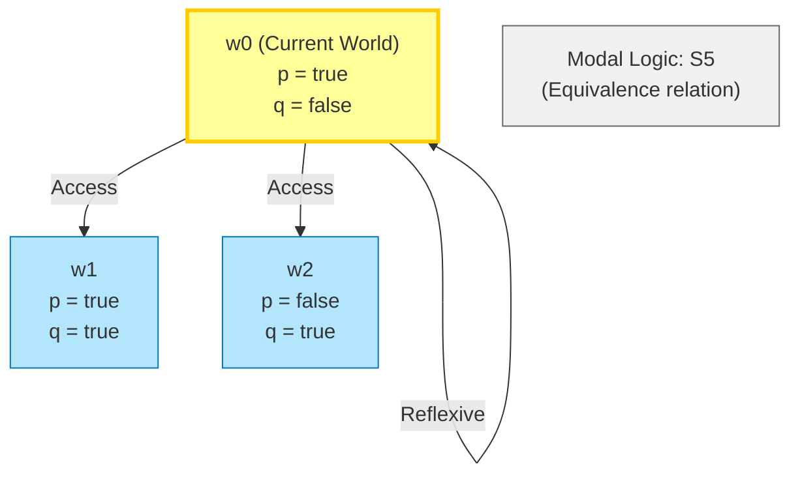
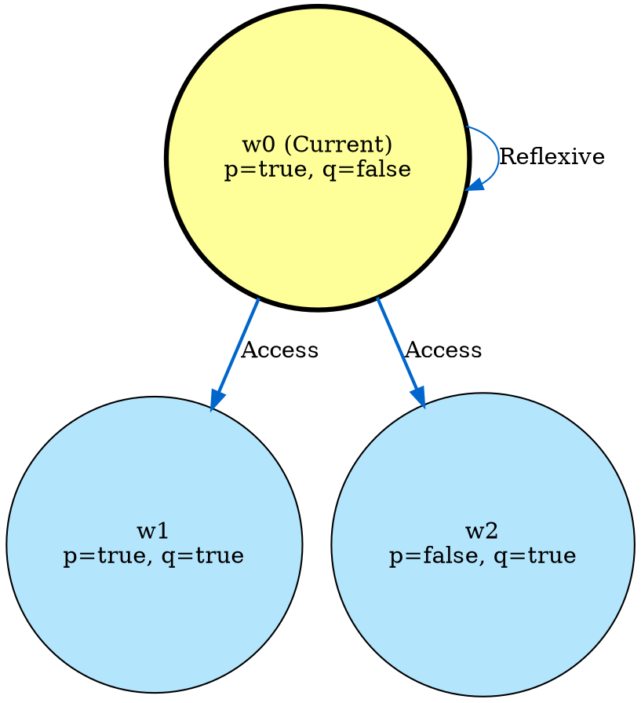
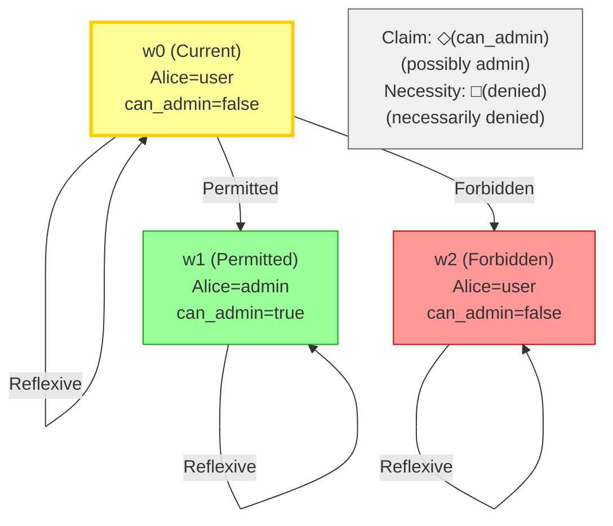
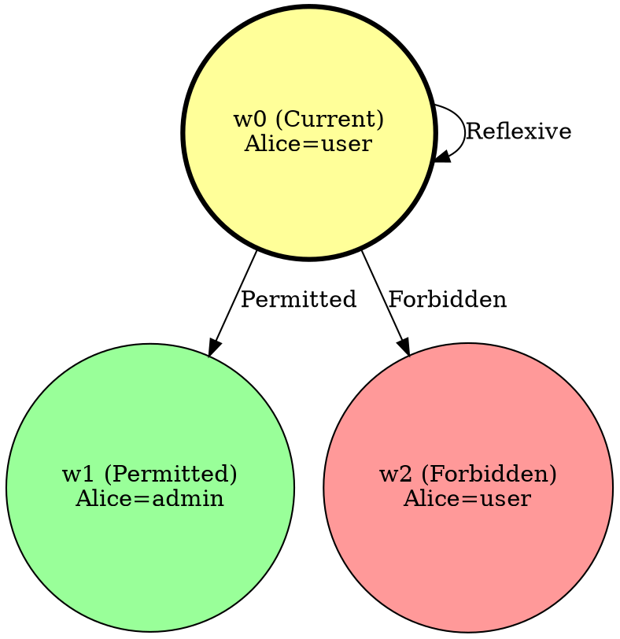

# Visual Grammar: Modal

How to render a `modal` thought as a diagram.

## Node Structure

Modal logic diagrams show possible worlds and accessibility relations:
- **Possible worlds** (circles or ellipses, labeled w0, w1, w2...): alternative states or scenarios
- **Current world** (highlighted in gold or with thick border): the actual world w0
- **Accessibility relation** (directed arrow between worlds): if world w1 is accessible from w0, draw an edge w0 → w1
- **Propositions within worlds** (text inside world node): statements true in that world (e.g., "p=true, q=false")
- **Necessity/Possibility labels** (on edges or in world nodes): □p (necessarily p) or ◇p (possibly p)
- **Logic system label** (top annotation): K, T, S4, S5 indicating the modal logic system

## Edge Semantics

- **Directed arrow** (`→`) — Accessibility: w1 is accessible from w0 (if p at w0, then p possible at w1)
- **Reflexive loop** (self-edge on w0): in T, S4, S5 (every world is accessible to itself)
- **Transitive path** (chain of arrows): in S4, S5 (if w0→w1→w2, then w0→w2)
- **Edge label** (e.g., "R for □p"): indicates which accessibility relation is relevant

## Mermaid Template

## DOT Template

## Worked Example

Alice admin access deontic/S5 scenario with 3 worlds.

### Mermaid

### DOT

## Special Cases

- **Multi-relation accessibility**: Use different edge colors or styles (solid vs dashed) for different accessibility relations (e.g., doxastic, epistemic, deontic).
- **Frame properties**: Annotate diagram title with logic system (K, T, S4, S5) to indicate whether relation is reflexive, transitive, or symmetric.
- **Counterexample world**: Highlight worlds in red that violate a property or constraint.
- **Necessity and possibility tracking**: Use annotations like □p (true in all accessible worlds) or ◇p (true in some accessible world).
- **Equivalence classes**: In S5, worlds can be grouped into equivalence classes with bidirectional arrows between all pairs.
