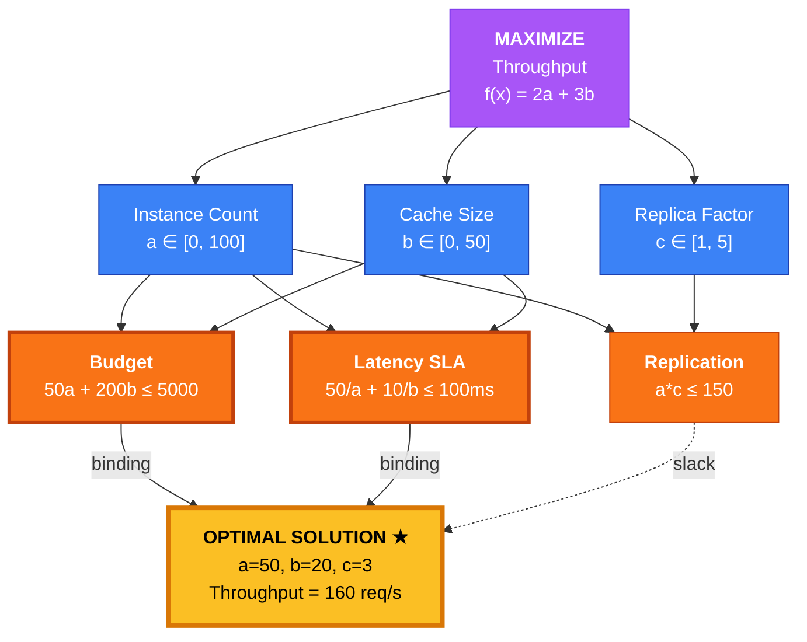
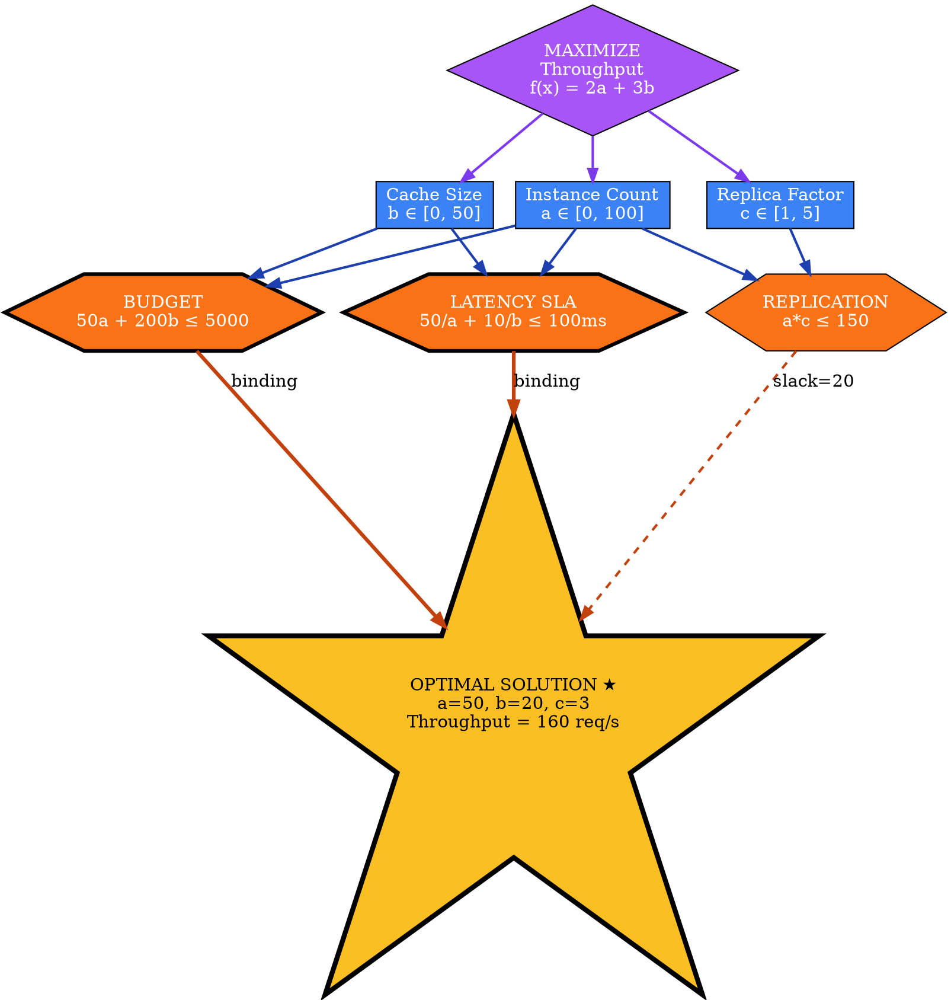
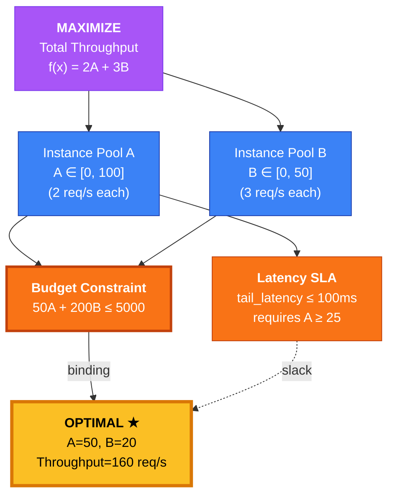
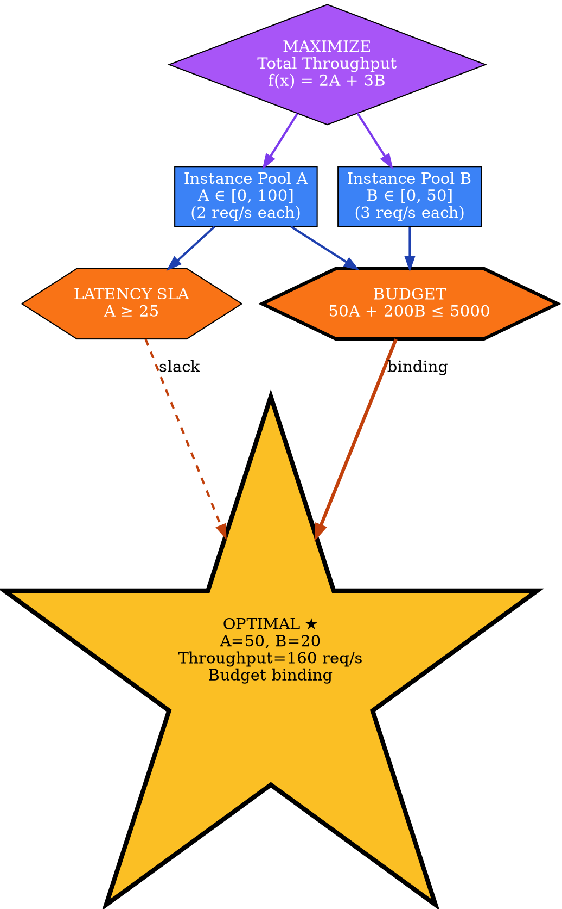

# Visual Grammar: Optimization

How to render an `optimization` thought as a diagram.

## Node Structure

Optimization diagrams show the objective function, decision variables, constraints, and the optimal solution. Structure:
- **Objective diamond** (at top or center): Labeled "Maximize f(x)" or "Minimize f(x)"
- **Variable nodes** (rectangles): Decision variables with domain bounds (e.g., "X ∈ [0, 100]")
- **Constraint nodes** (hexagons or boxes): Hard constraints with expressions (e.g., "X + Y ≤ 50")
- **Feasible region** (optional subgraph): Boundary showing the constraint intersection
- **Optimal solution node** (gold/yellow star): The point that maximizes/minimizes the objective within the feasible region
- **Binding constraint highlight** (thick border, bolded): Constraints that hold with equality at the optimum

Node colors:
- **Purple**: Objective function
- **Blue**: Decision variables
- **Orange**: Constraints
- **Gold**: Optimal solution
- **Red**: Binding constraints (active at optimum)

## Edge Semantics

- **Solid arrow** (`→`) — Dependency: variable influences objective or constraint
- **Dashed arrow** (`⇢`) — Weak binding: constraint is nearly active but has slack
- **Thick solid arrow** (`⟹`) — Binding constraint: tight at optimum, limiting the objective

## Mermaid Template

## DOT Template

## Worked Example

Based on the cloud instance allocation scenario from `reference/output-formats/optimization.md`:

### Mermaid

### DOT

## Special Cases

- **Binding constraints**: Draw with thick red borders and bold labels; these are the limiting factors at the optimum.
- **Non-binding constraints**: Draw with thinner borders; they have slack (unused capacity) and do not affect the optimal solution.
- **Sensitivity annotations**: For binding constraints, optionally add a label showing how much the objective would improve if the constraint were relaxed (shadow price or dual value).
- **Infeasibility**: If the problem is infeasible, shade the feasible region in red and label the constraint intersection as "∅ (empty)".
- **Integer solutions**: If variables are restricted to integers, mark them with a "Z" or "ℤ" superscript to distinguish from continuous variables.
- **Multi-objective trade-off**: For problems with competing objectives, render the Pareto frontier as a thick curved or stepped line, with the solution choice marked on the frontier.
