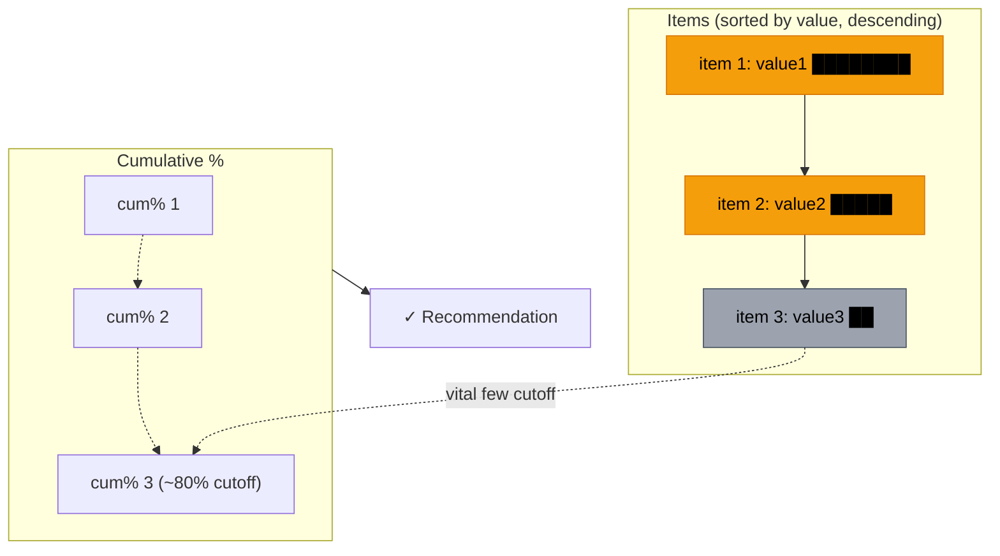
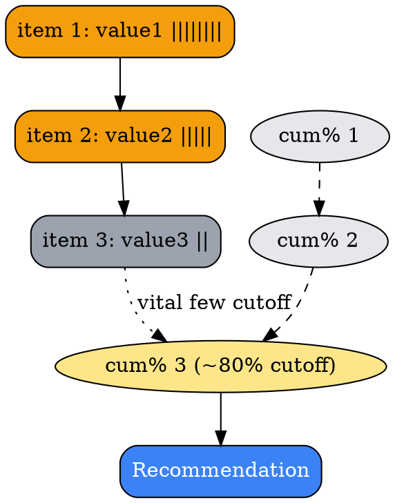
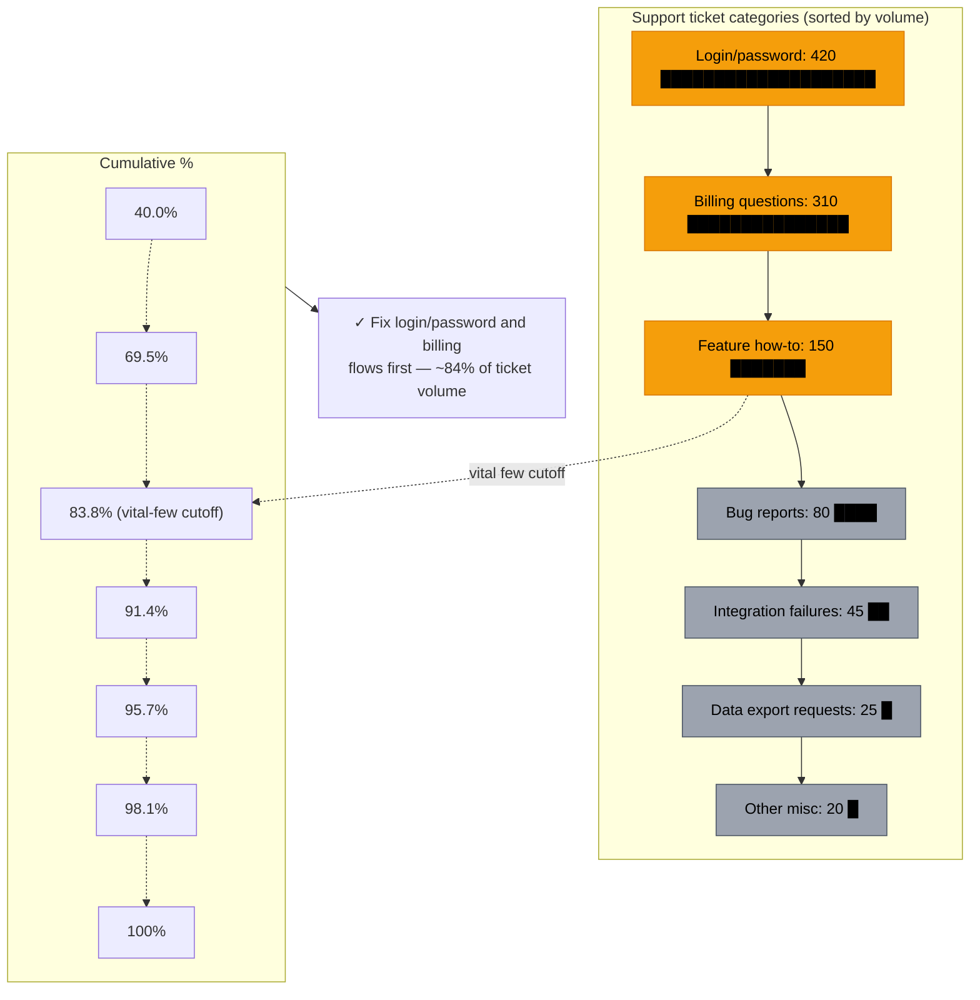
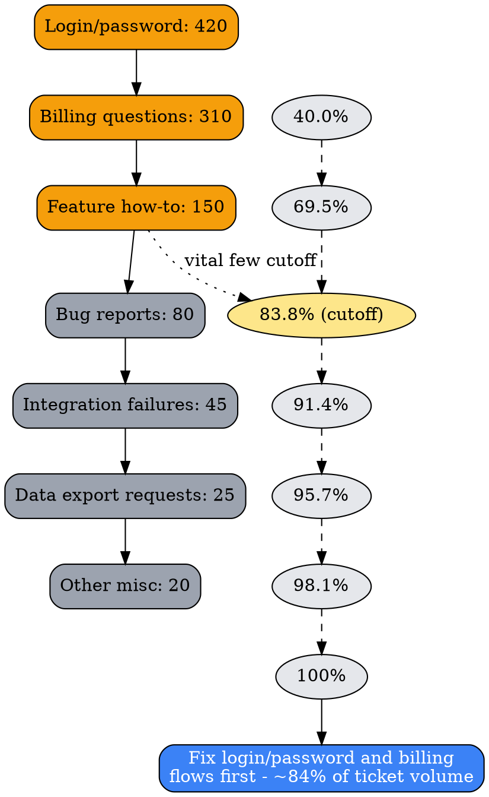

# Visual Grammar: Pareto (80/20)

How to render a `pareto` thought as a diagram.

## Node Structure

Pareto analysis is rendered as **sorted bars with a cumulative percentage line** — items ordered descending by `value`, with a running `cumulativePercent` overlay showing where the "vital few" cutoff falls. Neither Mermaid's plain `graph` syntax nor DOT natively support dual-axis bar+line charts, so this grammar is a **best-effort approximation**: bars are represented as proportionally-labeled boxes and the cumulative line as a directed chain of percentage nodes.

- **Item bars** (one per entry in `items[]`, sorted descending by `value`) → a **box** per item, labeled with `name`, `value`, and a text-block bar (`█` repeated proportional to `value`); items also present in `vitalFew[]` render in **gold**, the rest in **gray**
- **Cumulative chain** (parallel track) → one node per entry in `cumulativePercent[]`, chained in sequence, each labeled with its running percentage; a visually marked node at/just past 80% flags the vital-few cutoff
- **Recommendation** (optional, bottom) → a **blue box** with the prioritization action

## Edge Semantics

- **Thin directed arrow** connects each item bar to the next in descending-value order — this is a rank/sequence edge, not a causal one; it exists only so the sort order is visually explicit
- **Dashed directed arrow** chains the cumulative-percent nodes in the same order, approximating the cumulative line's trajectory
- A **dotted edge** from the last vital-few item to the 80%-cutoff node highlights where the vital-few boundary falls

## Mermaid Template

## DOT Template

## Worked Example

Based on the support-ticket scenario in `test/samples/pareto-valid.json` (7 categories, 1,050 total tickets):

### Mermaid

### DOT

## Special Cases

- **Best-effort chart, not a native chart**: Neither Mermaid's `graph` grammar nor DOT support true dual-axis bar+line rendering. If the `visual-exporter` agent is asked for a format with native chart support (e.g., an HTML dashboard using Chart.js, or a CSV export for spreadsheet charting), prefer that format over straining the Mermaid/DOT approximation.
- **Sort order is load-bearing**: `items[]` must already be sorted descending by `value` for this grammar to make sense — if the underlying thought's array isn't sorted, sort before rendering rather than rendering in input order.
- **`vitalFew[]` highlight matches by name**: An item bar renders gold if its `name` appears (verbatim) in `vitalFew[]`, gray otherwise — this is the same cross-reference-by-string-match pattern used for `primaryCauses[]` in the fishbone grammar.
