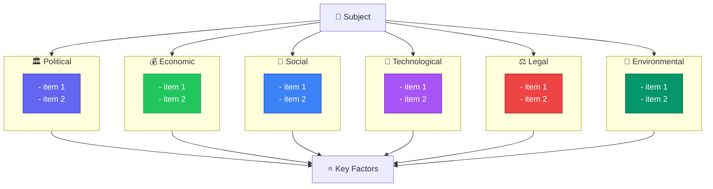
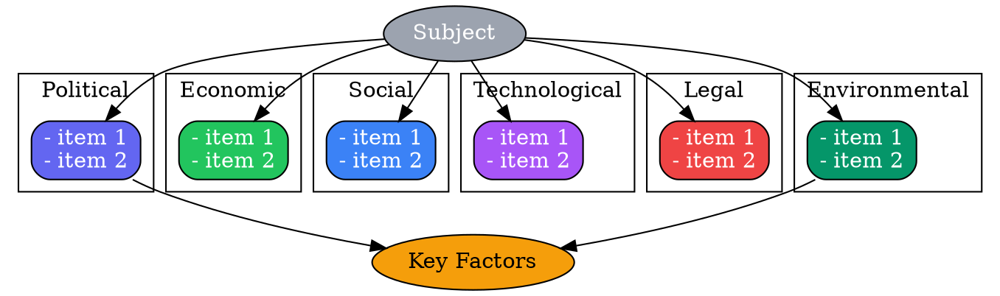
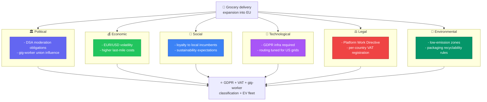
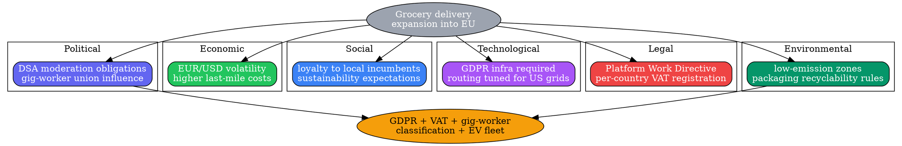

# Visual Grammar: PESTLE

How to render a `pestle` thought as a diagram.

## Node Structure

PESTLE analysis is rendered as a **6-lane board** — one lane per macro-environment category, all converging on the analyzed `subject`.

- **Subject** (top of board) → a **gray ellipse** naming what is being scanned
- **Political / Economic / Social / Technological / Legal / Environmental** (six parallel lanes) → each lane is its own **subgraph/cluster**, one distinctly colored per category, listing its array items (one per line)
- **Key Factors** (optional synthesis node, bottom of board) → a **gold box** listing `keyFactors[]`, the cross-lane factors judged most consequential

## Edge Semantics

PESTLE has no directional reasoning edges between lanes — like SWOT, it is a static classification board, not a causal chain. The only edges are thin informational edges from `Subject` into each of the six lanes, and from each lane into `Key Factors` when that node is rendered.

## Mermaid Template

## DOT Template

## Worked Example

Based on the EU-expansion scenario in `test/samples/pestle-valid.json`:

### Mermaid

### DOT

## Special Cases

- **Empty lane**: If a category array is empty, render the lane's node with the text "none identified" rather than omitting the lane — all six lanes must stay visible even when one is thin.
- **`keyFactors[]` cross-references multiple lanes**: A key factor commonly spans more than one PESTLE category (e.g., GDPR touches both Technological and Legal) — render `Key` as a single synthesis node fed from every contributing lane rather than trying to attribute each factor to exactly one lane.
- **Long lane lists**: If a lane has more than ~3-4 items, show the top items and add a "+N more" suffix rather than growing the lane node unboundedly.
