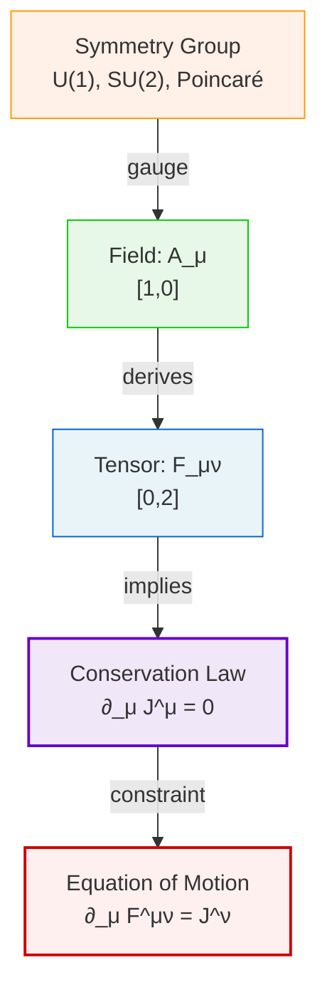
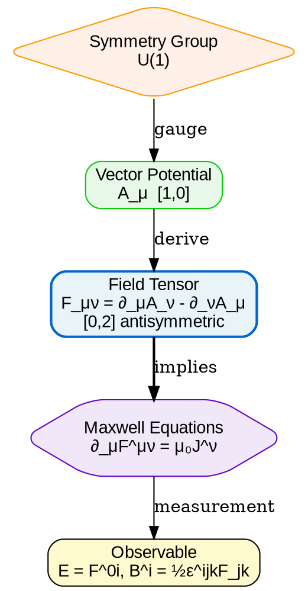
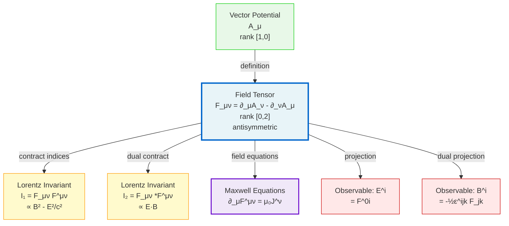
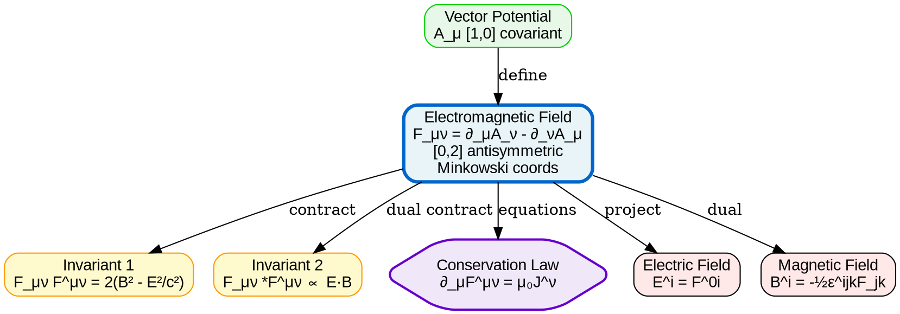

# Visual Grammar: Physics

How to render a `physics` thought as a diagram.

## Node Structure

- **Tensor objects** → Rectangles with rank label `[m,n]` suffix (blue)
- **Field quantities** → Rounded rectangles with units label (green)
- **Conservation laws** → Hexagons or bold rectangles (purple)
- **Symmetry groups** → Diamond nodes (orange)
- **Equations of motion** → Large nodes with LaTeX labels (center, red border)

## Edge Semantics

- **Derivation** → Solid arrow with "derives from" label
- **Conservation law application** → Thick bold arrow labeled with ∂, ∇, or the law name
- **Field coupling** → Dashed arrow labeled "couples to" or the coupling constant
- **Gauge transformation** → Double-headed arrow with "gauge: <transformation>"
- **Lorentz covariance** → Arrow labeled "covariant"

## Mermaid Template

## DOT Template

## Worked Example

Input: "Analyze the electromagnetic field tensor" (from physics.md)

**Mermaid:**

**DOT:**

## Special Cases

- **Multi-component tensors** → Show rank as `[contravariant, covariant]` suffix; use subscripts and superscripts in labels
- **Gauge-invariant combinations** → Draw as separate nodes below the field tensor; circle the invariant nodes or shade them distinctly
- **Symmetry breaking** → Show symmetry group node at top; draw broken arrow (wavy line) when symmetry is broken, with "breaking mechanism" label
- **Hub-and-spoke layout** → Place main tensor in center; radiate derivations, conservation laws, and observables outward; use `rankdir=LR` if space is tight
