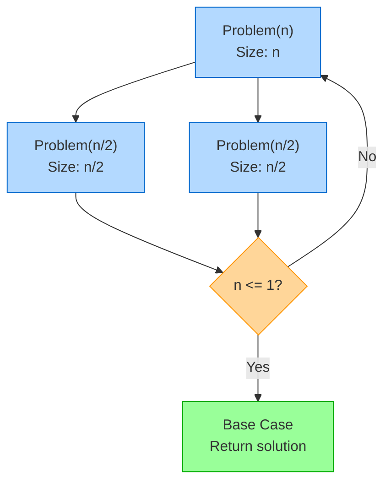
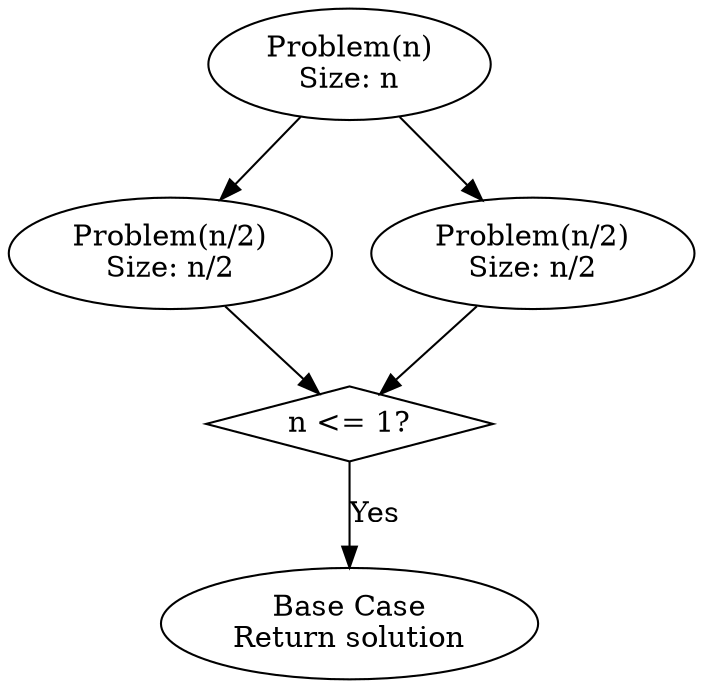
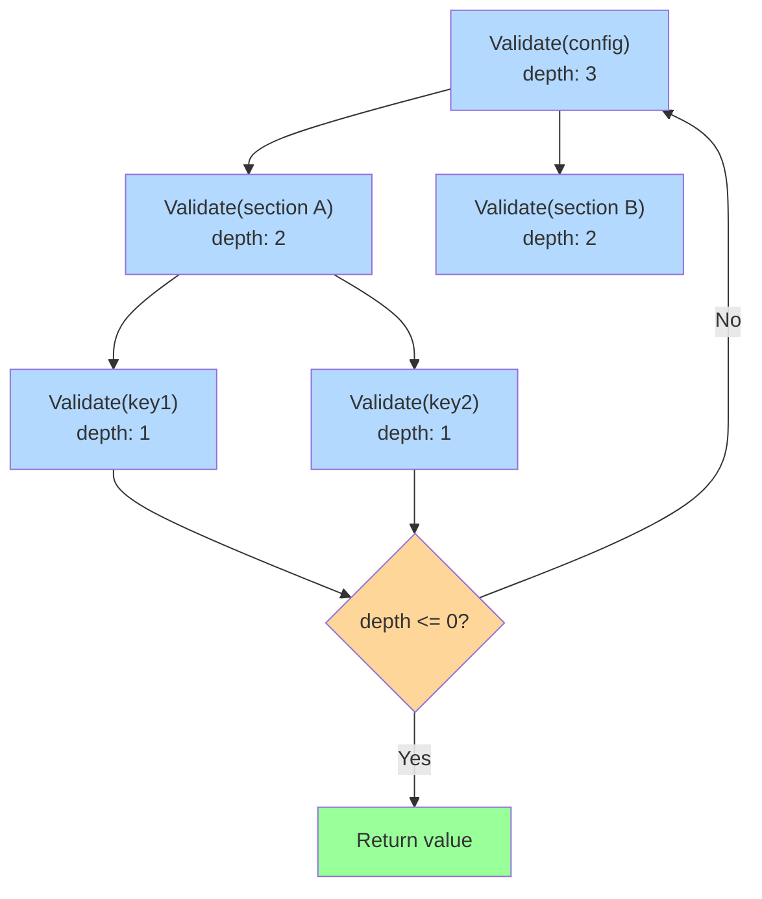
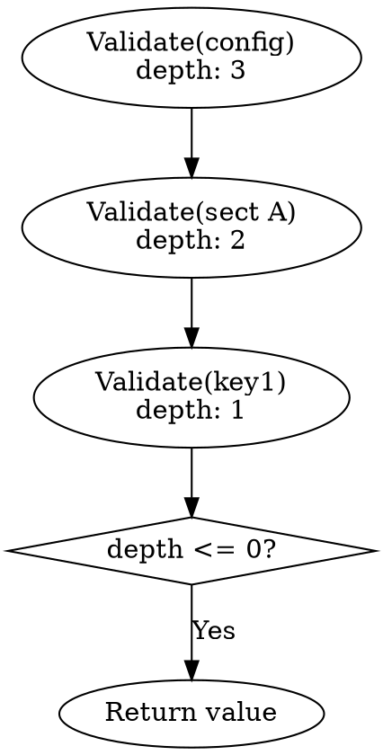

# Visual Grammar: Recursive

How to render a `recursive` thought as a diagram.

## Node Structure

Recursive diagrams show decomposition of problems into smaller subproblems:
- **Root problem** (top rectangle): the original problem of size n
- **Recursive calls** (rectangles, branching downward): subproblems at reduced size (n/2, n-1, etc.)
- **Base case** (green rectangle at bottom): the minimal problem that returns a solution directly
- **Halting condition** (diamond decision node on each call): check that problem size strictly decreases
- **Problem size labels** (edge annotations): show size reduction (n → n/2 or n → n-1)

## Edge Semantics

- **Solid arrow** (`→`) — Recursive call: problem subdivides into smaller subproblems
- **Bold arrow to base case** (`⟹`) — Reaches base case and terminates
- **Halting condition label** (on diamond): e.g., "if n <= 1" or "if size == 0"
- **Size annotation** (on edge): e.g., "n/2" or "n-1" showing the recurrence relation

## Mermaid Template

## DOT Template

## Worked Example

Nested config validation recursion with problem size tracking.

### Mermaid

### DOT

## Special Cases

- **Multiple base cases**: Use separate green nodes for different termination conditions.
- **Non-trivial combining step**: Annotate edges showing how results are combined (e.g., "merge left and right").
- **Logarithmic depth tree**: Problem size reduces by constant factor (e.g., n/2) creating balanced tree.
- **Linear depth chain**: Problem size reduces by constant (e.g., n-1) creating a chain, not tree.
- **Constraint violation**: Highlight nodes where the halting condition is violated in red.
