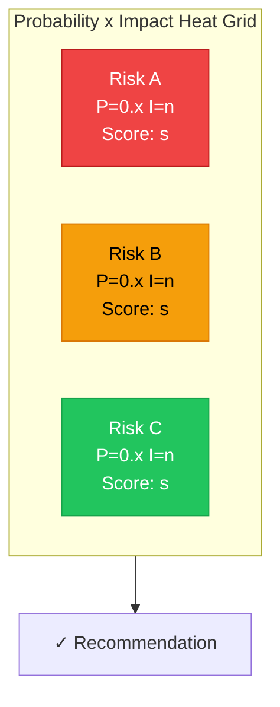
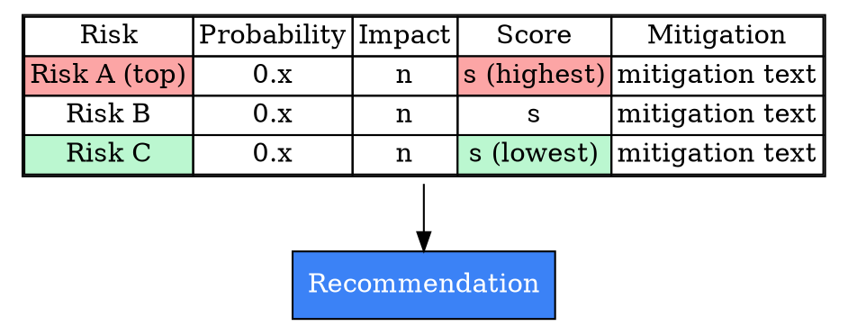
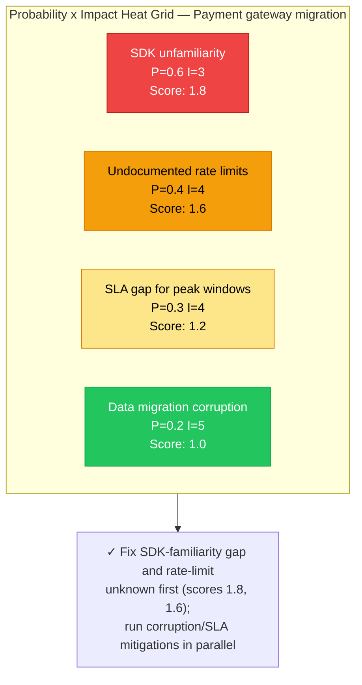
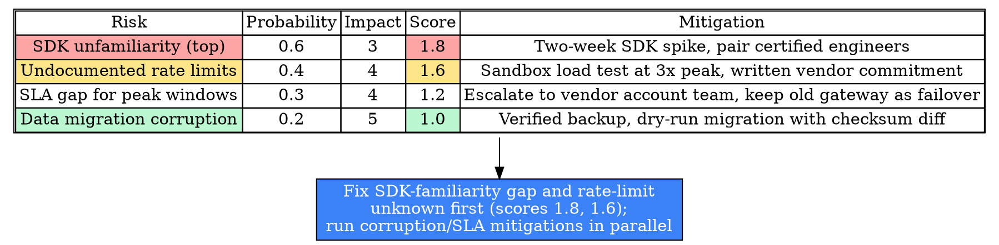

# Visual Grammar: Risk Assessment

How to render a `riskassessment` thought as a diagram.

## Node Structure

Risk Assessment is rendered as a **probability × impact heat grid** — a 2D scatter/grid where each risk is placed by its `probability` (vertical axis) and `impact` (horizontal axis), colored by its `score`, since `score` is the product of the two axes.

- **Grid cells** → a 5×5 (or continuous, if probability/impact are fractional) background grid from low to high on both axes, with warmer colors (red) toward the high/high corner and cooler colors (green) toward the low/low corner
- **Risk nodes** → one per entry in `risks[]`, placed at its `(probability, impact)` coordinate, labeled with `risk` (short excerpt) and `score`; risks listed in `topRisks[]` get a bold border
- **Mitigation callouts** (optional, attached to each risk node) → a small linked node or annotation showing `mitigation`
- **Recommendation** (bottom) → a **blue box** naming the priority order for addressing risks

## Edge Semantics

Risk Assessment has no causal or sequential edges between risks — like Decision Matrix, it is a static scored grid. The only edges are informational: a dotted edge from each risk node to its mitigation callout (if rendered separately), and a solid edge from the grid into the Recommendation node.

## Mermaid Template

## DOT Template

## Worked Example

Based on the payment-gateway migration scenario in `test/samples/riskassessment-valid.json`:

### Mermaid

### DOT

## Special Cases

- **`score` must always equal `probability × impact`**: per this mode's prose invariant, the rendered label must show the arithmetic (`P=0.4 I=4 → Score: 1.6`), not just the bare score — a bare score defeats the purpose of a probability × impact matrix, which is to make the priority ranking auditable.
- **Color by score, not by raw probability or impact alone**: a risk with high probability but low impact (or vice versa) should not render as dramatically as one with both high — color intensity tracks the product (`score`), matching how the Mermaid/DOT templates above grade from red (highest score) to green (lowest).
- **`topRisks[]` highlight matches by name**: a risk node gets a bold border / warmer color tier if its `risk` text appears (verbatim) in `topRisks[]` — the same cross-reference-by-string-match pattern used for `vitalFew[]` in the pareto grammar and `primaryCauses[]` in fishbone.
