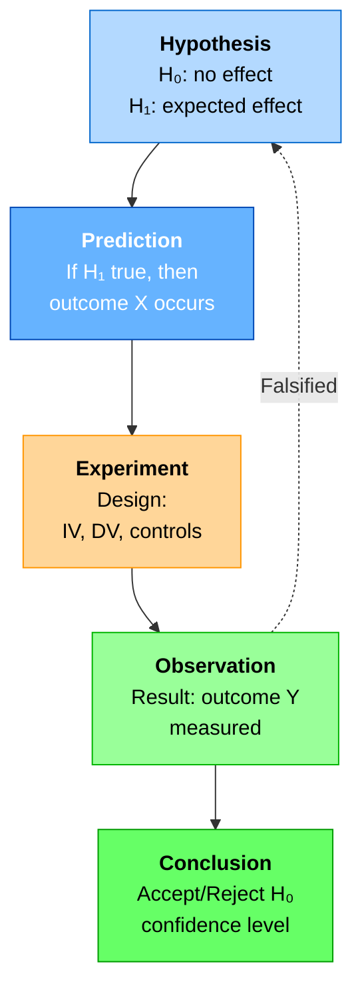
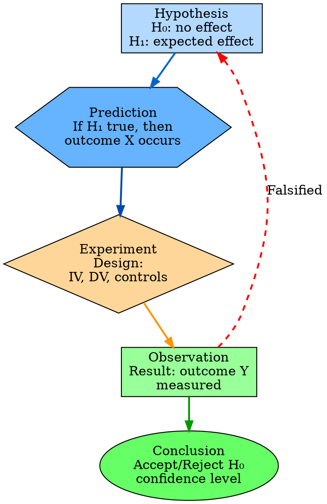
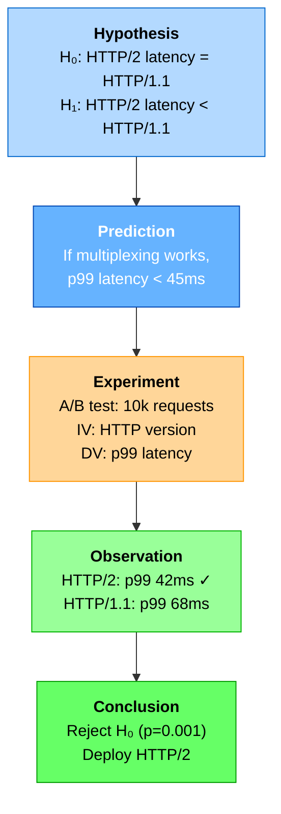
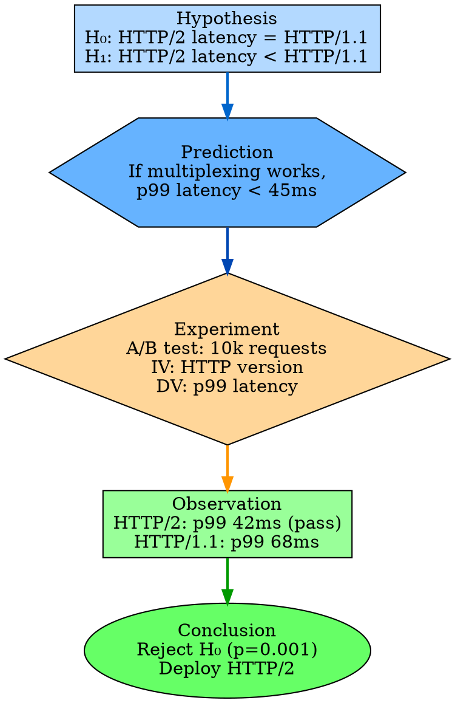

# Visual Grammar: Scientific Method

How to render a `scientificmethod` thought as a diagram.

## Node Structure

Scientific method thoughts are hypothesis-driven experimentation cycles. Each node represents a phase:
- **Hypothesis** (rounded rectangle, light blue): null hypothesis and alternative hypothesis side-by-side in the node
- **Prediction** (hexagon, blue): expected outcome based on the hypothesis
- **Experiment** (diamond, gold): design and procedure
- **Observation** (parallelogram, green for confirmed, red for refuted): measured result
- **Revision** (curved arrow back to hypothesis): falsifiability checkpoint

The cycle loops: hypothesis → prediction → experiment → observation → revise (if falsified) or conclude (if confirmed).

## Edge Semantics

- **Solid arrow** (`→`) — Main cycle progression: hypothesis to prediction to experiment to observation
- **Curved arrow** (`⤵`) — Revision loop: observation back to hypothesis when result contradicts prediction (falsification)
- **Thick solid arrow** (`⟹`) — Confirmed conclusion: observation to final conclusion box when hypothesis is supported

## Mermaid Template

## DOT Template

## Worked Example

Based on the HTTP/2 vs HTTP/1.1 latency A/B test from `reference/output-formats/scientificmethod.md`:

### Mermaid

### DOT

## Special Cases

- **Falsification**: When observation refutes the hypothesis, draw a dashed red arc from observation back to hypothesis labeled "Falsified" to indicate the cycle must restart with a revised hypothesis.
- **Multiple hypotheses**: If testing multiple H₁ variants, draw parallel experiment → observation paths from the same prediction node.
- **Control variables**: Can be listed in an annotation box attached to the experiment node.
- **Confidence level**: Display as a percentage or 0-1 scale on the conclusion node.
- **Incomplete experiment**: If the experiment is not yet run, show prediction → experiment with a dashed edge to observation, labeled "pending".

