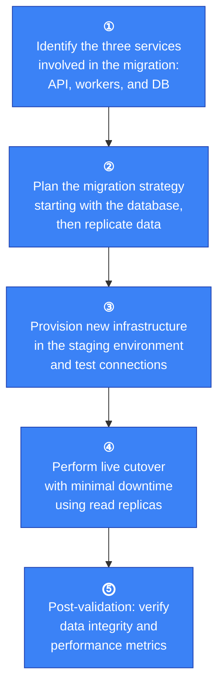
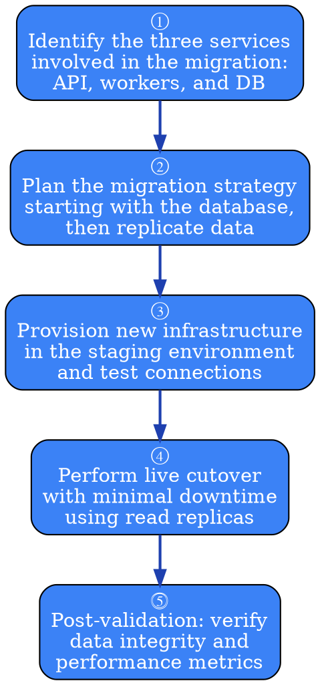
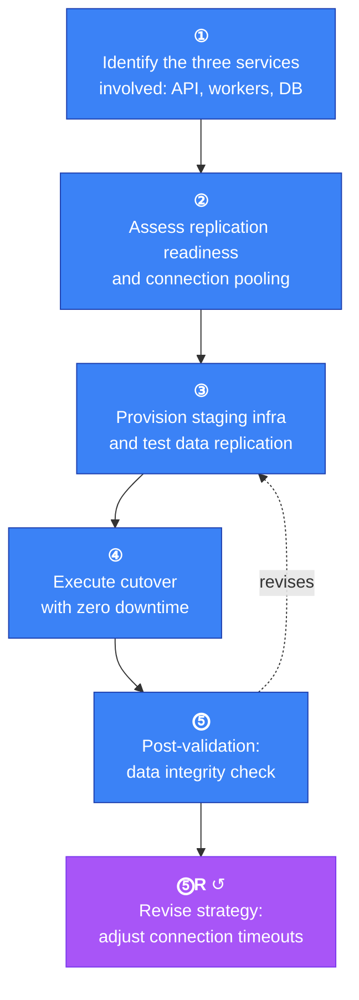
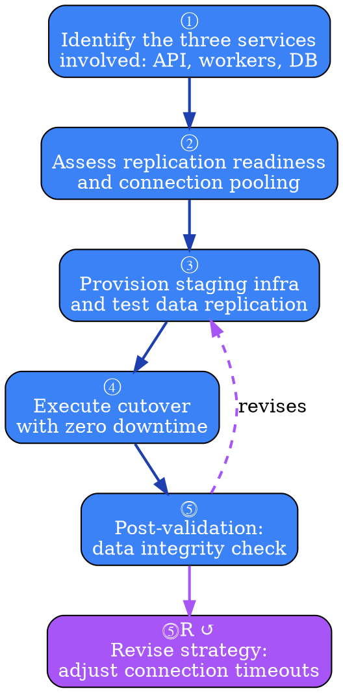

# Visual Grammar: Sequential

How to render a `sequential` thought as a diagram.

## Node Structure

Sequential thoughts are chains of iterative reasoning steps. Each thought is rendered as a **rounded rectangle** (stadium shape) with:
- **Badge**: `thoughtNumber` displayed in top-left corner (e.g., "①", "②", "③")
- **Content excerpt**: First 60 characters of the thought content
- **Revision indicator**: If `isRevision` is true, add a small "↺" symbol in the top-right

Related concepts:
- **Dependencies** → Incoming solid arrows from prior thoughts
- **Revisions** → Dashed backward arrows labeled "revises" pointing to the original thought
- **Branches** → Thick parallel arrows labeled "branches" to indicate parallel exploration paths

## Edge Semantics

- **Solid arrow** (`→`) — Direct dependency: `thoughtNumber` N depends on N-1 or is in the `dependencies` array
- **Dashed arrow** (`⇢`) — Revision: thought X revises an earlier thought, labeled with `revisionReason` excerpt
- **Thick solid arrow** (`⟹`) — Branch: thick line to indicate a new exploratory path from the parent thought, labeled with `branchId`

## Mermaid Template

## DOT Template

## Worked Example

Based on the database migration scenario from `reference/output-formats/sequential.md`:

### Mermaid

### DOT

## Special Cases

- **Revisions**: When a thought revises an earlier step (`isRevision=true`), draw a dashed arrow pointing backward to the revised thought, labeled with the revision reason (e.g., "revises: discovered connection pool bug").
- **Branching**: When `branchFrom` is set, draw a thick parallel arrow from the parent to the new branch, labeled with the `branchId` to show exploratory paths.
- **Optional next thought**: If `nextThoughtNeeded` is false, mark the final node with a checkmark (✓) or use a stadium/pill shape for terminal nodes.
- **Multiple dependencies**: When a thought depends on multiple prior thoughts, draw arrows from each, allowing the node to have multiple incoming edges.

