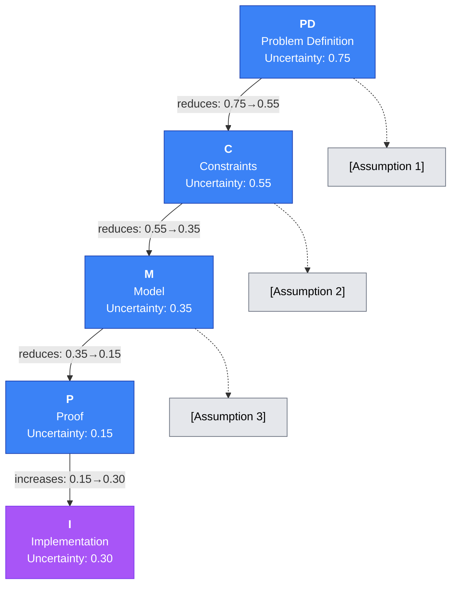
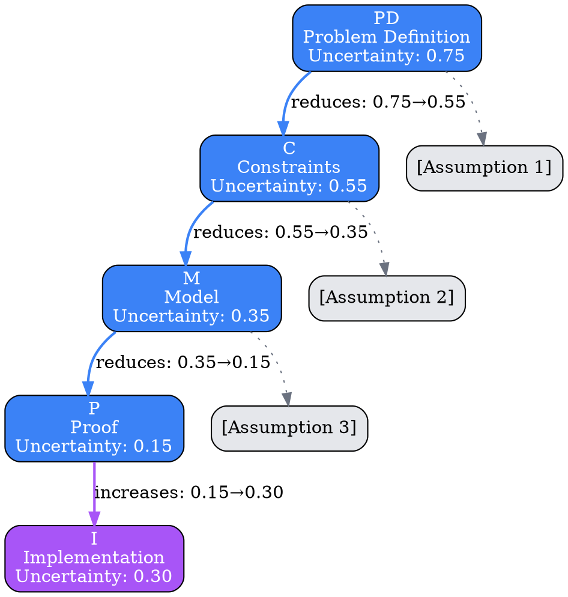
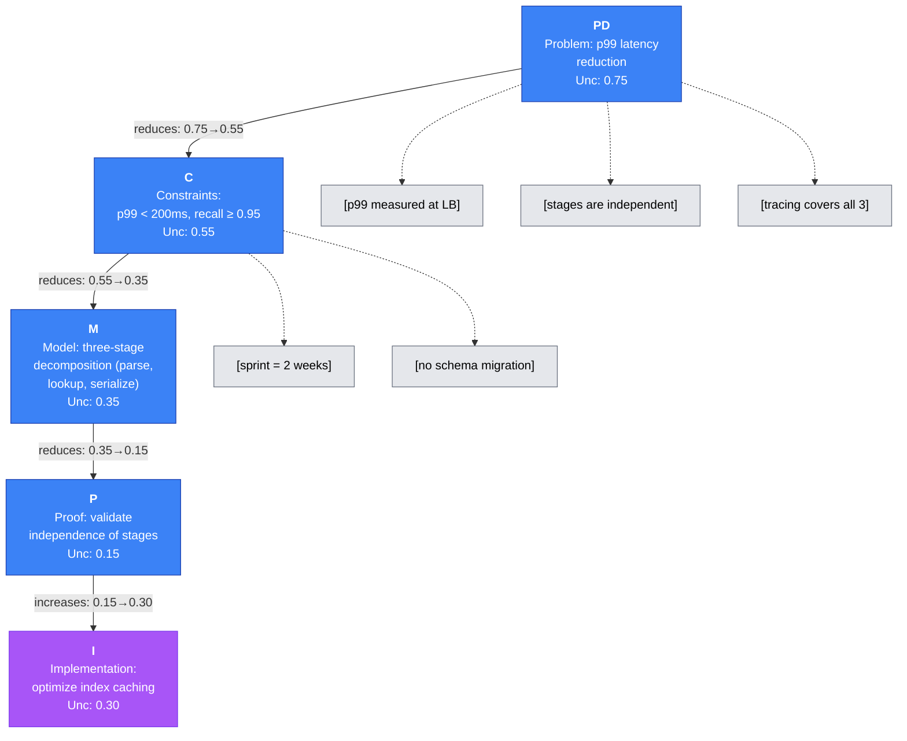
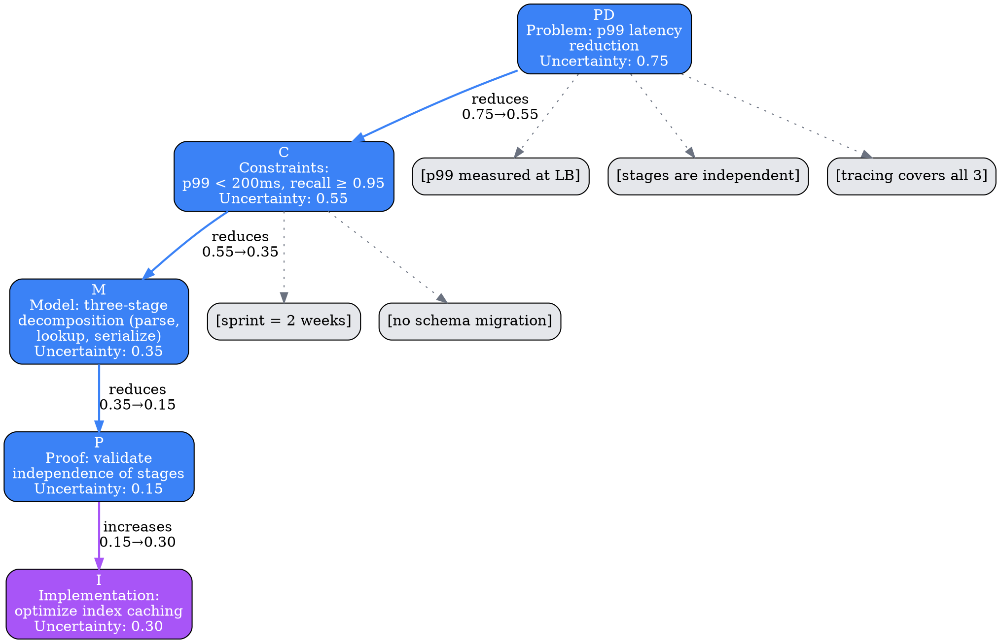

# Visual Grammar: Shannon

How to render a `shannon` thought as a diagram.

## Node Structure

Shannon's 5-stage reasoning follows a systematic progression of uncertainty reduction. Each stage is rendered as a **rounded rectangle** with:
- **Stage label**: Abbreviated stage name (e.g., "PD", "C", "M", "P", "I") in bold in the top-left
- **Content excerpt**: First 50 characters of the thought content
- **Uncertainty value**: Displayed inside or on the right edge (e.g., "Unc: 0.75")
- **Assumptions**: Rendered as smaller leaf nodes hanging below the stage

Related concepts:
- **Assumptions** → Rendered as small `[...]` rectangles hanging below each stage
- **Stage progression** → Solid downward arrows connecting stages sequentially
- **Uncertainty decay** → Arrow labels or node border color intensity should reflect decreasing uncertainty

## Edge Semantics

- **Solid arrow** (`→`) — Stage dependency: stage N+1 depends on stage N's output; labeled with `"→ reduces uncertainty from X to Y"` showing the decrease
- **Thin gray edge** — Assumption reference: from stage to each of its assumption nodes
- **Bold edge** — High-confidence dependency: when `confidenceFactors.methodologyRobustness > 0.8`

## Mermaid Template

## DOT Template

## Worked Example

Based on the p99 latency decomposition from `reference/output-formats/shannon.md`:

### Mermaid

### DOT

## Special Cases

- **Uncertainty increases**: In the `implementation` stage, uncertainty may increase from the `proof` stage (due to practical deployment unknowns). Show this with an upward-pointing arrow and clearly label the increase.
- **Alternative approaches**: If `alternativeApproaches` is non-empty, render them as dashed branches off the stage that considered them, to show roads not taken.
- **Rechecks**: If `recheckStep` is populated, add a backward dashed arrow from the current stage to the stage being rechecked, labeled with the recheck reason.
- **Confidence factors**: Optionally display `confidenceFactors` as a small badge or sidebar (e.g., "Data: 0.7 | Method: 0.8 | Assume: 0.65") to show degree of confidence per stage.

