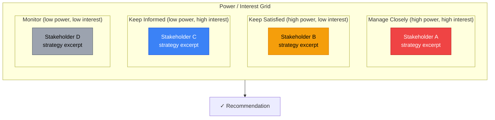
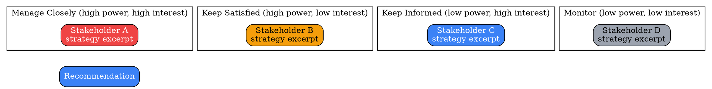
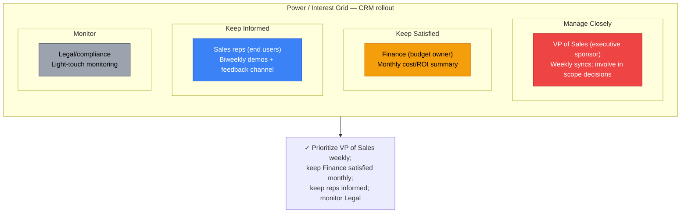

# Visual Grammar: Stakeholder Analysis

How to render a `stakeholder` thought as a diagram.

## Node Structure

Stakeholder Analysis is rendered as a **power/interest 2×2 grid** — the classic quadrant map crossing Power (low/high, vertical axis) against Interest (low/high, horizontal axis) into four named quadrants: Manage Closely (high power, high interest), Keep Satisfied (high power, low interest), Keep Informed (low power, high interest), and Monitor (low power, low interest).

- **Quadrant regions** → four subgraphs (Mermaid) / clusters (DOT), one per `quadrant` value, laid out so power increases upward and interest increases rightward
- **Stakeholder nodes** → one per entry in `stakeholders[]`, placed in the subgraph/cluster matching its `quadrant`, labeled with `name` and a short excerpt of `strategy`
- **Recommendation** (optional, bottom) → a **blue box** synthesizing engagement priority across quadrants

## Edge Semantics

Stakeholder Analysis has no causal or sequential edges — like SWOT and PESTLE, it is a static classificatory grid. There are no edges between stakeholder nodes; each stakeholder's only relationship is its placement within a quadrant.

## Mermaid Template

## DOT Template

## Worked Example

Based on the CRM-rollout scenario in `test/samples/stakeholder-valid.json`:

### Mermaid

### DOT

```dot
digraph StakeholderCRM {
    rankdir=TB;
    node [shape=box, style="filled,rounded"];

    subgraph cluster_manageClosely {
        label="Manage Closely";
        S1 [label="VP of Sales (executive sponsor)\nWeekly syncs; involve in scope decisions", fillcolor="#ef4444", fontcolor="white"];
    }
    subgraph cluster_keepSatisfied {
        label="Keep Satisfied";
        S2 [label="Finance (budget owner)\nMonthly cost/ROI summary", fillcolor="#f59e0b", fontcolor="black"];
    }
    subgraph cluster_keepInformed {
        label="Keep Informed";
        S3 [label="Sales reps (end users)\nBiweekly demos + feedback channel", fillcolor="#3b82f6", fontcolor="white"];
    }
    subgraph cluster_monitor {
        label="Monitor";
        S4 [label="Legal/compliance\nLight-touch monitoring", fillcolor="#9ca3af", fontcolor="black"];
    }

    Rec [label="Prioritize VP of Sales weekly;\nkeep Finance satisfied monthly;\nkeep reps informed; monitor Legal", fillcolor="#3b82f6", fontcolor="white"];
}
```

## Special Cases

- **Quadrant placement must match the `quadrant` field verbatim** — do not re-derive quadrant placement from `power`/`interest` text if `quadrant` already names it; the field is authoritative even though it is logically derivable from the other two.
- **Four quadrants always render, even if empty**: unlike SWOT's "at least two of four" rule, a stakeholder map with all stakeholders in one or two quadrants should still show all four quadrant regions (possibly empty) so the reader can see where nobody currently sits.
- **Strategy excerpts, not full text**: `strategy` is often a full sentence; truncate to a short excerpt in the node label and let the accompanying prose carry the full strategy text, consistent with how `decisionmatrix` truncates arithmetic into cell labels.
