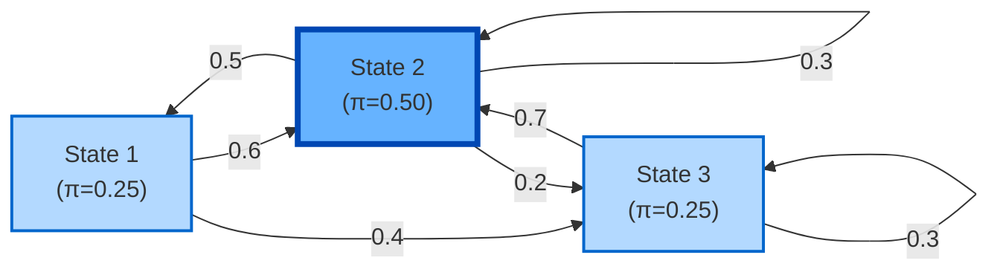
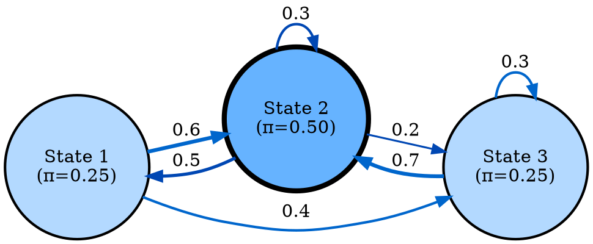
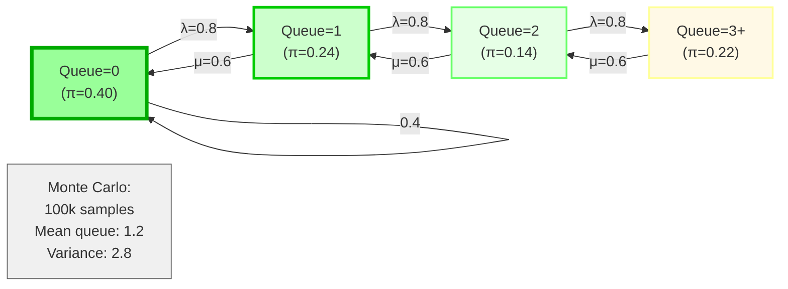
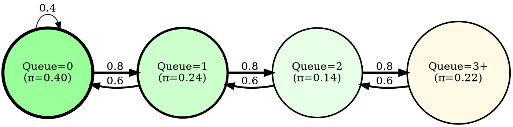

# Visual Grammar: Stochastic

How to render a `stochastic` thought as a diagram.

## Node Structure

Stochastic (Markov chain) diagrams model probabilistic state transitions:
- **States** (circles, sized by steady-state probability): nodes representing possible conditions
- **Transition probabilities** (labeled edges): arrows from state i to state j with probability p(i→j)
- **Stationary distribution** (node size or annotation): larger or darker nodes indicate higher long-run probability
- **Node sizing** (by steady-state probability): visual encoding of which states are visited most frequently
- **Monte Carlo samples annotation** (separate box): count or distribution of simulated paths (if applicable)
- **Ergodic indicator**: note whether chain is irreducible and aperiodic

## Edge Semantics

- **Labeled arrow** (`→ 0.8`) — Transition probability: edge label shows probability of moving from source to target
- **Self-loop** (`↻ 0.1`) — Remaining probability: stay in current state
- **Node size** (radius proportional to steady-state probability): visual indicator of long-run occupancy
- **Thickness of edge** (penwidth scales with probability): visual encoding of likelihood

## Mermaid Template

## DOT Template

## Worked Example

M/M/1 ticket queue with steady-state distribution and Monte Carlo sampling.

### Mermaid

### DOT

## Special Cases

- **Absorbing states**: Use a different color (e.g., black with white border) for states with π=1 self-loop.
- **Transient behavior**: Annotate initial distribution and show time-stepping from t=0 to t=∞.
- **Multiple chains**: If the system has multiple irreducible components, separate them visually or use different subgraph clusters.
- **Simulation results**: Show a histogram or box plot of steady-state metrics (e.g., mean queue length, response time) in an annotation box.
- **Convergence rate**: Optionally annotate with the spectral gap or mixing time (e.g., "mixes in ~50 steps").
