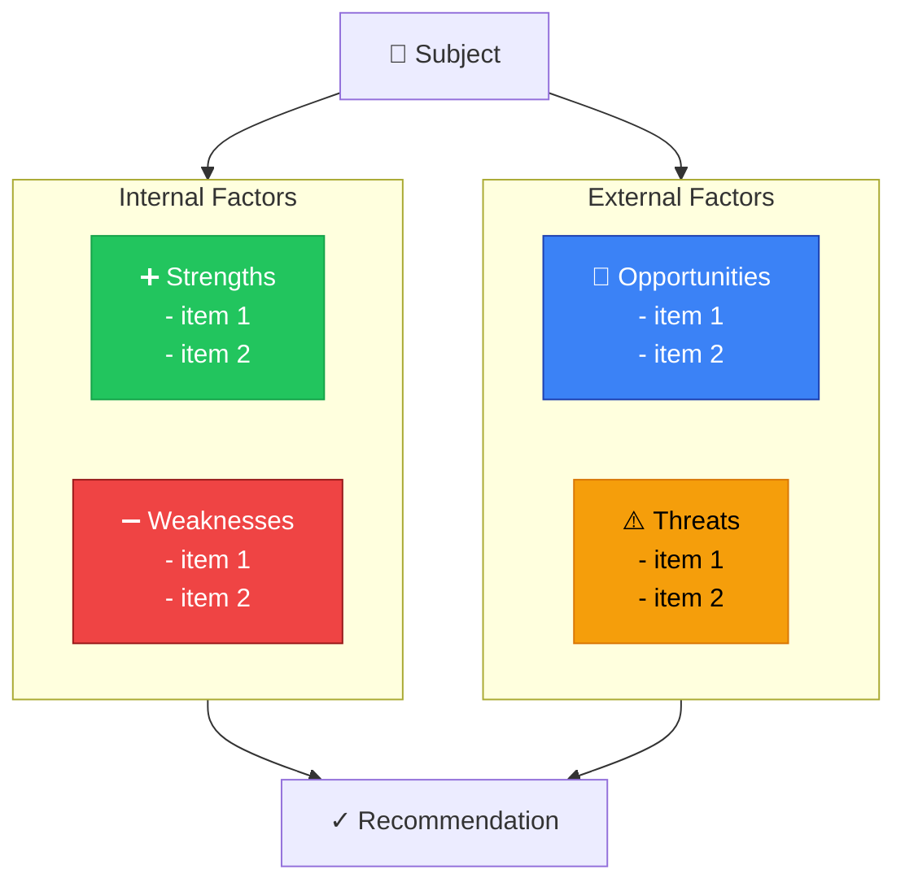
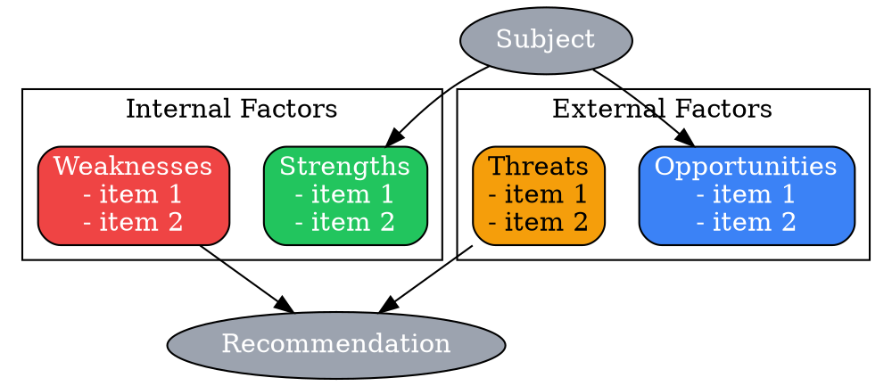
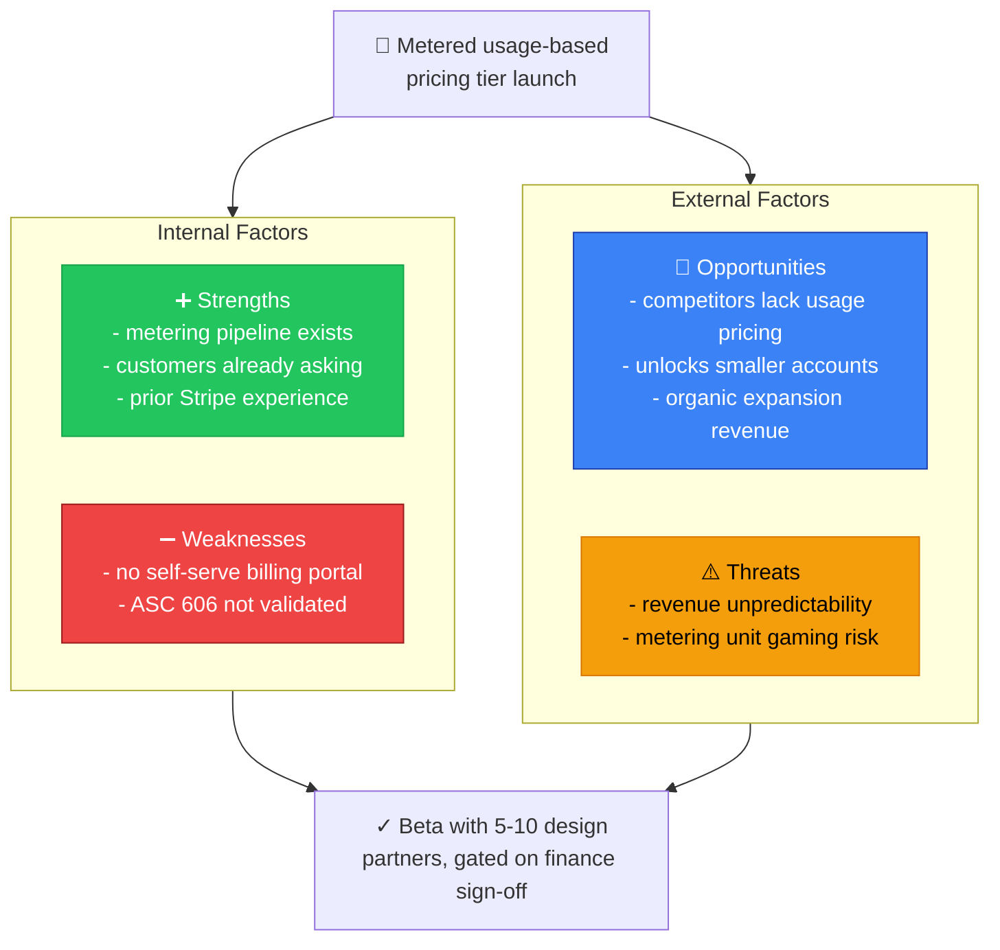
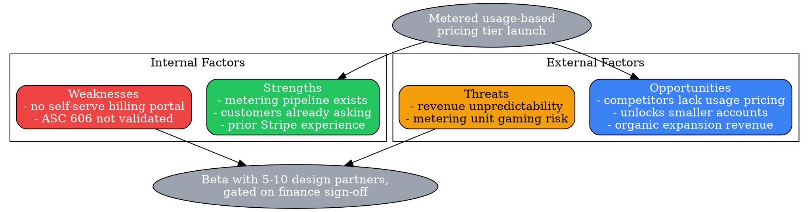

# Visual Grammar: SWOT

How to render a `swot` thought as a diagram.

## Node Structure

SWOT analysis is rendered as a **2×2 quadrant grid** crossing two axes: Internal vs. External (rows) and Positive vs. Negative (columns).

- **Strengths** (top-left, internal + positive) → **green box**
- **Weaknesses** (top-right, internal + negative) → **red box**
- **Opportunities** (bottom-left, external + positive) → **blue box**
- **Threats** (bottom-right, external + negative) → **orange box**
- Each quadrant node lists its array items (one per line)
- Optional **Subject** node above the grid names what's being assessed; optional **Recommendation** node below the grid captures the synthesis

## Edge Semantics

SWOT has no directional reasoning edges between quadrants — it is a static classification grid, not a causal or inferential chain. The only edges (when `subject`/`recommendation` are rendered) are a thin edge from `Subject` into the grid and from the grid into `Recommendation`, both undirected/informational rather than causal.

## Mermaid Template

## DOT Template

## Worked Example

Based on the metered-pricing scenario in `test/samples/swot-valid.json`:

### Mermaid

### DOT

## Special Cases

- **Empty quadrant**: If a quadrant array is empty, render the node with the text "none identified" rather than omitting the node — the 2×2 grid shape must stay intact even when a quadrant is thin.
- **Prose invariant**: A well-formed SWOT should have at least one item in at least two quadrants (per `skills/think-frameworks/SKILL.md`) — a SWOT with content in only one quadrant is a sign the analysis is incomplete, not that the other three are legitimately empty.
- **Long item lists**: If a quadrant has more than ~4 items, show the top 3-4 in the node and add a "+N more" suffix rather than growing the node unboundedly.
