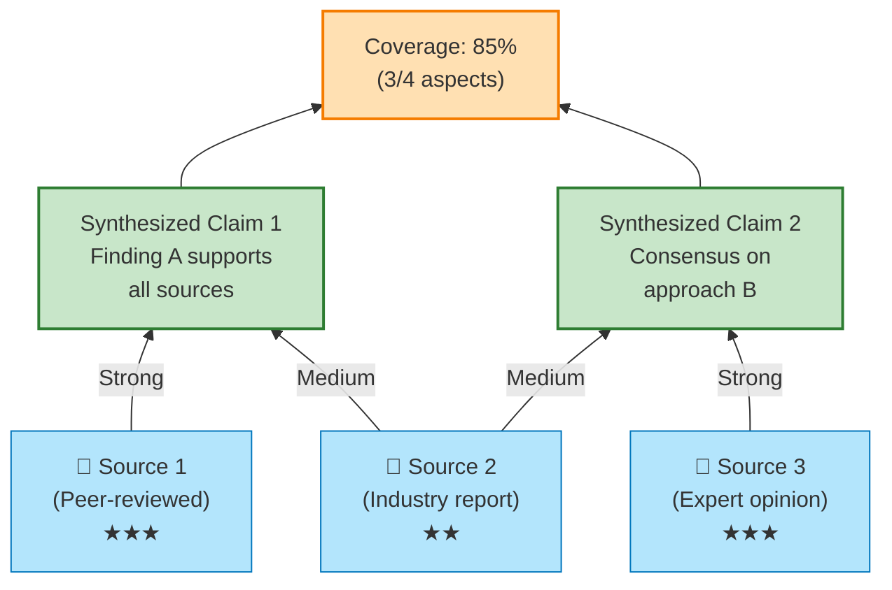
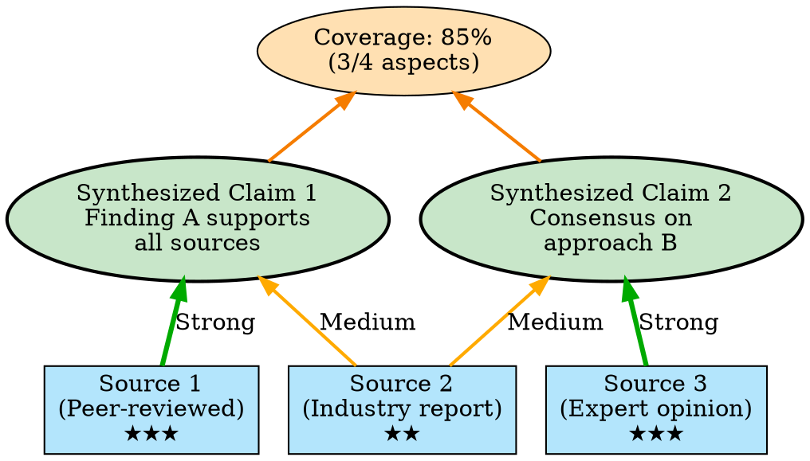
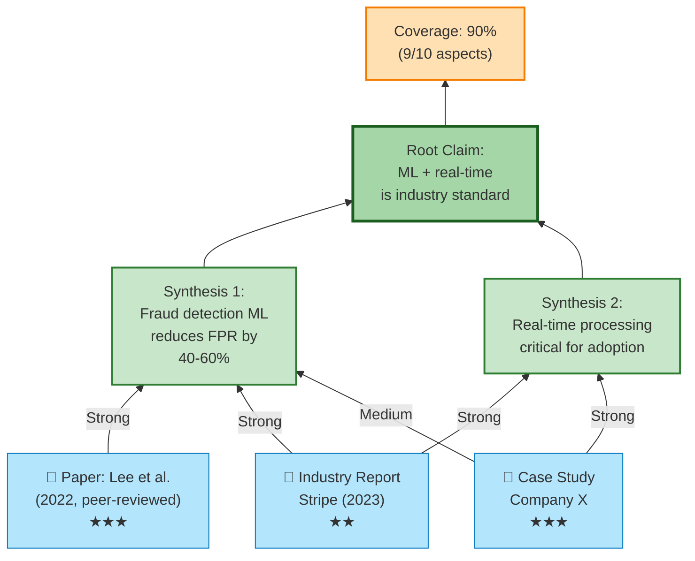
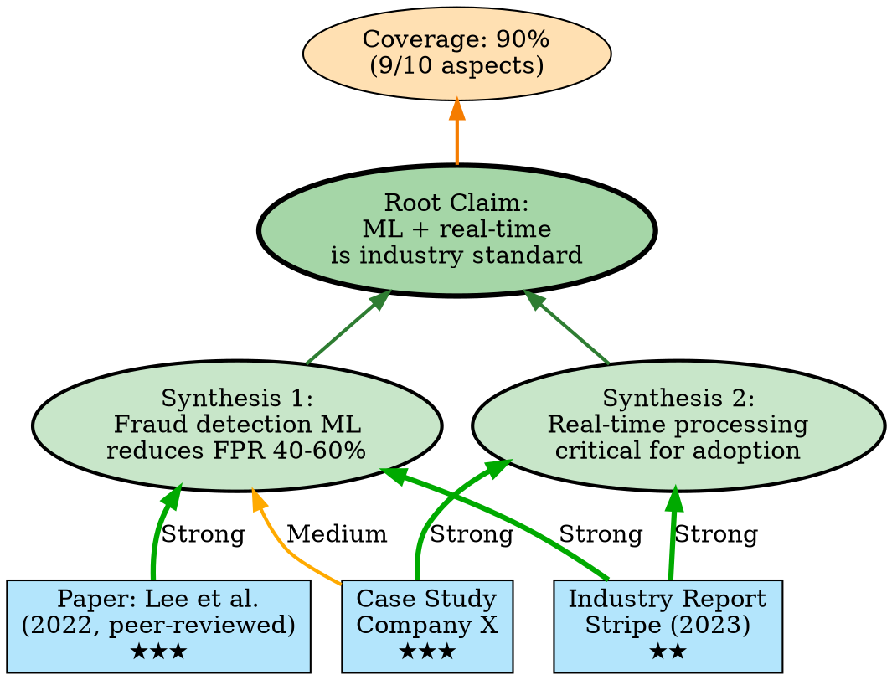

# Visual Grammar: Synthesis

How to render a `synthesis` thought as a diagram.

## Node Structure

Synthesis diagrams integrate evidence from multiple sources into unified claims:
- **Source nodes** (rectangles at bottom, left-to-right): individual sources or studies with reliability badges
- **Evidence edges** (arrows with labeled weights): evidence strength (strong, medium, weak) from source to synthesized claim
- **Synthesized claims** (rounded rectangles, top): unified, higher-level statements derived from multiple sources
- **Coverage ratio** (donut chart node or labeled ellipse, corner): percentage of topic coverage achieved
- **Reliability badge** (small star or colored dot): source credibility indicator

## Edge Semantics

- **Strong edge** (bold, thick arrow): high-confidence or peer-reviewed evidence
- **Medium edge** (standard arrow): standard-confidence evidence
- **Weak edge** (thin, dashed arrow): lower-confidence or preliminary evidence
- **Coverage label** (percentage on node): what fraction of the topic domain is covered

## Mermaid Template

## DOT Template

## Worked Example

Based on multi-source literature integration from `reference/output-formats/synthesis.md`:

### Mermaid

### DOT

## Special Cases

- **Conflicting sources**: If sources disagree, draw two parallel edges with different colors (e.g., green for "supports" and red for "contradicts") to the synthesized claim, labeled with the conflict.
- **Source hierarchies**: If sources can be ranked by reliability, arrange them top-to-bottom in the tree with the most reliable at the bottom.
- **Weighted evidence**: Use edge thickness or penwidth to represent evidence strength quantitatively.
- **Coverage tracking**: Show coverage as a percentage in the corner node, and highlight gaps (e.g., "Gap: culture adoption" in a separate callout).
- **Consensus strength**: On synthesized claim nodes, use border thickness or color saturation to indicate consensus level (e.g., strong consensus = bold border, weak = thin).

